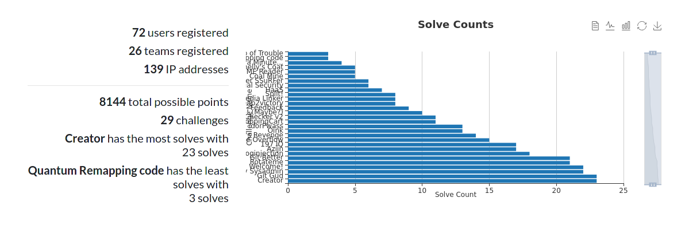
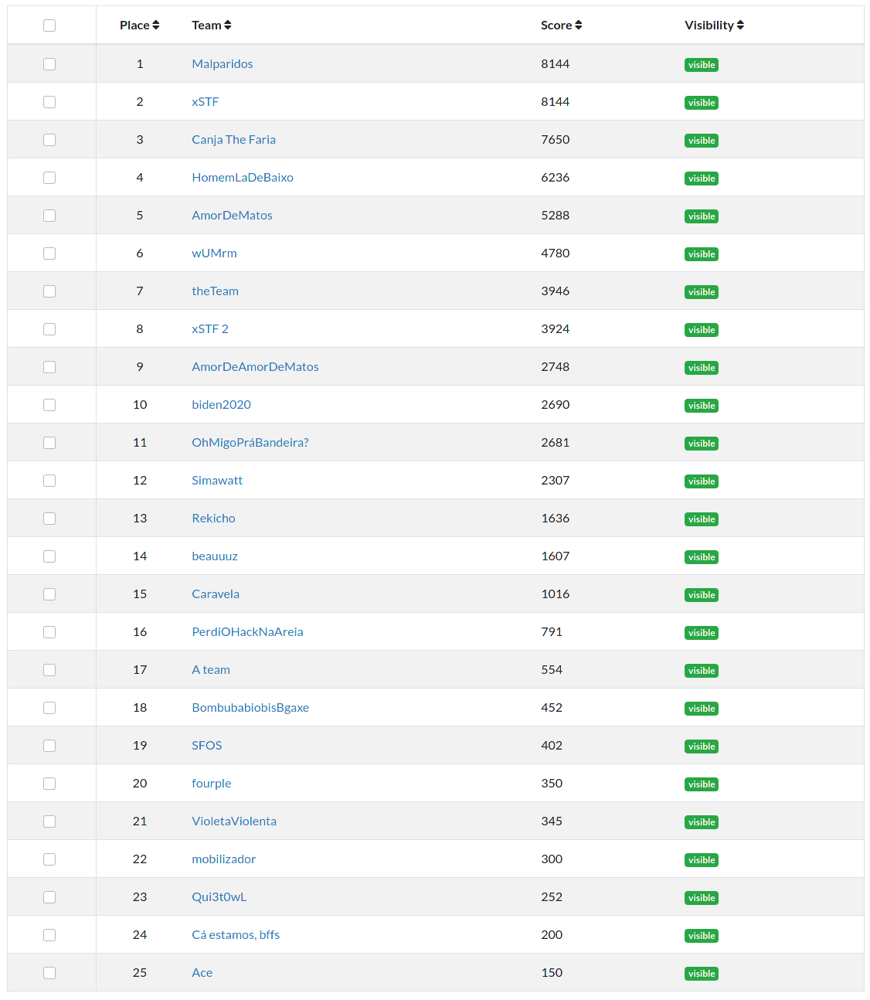
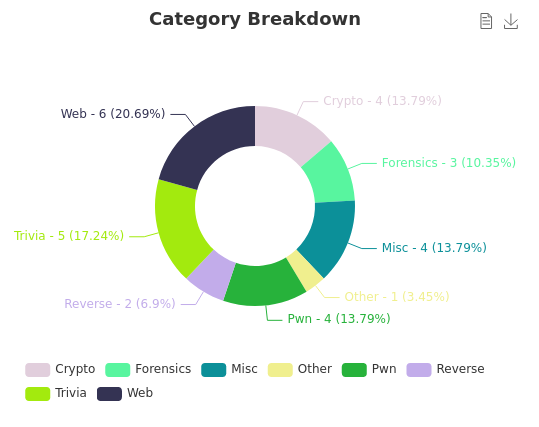

As I've mentioned in my [previous blogpost](../october-opdate/), I've been pretty busy working on a CTF. As such, I'll talk about it now, since it ended just yesterday!

The [CTF](https://ctf.sinf.pt) was a "companion event" to [Semana de Informática 2020](https://sinf.pt/), a tech conference that my student branch ([NIAEFEUP](https://ni.fe.up.pt/)) usually organizes every year (this was the third edition). It spans over 3 days and has several talks, workshops and other sessions such as interview sessions with companies.

Since this year the conference had to be moved to remote (for obvious reasons), the team was thinking of ways to increase the buzz around it other than the programming contest that has been part of it every year. Despite not being part of the conference's organization this year (since I would've been in Erasmus - which sadly was not possible), I volunteered (as tribute, clearly!) to organize a CTF **all by myself** (uh oh!).<br/>
And oh my, what a journey it was!

## CTF Overview

SINF CTF 2020 started on 6th of November (Friday) at 21:30 and ended on 11th of November (Wednesday) at 16:00. It was a nation-wide CTF for students with a duration of almost 5 days, which is quite long comparing to other CTFs I've participated in.

The participation was higher than I initially expected, given that we weren't having a lot of reach at first. Thankfully, after reaching out to contacts in several faculties and universities in Portugal (FCUP, ISEP, UA, UMinho, etc.) and a couple of days into the CTF, the numbers were looking much better!

In the end, these were the stats:


The scoreboard ended up looking like this (screenshot of the admin page since the main scoreboard was frozen and I can't seem to unfreeze it):


`Malparidos`, `xSTF` and `Canja The Faria` were the top 3 teams! Congratulations! They won pro vouchers for PentesterLabs, to whom we thank for their support!

Now, into the specifics of the CTF: it had 28 challenges (plus one for feedback), all designed by me (you can check them out + their solutions in [this repo](https://github.com/miguelpduarte/SINFCTF2020-public)). Obviously, several of them were inspired by other challenges I saw on other CTFs or platforms like HackTheBox (or even are just concepts or common vulnerabilities that I found interesting and wanted to "share" in this creative way :) )

I strongly believe that this should be the spirit of CTFs for both player and organizers alike, a learning experience first and foremost.
Thus, I focused my efforts on trying to create a good learning experience. For a good amount of people this would be their first CTF and as such it was fundamental that this first experience was positive!

Sadly, this made it so that some of the better performing teams (due to having more previous experience) did not have as good a time as if they were competing for higher stakes and difficulty, since the challenges were quite easy for them. I tried to tackle this by including some tasks which required some programming and thus would require problem solving regardless of Pwn, Web or any other category-specific knowledge.

Thankfully, several people contacted me to mention that the CTF was quite fun despite them not having a lot of or any experience with similar competitions!
Mission accomplished!

By the way, the challenge category distribution was as follows:


## Infra

The infrastructure itself is quite simple, and barely worth a diagram. I used GCP to host the CTF (as the competition was sponsored by them - thanks!) and had 2 `e2-standard-4` Compute Engines, one for hosting CTFd and the other for the challenges.
Additionally, two instances were created: Memcached Memorystore and Cloud SQL (MySQL), both for CTFd to use. These were put in a VPC that was created, along with the Compute Engine running CTFd.

The VPC would ideally insulate the DB and Caching servers so that they did not have to be exposed, and the VM could communicate with them in the internal network.
Due to my very limited experience with cloud hosting, I had to mess around for a bit until I understood I could not SSH into the machine since the VPC was not allowing external SSH traffic.
I then added a network tag of `ctfd` to the machine and created a firewall rule for it as well and got the SSH access I needed! I could now ping the outside world and also ping the machines where the DB and Redis services were hosted! Nice!

I also created a Cloud Storage bucket but due to misconfigurations in the CTFd service, the local disk ended up being used instead.
After debugging the setup locally a couple days before the CTF started I quickly found out the root cause - the docker setup of CTFd claims to use the env variables for easy setup but it only does so if the value is not specified in `config.ini` ([Relevant PR](https://github.com/CTFd/CTFd/pull/1574)).
As such, the value for the env variable that controls where the files are stored (`UPLOAD_PROVIDER`) could never be set via env variables since it is set to `filesystem` in `config.ini`.

This seems a bit backwards as the `docker-compose.yml` in the repo (and what's specified in the docs) all point to the env vars being where the value for the config variables is retrieved from... But this is not the case, as explained. I might create an issue to request some sort of warning if this situation is detected: kind of like printing that an env variable is being used but its value is being superceded by `config.ini`. Seems like it would be simple enough and would've saved me a lot of trouble 🙃

Finally, the CTFd base code does not work well with GCP Buckets, even in their interoperable API that is supposed to work as S3 buckets. I spoke with some organizers of DownUnderCTF and their infra blogpost (linked below) had the solution for this, in the form of a [patch file](https://github.com/DownUnderCTF/ctfd-appengine/blob/master/patch.txt) that could be applied to CTFd's base Docker image. This would remove the default value for the upload provider from `config.ini` and fix the section that generates a link to download files from the bucket. The only issue is that this requires you to grant the `Storage Legacy Object Reader` permission `allUsers` (since the link would be used instead of a token that would expire). Given that the files in the bucket would be public anyway (and CTFd "hides" the uploaded files by putting them in folders with random hashes), I did not feel like this would be too troublesome.

Despite making the setup work locally, I still left it as it was since it would most likely require resetting the instance's data. We were only a couple days away from the CTF start and had already started getting some registrations, so I didn't want to risk it.
Since the VM had 30-something GBs of SSD I just figured it would be fine and decided not to risk the potential problems from changing things.

Initially, I was trying to follow along [this blogpost from the organizers of DownUnderCTF 2020](https://medium.com/@sam.calamos/creating-scalable-ctf-infrastructure-on-google-cloud-platform-with-kubernetes-and-app-engine-8c0a7847a53c) (which is pretty cool and a good read btw) to try and setup App Engine but kept having issues with it. Since I had set up CTFd in a VPS for beta testing (a small linode instance) and knew that was pretty straightforward, I went for that instead.

Now, in hindsight, I can say most of the issues I was facing were most likely not due to using App Engine, as I also faced them later when using the Compute Engine instance (being unable to use the bucket due to `config.ini` shenanigans and being unable to SSH due to the VPC's rules, for example). However, since I did not have a lot of time to experiment I went for the safe route.

Additionally, I was looking at a base instance of 2vCPUs and 4GB RAM for App Engine and since I wanted to use Docker to deploy it, I couldn't even scale to zero (so no cost savings from scaling down).
However, the price for the used Compute Engine instance (4vCPUs and 16GB RAM) was only 10$/month more than the considered setup for App Engine in the pricing calculator, so that was also a point to consider.
Sure, I would lose out on the automatic scaling, but you don't need to scale much when the instance is already very overkill!

I kept a close eye on both machines during the whole CTF and neither of them went over 40% at any given time, so I think we were pretty fine :P<br/>
**Update:** There might have been a bug in GCP's dashboard since at the time it showed a 40 something % CPU usage spike but now when I list the usage for the last 7 days I can't seem to find it. The CTFd instance always stayed under 4% and the challenges instance was always under 11%. I just checked both the DB and Redis instances and their CPU usage was under 5 and 1% respectively (given that the DB had a weird spike to 32% in the first day of the CTF's evening, maybe due to a lot of people registering? Weird).

The only last boulder in my path was nearly having a heart attack with 4 hours and 30 minutes remaining until the start of the CTF.
I was testing the netcat connections to the Pwn challenges and they all failed.
After looking at the logs for the nsjail container there were several errors about something related to `userns_clone`.

Thankfully, I remembered that I had previously found that problem when deploying the CTF for beta testing on the linode VPS.
Some quick google-fu was applied and [this link was found!](https://security.stackexchange.com/questions/209529/what-does-enabling-kernel-unprivileged-userns-clone-do)
`sudo sysctl -w kernel.unprivileged_userns_clone = 1` and then writing that to a file in `/etc/sysctl.d/` just in case the machine was restarted saved the day! Phew!

I also would like to share a pair of scripts that helped me manage the challenge's release. They handled opening and closing ports in the challenge VPS so that the ports for the challenges which hadn't yet been released remained closed. No `nmap` would find the challenges earlier than supposed!<br/>
Here they are:

```sh
## challs_open_port.sh
#!/usr/bin/env sh
echo "Creating rule for port ${1:?Port number must be specified as first argument}"

gcloud compute firewall-rules create "sinfctf2020-challs-allow-$1" --action allow --rules "tcp:$1" --target-tags ctf-challenges

## challs_close_port.sh
#!/usr/bin/env sh
echo "Deleting rule for port ${1:?Port number must be specified as first argument}"

gcloud compute firewall-rules delete "sinfctf2020-challs-allow-$1"
```

The scripts are quite simple but they allow easily opening and closing ports due to standardizing the rule names. This allowed me to quickly test an upcoming challenge by temporarily opening the port and checking it was fine and then deleting the firewall allow rule once again so that the running service was not discovered until the challenge was released!

## What went wrong

Thankfully, I think I can say that due to the good amount of preparation and testing that went into organizing this CTF, not a lot of things went wrong.
During the CTF itself, I think that only a couple of things went wrong with the challenges: I had a typo in the hostname which made it so that following the url for the challenge did not work and I forgot to open a port after releasing a challenge in CTFd (whoops).

However, something more "macro" that went wrong was the pacing of the challenges.
As mentioned before, the CTF was aimed more at players with less experience.
Due to this, teams with a bit of experience were pretty fast in solving the challenges.
However, they were even faster than anticipated, which kind of broke my release schedule.

This kind of got me off balance as I tried to fix this by releasing a couple of challenges before the expected release time.
Sadly, this was a problem with the pacing of the whole CTF and not just the start of it - the faster teams could not get a large enough margin to ensure their victory (or at least have a considerable advantage until the next challenges were released).

Ideally, challenges would open up as soon as others were solved (this is common in a lot of CTFs, in which it is frequent to let the team that solves the challenge first select the next challenge to open).
However, since the objective was to keep people engaged as a way to hype up for SINF itself, the release schedule was a bit more sporadic - once or twice per day (two challenges at a time) over the middle 3 days (no challenges were released on the last day).
I think that the solution for this problem (besides having more challenges, which would require having (a lot) more time and possibly manpower) would be to have the competition go on for a smaller period of time.
5 days is a lot, especially for a 1-man army such as myself :P

## What went right

Continuing to share my experience, I'll go into some things that I think went well and that I might recommend anyone in the same position as me to do.

Firstly, start collecting ideas early and thoroughly! I was only able to get a decent number of challenges ready in time due to starting the creative process very early (several months before the CTF's start).
Creating the challenges was still demanding, as I wanted to test them thoroughly to ensure that they were solvable as intended and that they also would not lead to unwanted access (for example, using `docker-compose` capabilities and security options, along with things like [`nsjail`](https://github.com/google/nsjail)) but having the ideas ready to implement beforehand was certainly a great help.

Initially I had a note in Google Keep with a lot of bulletpoints of ideas which were then moved to Trello for better organization. I added labels for each category and lists for "backlog", "in progress", "done", "deployed", etc. which helped in sorting the notes and remembering what I was supposed to do next in order to balance the categories, for example. I ended up having more ideas than time to create challenges, which was pretty great since I can always save those ideas for later :)

Following up on the previous topic's last section: the schedule. All in all, I think that the schedule might have had its flaws since it left a lot of participants eagerly waiting for the next challenges instead of being invested in the CTF continuously. This is a problem especially when two teams are tied with all the challenges solved, since solving the new challenges first might not give you more points, but puts you in an "unbeatable" position, since it is not possible to overtake you (due to there being no more challenges). However, I think that the schedule served the intended purpose: it kept people coming back for more!

In a future CTF that I might organize I would ponder the schedule better, taking into account the issues mentioned. However, I still think that if the objective is to make people come back, having the releases be timed might be a good way to ensure this sort of engagement.
Of course, this should be weighted given the CTF duration, number of challenges and their difficulty, etc. A lot of factors should be taken into account to have a good pacing of the CTF!

Just so that I can flex my exercise of Javascript pointlessness: I wanted to have a countdown timer on the homepage. I found a [CTFd plugin](https://github.com/alokmenghrajani/ctfd-event-countdown), but it seemed like it [wouldn't work.](https://github.com/alokmenghrajani/ctfd-event-countdown/issues/1)
As such [I developed something in JS real quick](https://github.com/alokmenghrajani/ctfd-event-countdown/issues/1#issuecomment-720185394) to solve that! Hehe

## What I would do differently with the superpower of hindsight

If only I had some hindsight, I would've done a couple of things a little bit differently.
This is a bit more related to the challenges themselves.
I believe that most of them were fine, but I would adapt some a bit.

For `Spatial Security` I think that having a script (or binary) that encodes the data (and it being provided) and having to reverse the encoding by creating a reverse script after understanding what the algorithm does would be more interesting than applying preexisting tools.
This change to the challenge would probably make it switch category to Reverse most likely, but I don't think that there is anything especially bad about that, since it would remove the (mild) "guessing" elements from the challenge which would arguably make it more enjoyable.
I also mislabeled this challenge as Crypto when it was actually Stego (this was not 100% accidental as I kind of grouped it with the other Crypto challenges since all of them were related with hiding data in a certain way).

For `Quantum Remapping code` I might switch up some things.
Firstly, I should probably have gone with a different name. Quantum might have hinted at something related with quantum computing, which might've been a bit of a throw off.
In truth, the challenge name was just a play on words to get it to spell out `QR code`.
I tried to minimize this by having several names in the problem statement, but now that I noticed, they all start with `Quantum` - whoops 🙃🙃.

Additionally, I would probably try to add some sort of hints about coordinates to the challenge.
It was probably the challenge that was left unsolved for the longest time (counting from when it was released until it was solved), which goes to show that it might not have been the most intuitive thing ever.
Still, I liked the challenge idea so I wouldn't outright remove it or change it too much, just maybe add some hints in the problem statement or something of the sort.

## Sign-off

I hope you have enjoyed this insight of what goes into organizing a CTF, or at least my experience of organizing one!
Overall it was an amazing learning experience which forced me to think from a blue-team perspective at times ("What if my challenge is vulnerable in ways I don't want it to be?"), learn about cloud infrastructure (despite not putting a lot of what I learned into practice, sadly, due to the reduced scale of the event) and overall deepen my knowledge of a lot of things infosec! (due to researching about stuff to create challenges about, deep diving for more ideas and even when trying to solve my own challenges - which arguably should've been easier given that I actually made them... 😁😁)

Would I do it again? Most likely yes, given that my instinct for self-preservation is apparently ignored by my desire to learn more about infosec and hacking things!
Speaking honestly, I would probably do this again, but not for a while - it was a lot of work and now I have some catching up to do in other areas of my life (such as HTB, Faculty, etc.) so I would not do this again straight away.

I would also enjoy working with a team when making a CTF. While creating the challenges and testing them by myself was plenty fun, I think it would've been easier and much more fun when working together with other people, as the responsibility for the CTF is shared (which reduces a lot of pressure), there are a lot more ideas floating around (which makes creating challenges easier) and it would be fun to mix creating my challenges with solving other people's.

And now, what's next? As mentioned, I have a lot of catching up to do in HTB (a loooot of Linux machines were released, which I should look into, as well as Hacking Battlegrounds, which look **freaking awesome**).
I also need to work on a writeup for Intense, as it was announced it would be retiring soon! I'm pretty excited to work on that!

I might also make a blog post to go into detail on this CTF's challenges - a bit like a writeup.
However, given that the solutions are already listed in [the repository](https://github.com/miguelpduarte/SINFCTF2020-public) and I don't exactly have a super interesting perspective from the solver's side to provide, I might end up not doing it (especially since there are other more interesting things to do and I probably won't have time for everything 😔).

Additionally, I need to work on some things related with college, as we have some deliveries and evaluations coming up soon (which means I'll sadly have less time to go around hacking stuff and telling you all about it for a bit).

Afterwards, I will probably revamp my CV, making it more about the infosec side of my experience (in which I will happily include SINF CTF 2020 😁) and start looking for potential future positions for entry-grade in infosec, possibly somewhere around Europe.

I hope you enjoyed reading about my challenges organizing these challenges (heh), and that it might have been insightful and/or helpful for anyone.<br/>
As always: thanks for reading!
